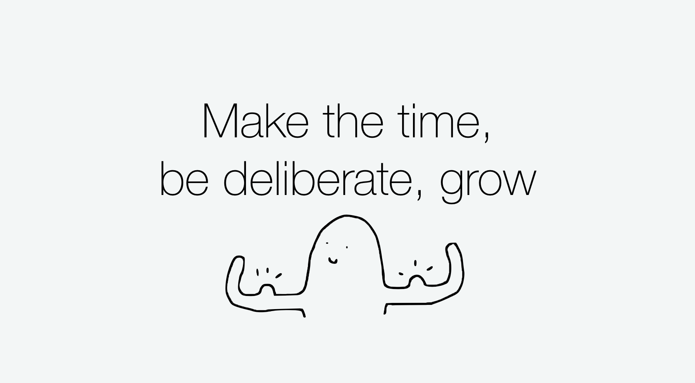
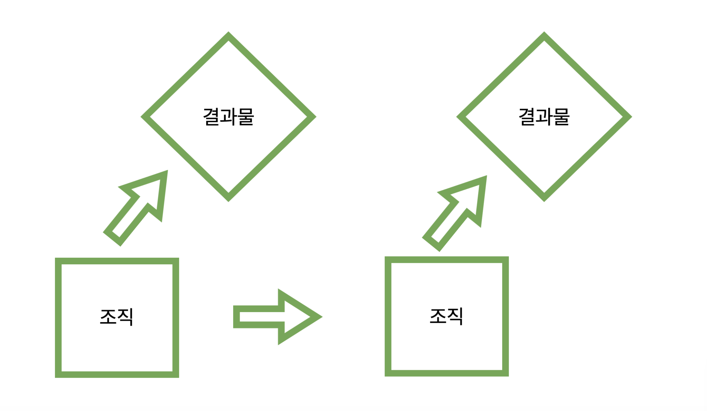
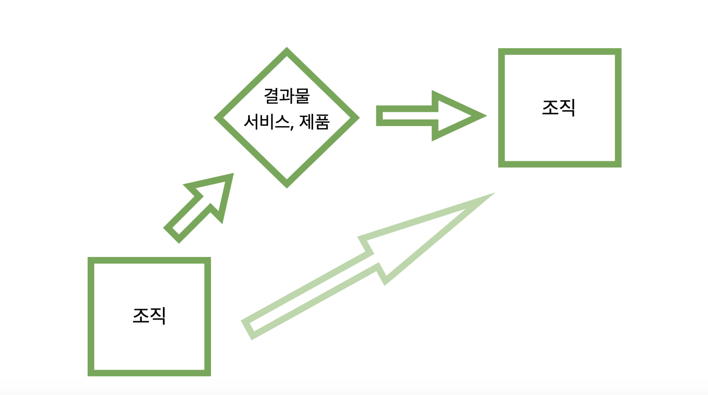

#### 1만 시간의 법칙?

저자는 시간을 들여 오랜시간 반복한다고 해서 한 분야의 전문가가 될 수는 없다고 말합니다. 양치질과 세수를 예시로, 수십년간 양치와 세수를 한다고 해서 꼭 세면의 대가가 되지 않는 것 처럼요.
우리의 평소 업무는 크게 세가지로 구분할 수 있습니다.
A: 평상시 반복하는 업무(목표 달성을 위해 하는 일)
B: A 를 발전시키고, 향상시키는 일
C : B의 발전을 위한 일
B 와 C 작업이 이루어지지 않는다면 일을 한 ‘시간’과는 관계없이 일에대한 기술이 늘지 않는다고 주장합니다.
소프트웨어 개발 업계의 경우에도 연차와 실력의 상관관계에 대해 회의적으로 말하고 있습니다. 물론 경력이 짧은 경우, 예를 들면 대학교 졸업생과 개발자 2년차의 실력과 능력은 차이가 있겠지만 일정 기간과 수준을 넘어선다면, 연차는 의미가 없어진다고 주장합니다. 근거로 미국 연방정부의 연차와 성과 데이터를 분석해본 결과, 직무 성과와 연차의 상관성은 0.18, 학력은 0.10 이라고 합니다.
한마디로 같은 작업을 오래 반복한다고 해서 실력이 향상되지 않는다는 것을 말하고 있는데요,

#### 

#### 그럼 어떻게 성장해야 할까요?

예를들어 제가 속해있는 팀이 계산기 어플리케이션 프로젝트를 진행한다고 가정 해볼게요. [폭포수 방식](https://ko.wikipedia.org/wiki/%ED%8F%AD%ED%8F%AC%EC%88%98_%EB%AA%A8%EB%8D%B8)에 따라 기획도, 설계도 꼼꼼하게 진행했습니다. 개발을 시작해보니 한달 전에 진행했던 db 설계에서 보완점을 발견했습니다. 동료들과 함께 회의를 하고 ‘나은 방법이 있겠지만 우선 프로젝트가 많이 미뤄지니 떼우는(?) 방식으로 진행하자' 라는 결론이 났습니다.
다음 카페 주문, 배송 관리 어플리케이션 프로젝트를 진행하며 지난번에 했던 실수를 반복하게 되었습니다. 그럼 또 한참 지나서 기존에 잘못 진행되었던 부분을 A 작업, (같은 일에 대한 반복적인 작업, 즉 시간)으로 매웁니다. 피드백을 적절한 때에 받지 못한다면, 다음번 프로젝트를 진행 할 때도 크게 나아지기 힘듭니다.

#### 

반면에 복리조직, 발전하는 조직이 일하는 구조는 결과물을 일찍 만들어 냅니다. 최소한의 결과물을 만들고, 피드백을 받아 개선사항을 앞으로의 방향에 십분 반영하기 위해서 입니다. 이전단계의 결과물과, 수정사항, 개선사항이 다음 단계에서 내 몸의 자양분이 되듯 받아드리는 구조입니다.

#### 

앞서 말씀드린 A, B, C 업무와 관련이 있습니다. 책은 특히 C 과정, ‘어떻게 발전할지 회고하는 과정'에 강조를 하고 있습니다. 주기적으로 발전 방향에 대해 생각해보고, 논의하는 과정이 잘 갖춰져 있다면(C), 더 나은 방향으로 업무를 발전시키게 되고(B), 결과적으로 매일 하는 일(A)들에 대한 실력이 향상된다고 보기 때문입니다.

#### 학습프레임 vs 실행프레임

다음으로 저자는 **학습프레임** 과 **실행프레임** 에 대해 소개합니다. 간단한 예시로 그룹의 아이들에게 ‘이것은 너희들의 창의성과 그림실력을 보기위함이니, 잘 그려줘' 라고 말하고 것이 실행프레임입니다. 반면에 ‘오늘은 그림그리는 시간인데 자유롭게 너희들이 안그렸던 방법등을 통해 그림을 그려봐' 는 학습프레임 이구요.
결과는 예측가능하게 학습프레임에서 더 많은것을 배우고, 실질적으로 성과도 좋았다는 연구결과가 있다고 합니다. 학습 프레임과 실행 프레임을 가지고 업무에 임할 때 우리 머릿속에 가장 큰 차이는 무엇이 될까요? 제 생각으로는 ‘실수에 대한 부담감’ 의 차이일 것 같습니다. 실행프레임을 가지고 업무에 임한다면, ‘실수’ 라는 부담감이 생깁니다. 하지만 학습과정에서는 그렇지 않습니다. 되려 자유롭게 질문하고, 나만의 시선을 가지고 문제를 해결할 확률이 높아집니다.
학습프레임을 우리의 일상에 어떻게 적용할 수 있을까요?
의도적으로 학습프레임에 대해 생각하는 것은 실행하기에 부족한 점이 있다고 생각합니다. 당장 앞에 기한이 있는데 학습이라뇨. 이처럼 시간, 공간, 사람등 여러가지 제약이 생긴다면 이 생각은 자연스레 힘이 약해질 수 있고 자연스레 실행프레임으로 업무에 임하게 될 수 있습니다. 따라서 업무를 진행하기 전에

1. 자유로운 의견 나누기, 브레인 스토밍(혼자 진행하는 경우에)
2. 목표에 따라 채택할 아이디어와 미루는 아이디어로 분류

이 과정을 통해 시작할 때의 뱡향을 학습프레임으로 잡을 수 있겠다고 생각합니다. 물론, 업무를 진행할때는 ‘잘 해야한다'(잘 하고싶다) 등의 생각이 날 수 있겠지만, 브레인스토밍 혹은 의견을 나누는 문화가 생긴다면, 조직에서 전반적으로 학습 프레임 대한 문화가 생겨날 수 있지 않을까 생각합니다.

#### 무엇에 집중할 것인가?

**컴퓨터로부터 살아남기**
현대의 수많은 직업들은 컴퓨터에 의해 빠르게 대체 되고 있습니다. 특정한 작업을 반복 하는 직업은 물론이구요, 최근에는 사람의 직관으로 생각되던 영역 까지도 컴퓨터가 신속하게 모든 경우의 수를 다 계산해서 처리하는 경우를 볼 수 있습니다. 웹개발의 경우에도, 새로운 라이브러리, 프레임워크 로 인해 적은 resource로 어플리케이션을 구현할 수 있게 되었습니다. (개발자의 일자리를 점점 줄여가고 있습니다ㅎ…) 컴퓨터가 하기 힘든 작업이란 무엇일까요?
저자는 컴퓨터가 대체할 수 있는 작업의 4가지 특징을 언급했습니다.

1. 목표가 분명하고 객관적으로 정해져 있으며 정적이다.
2. 매 순간 선택할 수 있는 행동/선택의 종류(MOVE)가 유한하게 정해져 있다.
3. 매 순간 자신이 목표에 얼마나 근접했는지를 알 수 있다 (내가 한 선택의 피드백이 빠르게 주어진다)
4. 주로 닫힌 시스템(외부 요소의 개입X) 속에서 일한다. 선택과 결과에 대한 구조화된 기록이 많다.

반면에 독창성, 사회적 민감성, 협상, 설득, 타인을 돕고 돌보기 와 같은 영역들을 가지진 직업들이 컴퓨터에 의해 대체될 가능성이 낮다는 연구 결과가 있습니다. 소프트웨어 분야로 따지면, 요구사항을 명확히 받아 혼자 프로그램을 개발하는 직업은 점점 사라지게 된다는 말이겠죠. 반면에, 니즈를 파악해 알맞은 프로그램을 생각하는 능력, 고객의 요구사항을 듣고 설계하는 능력 등의 컴퓨터가 대체할수 없는 영역들에서 일거리가 더욱 생겨나게 될거라고 예상하고 있습니다.
