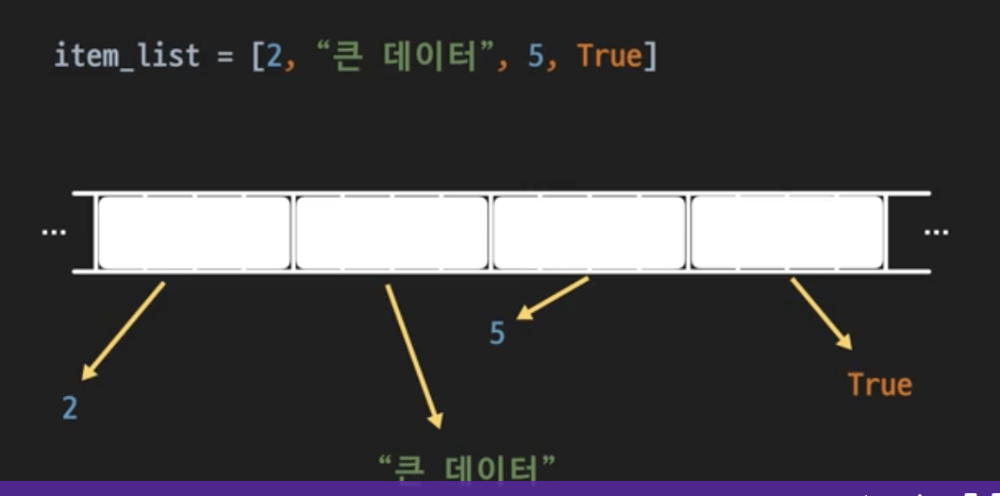
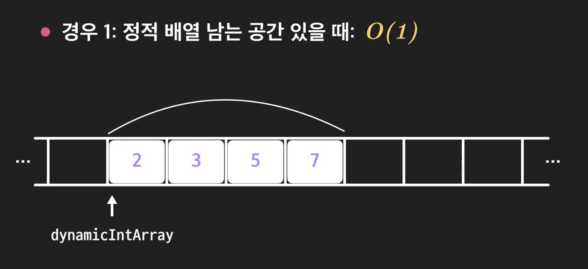
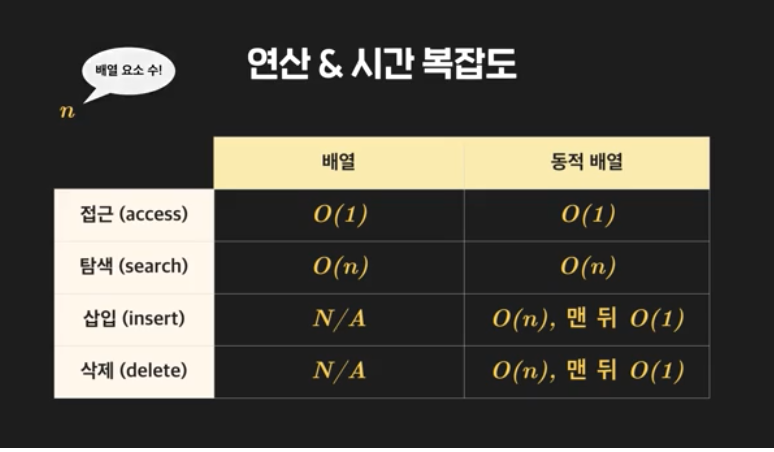

### 자료구조를 배워야 하는 이유는?

컴퓨터 내부에는 저장공간이 있다. 1. storage 2. memory 로 구분할 수 있다. storage는 데이터가 영구적으로 저장되는 곳이다. SSD, HDD 등의 hard disk다.
그 다음은 memory 인데, 너 컴퓨터 램 몇기가야? 할때의 RAM(Random Access Memory)가 있다. 
우리가 배울 자료구조에서는 메모리에 데이터를 **저장**하고, 데이터를 **찾아오는** 과정에서 가장 효율적인 방법을 찾는 것이다.

예시) 예를 들어 워드파일을 작성하는데, 저장/다른 이름으로 저장을 하게 되면 storage(hard disk)에 저장이 되는 것이고, 그 전에 워드프로세서 내부에서 보이는 쓴 글은 memory 에 저장되고 있는 것이다.

RAM 에 대해 조금 더 자세히 알아보자.

##### RAM (random access memory)

RAM 은 임의접근메모리 메모리로서, 메모리의 기본단위는 바이트(byte)를 사용한다. 메모리 한 칸에 담기는 데이터 용량은 1 바이트라는 뜻인데,
4GB 메모리를 가지고 있다고 하면, 4e+9 byte 만큼을 저장할 수 있다는 뜻이고, 1 byte는 binary(0 또는 1) 데이터를 저장할 수 있으니,
4GB를 탑재한 컴퓨터의 메모리는 4e+9 만큼의 0 또는 1의 데이터를 저장 할 수 있다는 뜻이다.

이때 RAM의 저장공간에는 주소가 있는데, 이것을 Reference 라고 한다.

### 레퍼런스 Reference

reference를 조금 더 정확히 얘기하면 데이터에 접근할 수 있게 해주는 값이다. 
`myList = [1,2,3,4]` 의 list가 있을 때, myList[0]으로 리스트의 첫번째 값에 접근할 수 있다. 이 때 index 값, 0을 reference라고 한다.
RAM 에도 같은 주소 값이 있다. 자료 구조를 배울 때는 주소 = 레퍼런스라고 생각해도 된다고 하니 일단 넘어가자.

##### 예시) 데이터의 주소

    >>> x = 3
    >>> id(x)
    4415257296
    
    >>> a = 2
    >>> x = a
    >>> a
    2
    >>> x
    2
    >>> id(x)
    4415257264
    >>> id(a)
    4415257264
    
    >>> id(x)==id(a)
    True

### C 배열과 파이썬 리스트의 차이점

C의 배열과 파이썬 리스트에 차이점에 대해 알아보자. 
결론부터 이야기하면, C 배열은 메모리에 값을 저장하고, 파이썬 리스트는 레퍼런스를 저장한다.
C 배열은 정적배열, 파이썬 리스트는 동적배열이다.

C에서는 배열을 이렇게 선언한다.

`int numArray[4]`
1. 앞서 나오는 `int`는 array에 들어갈 요소의 타입을 미리 정해주는 것이다. 이 경우에 array에 들어갈 요소는 **모두 정수값 이여야만 한다.**
2. 마지막에 나오는 `[4]`는 배열의 크기가 4라고 지정해주는 것이다. numArray 배열의 길이는 **4를 넘을 수 없다.**

C에서 배열을 선언할 때 (1)데이터 타입과 (2)요소의 길이 를 미리 정해주는 이유는 **array가 차지할 총 메모리를 계산해서, RAM 공간 내, 비어있는 저장공간을 확보하기 위함이다**

파이썬의 list는 c로 구현이 되어 있다. 결국 파이썬의 list 도 C 배열로 구현이 되어있다는 말인데, 파이썬에서는 미리 자료형을 정해줄 필요도, 요소의 길이를 정할 필요도 없다.
저장공간에 레퍼런스를 저장해서 가능한 이야기다. 천천히 살펴보자.

**파이썬은 array 요소에 레퍼런스를 저장한다**

아래의 그림을 보면 앞서 나온 C 배열과 같이 RAM 에 저장공간을 확보하고, 그 속에 값을 저장한다. 
하지만 다른 점은, 값을 저장하는 것이 아니라, 값이 저장되어있는 주소값(reference)를 저장한다. 

그림의 경우에 `item_list`는 총 4개의 요소를 가지고 있다. 정수형 (2, 5)와 문자열 "큰 데이터", 불리언 (True) 인데, c 배열로 저장하려고 하면 그렇게 할 수 없을 뿐더러
2byte x 2 , 3byte * 5("큰  데 이 터") * 1byte x 2 (True)의 byte 값을 총 더한 다음에 RAM 의 **연속적으로 비어있는 공간**에 저장해야 한다.
하지만 파이썬의 리스트는 2, "큰 데이터", 5, True 각 각 비어있는 메모리에 저장한 다음 (연속적인 공간이 아니여도 된다), 그 메모리의 주소를 한 배열에 저장한다.

*** C 배열에서 한거번에 엄청 큰 공간을 예약해놓고, 담으면 안되나요? *** 라고 생각한다면, 메모리가 한정적인 자원이고, application 과 컴퓨터 성능의 성능에 영향을 준다는 사실을 기억해야 할 것이다.

결론적으로 파이썬의 경우, 복잡한 코딩 없이 메모리 공간을 효율적으로 사용할수 있게 된다.

### C 배열에서 데이터를 저장하고 가지고 오는 법

배열을 선언하게 되면,
1. 공간이 충분한 저장공간을 확보한다
2. 시작점의 index number 를 기억한다.
**따라서 배열의 내부 요소에 접근할 때는 O(1)의 시간복잡도를 갖는다**

예시)
`int numArray[4]` 일 때, numArray는 해당 저장공간의 시작점을 가지고 있음, 따라서 4byte 의 정수형의 인덱스에 접근할 때는
`numArray 시작점 주소 * 4` 가 해당 요소의 주소가 된다.

#### 배열 탐색

배열에서 특정한 조건을 만족하는 값을 찾기 위해서, **배열 탐색** 을 알아보자.
결론부터 이야기하면 배열 내부 요소중 특정한 조건을 만족하는 값을 찾기 위한 작업, 즉 **배열 탐색 연산** 은 **선형탐색 O(n)**이다. 정적배열과 동적배열 모두 O(n)이다.

### 배열의 종류

1. 정적 배열 : 크기 고정(요소 수 제한) ex) C array
    1. 배열을 정의할 때 해당 요소를 전부 담을 수 있는 **한번에 연결된 메모리를 사용하기 때문에**
    2. 저장공간 내에서만 수정할 수 있음
    3. 만약 필요 이상으로 여유롭게 배열을 정의 할 경우에 메모리 낭비가 생길 수 있음 * 5개 저장할 때, 5000개를 정의하면 4995는 낭비

2. 동적 배열 : 크기 변함 (요소 계속 추가 가능) ex) 파이썬 list

"동적배열" 이라는 다른 자료구조가 있는 것은 아니다. 정적배열을 선언하고, 특정 조건이 되었을 때, "동적"으로 배열의 크기를 늘리는 배열이다.
아래는 정적배열로 동적배열을 구현하는 과정이다.
    
    정적배열 선언
    배열의 크기가 1/2 남았을 때 기존의 배열보다 2배 큰 배열공간 확보 **이 때 1/2, 2배는 각 언어마다 다른 값을 가지고 있다고 한다**
    기존 값 복사
    다음 칸에 저장 .. 다음 칸에 저장..  다음 칸에 저장
    2 - 4  반복

### 추가 연산(append operation)

**동적배열**에 새 값을 추가하려고 할 때
- 정적배열에 남는 공간이 있을 때 **O(1)**

    

- 없을 때 **O(n)**
1. 기존배열 → 새로운 배열로 값 복사
    - n 개의 새로운 배열 복사 O(n)
2. 새로운 요소 추가 O(1)

#### 추가 연산 시간 복잡도

- 남는 공간이 있을때 O(1) 이 남는 공간이 없을 때 O(n) 보다 자주 일어남
- **분할상환분석**(Amortised analysis) : *할부 (1년에 108만원, 한달에 3만원)*
    - 시간복잡도를 평균을 내서 계산하는 방법
    - 보다 합리적인 시간 복잡도를 구하기 위해
    - 한 작업에 요구되는 시간복잡도가 조건에 따라 다를 때

ex) 동적 배열에 요소를 추가

**요소를 추가하는 것을 n 번 반복한다고 했을 때의 예제는**

1. 빈 공간이 있을 때
    1. 빈 공간이 있을 때는, 여유공간이 있다
    2. 따라서 새로운 요소 추가 *O(1)* 의 시간이 걸린다, n 번 반복한다고 했을 때 O(n)의 시간이 걸린다
2. 빈 공간이 없을 때
    1. 빈 공간이 없다면, 우선 새로운 저장공간을 확보하고
    2. **기존의 데이터를 복사해야한다**. 1개의 데이터를 복사할 때, O(1) 의 시간이 걸리므로, n 개의 데이터를 복사한다면 ***O(n)*** 의 시간이 걸린다.
    3. 그리고 나서 새로운 요소를 추가하는 것 O(1), n 번 반복하게 된다면 ***O(n)*** 의 시간이 걸린다. 

이때 배열 안 요소 수를 n, 마지막에 옮겨 저장한 데이터 요소 수를 m 이라고 할때, 복사해서 저장하는데 걸리는 총 시간은 2m-1 이고, m 은 n 보다 작습니다.

따라서 n 번 반복하게 된다면 O(n) + O(n) + O(n) = 3O(n) = O(n),
한번 반복할 때는 O(n)/n = O(1) 의 시간복잡도가 걸린다.

## 삽입 연산

추가와 삽입의 차이 : **추가**는 아무 위치에나, **삽입**은 특정한 위치에만

- 남는 공간이 있을때
    - O(n) (최악의 경우 array[0] 에 삽입 하고 하나씩 전부 미룰때)
    - O(1)
    - O(n) + 1= O(n)
- 남는 공간이 없을때
    - O(n) 데이터 복사(추가 공간 확보한 곳)
    - O(n) (최악의 경우 array[0] 에 삽입 하고 하나씩 전부 미룰때)
    - O(1)
    - O(n) + O(n) + O(1) = 2O(n) + 1 = O(n)

### 동적 배열의 크기 줄이기
배열에 요소가 추가되는 상황도 있지만, 제거되는 상황도 있습니다. 이 때, 만약 동적배열이 크기를 그대로 유지한다고 하면 메모리 낭비가 일어나게 됩니다.
동적배열은 메모리 낭비를 줄이기 위해 프로그래밍 언어에서는 동적 배열의 요소수가 특정값(1/3) 으로 떨어지게 되면 새로운 공간을 예약하고, 그곳으로 자료를 옮깁니다.

이것도 마찬가지로 복사를 할 때는 O(n) 의 시간복잡도가 소요되고, 삭제할 때는 O(1)의 시간복잡도가 소요되는데, 대부분의 경우에는 O(1) 이 걸리기 때문에 분할상환분석 으로 인해 O(1) 이 걸린다고 할 수 있다.

마지막으로 동적배열과 정적배열의 차이를 표로 정리하고 마무리하겠습니다.

### 정적배열 vs 동적배열

동적배열은 정적배열을 생성하고, 동적 배열의 요소 수가 특정 값 이하로 떨어질 때, 정적배열을 새로 생성하고, 옮기는 작업을 해야한다.