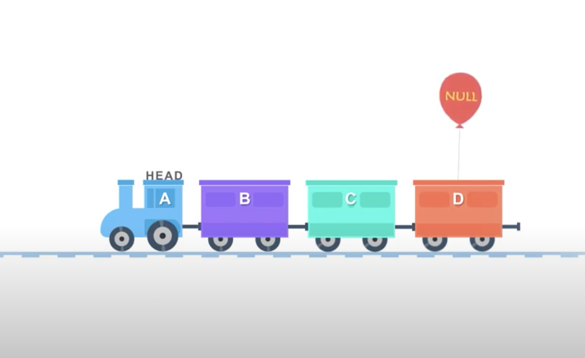
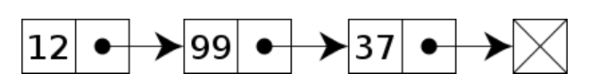
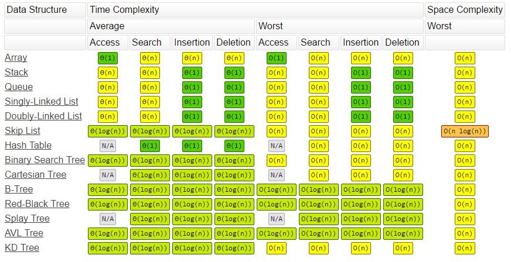

## Linked List



-   Node 에 데이터를 저장한다.
-   Node 는 저장할 데이터에 해당하는 `data`, 연결에 대한 정보를 담고 있는 `next(+prev)`(doubly linked list 의 경우) 를 포함하고 있다.
-   다른 추상 데이터 타입 list , stacks, queues, associative arrays, S-expression 등을 구현하는데 사용된다.
-   Singly linked list, Doubly linked list, dummy linked list, Circular linked list 등 linked list에서 파생된 데이터 구조가 있다.

### Node

Linked list의 기본적인 Node 의 구성

```python
class Node:
    def __init__(self, data):
        self.data = data
        self.next = None
```

### Singly Linked List



-   head, tail `Node` 에 대한 정보를 담는 property 를 포함한다.
-   위 예시 그림의 경우에 `head` 값은 데이터가 12인 노드를 가리킨다. 마찬가지로 `tail` 의 경우에 데이터값이 37인 노드를 가르킨다.

#### 시간복잡도



-   추가
    -   맨 뒤에 data 추가: O(1)
    -   중간에 data 추가: 검색 + 추가 = O(n) + O(1) = O(n)
-   삭제 : O(n)
    -   맨 앞 data 삭제: 삭제 = O(1)
    -   중간, 마지막 data 삭제: 검색 + 삭 = O(n) + O(1) = O(n)
-   검색 : O(n)

#### Singly linked list 구현예시

-   생성자 : head, tail 초기화
-   메소드 구현
    -   **추가**
    -   .append(data): 맨 뒤에 노드 추가
    -   .insert(prevData, data): 특정 data값을 가진 Node 뒤에 추가
    -   .prepend(data): 맨 앞에 노드 추가
    -   **삭제**
    -   .delete_target(target): target 노드 삭제
    -   .delete_head(): head 노드 삭제
    -   **검색**
    -   .find_node_at(index): index 번째의 data 검색
    -   .find_node_with_data(data): data의 값을 가진 node 검색

```python
class LinkedList:
    def __init__(self):
        self.head = None
        self.tail = None

    def append(self, data):
        newNode = Node(data)
        if self.head is None: # linked list가 빈 상태일 때
            self.head = newNode
            self.tail = newNode
        else:
            self.tail.next = newNode
            self.tail = newNode

    def insert(self, prev_data, data):
        newNode = Node(data)
        iterator = self.head

        if iterator is None: # linked list가 빈 상태일 때
            self.head = newNode
            return

        elif prev_data == self.tail.data: # prev_data == tail.data
            self.tail.next = newNode
            self.tail = newNode

        else:
            while iterator is not None:
            if iterator.data == prev_data:
                newNode.next = iterator.next
                iterator.next = newNode
            else:
                iterator = iterator.next

    def prepend(self, data):
        newNode = Node(data)
        if self.head is None:
            self.head = newNode
        else:
            newNode.next = self.head
            self.head = newNode


    def delete_target(self, target):
        iterator = self.head
        while iterator is not None:
            if iterator.next.data == target:
                if iterator.next == self.tail:
                    self.tail = iterator
                    iterator.next = None
                    return
                else:
                    iterator.next = iterator.next.next
                    return
            else:
                iterator=iterator.next


    def deleteHead(self):
        self.head = self.head.next
        return

    def __str__(self):
        word = ''
        iterator = self.head
        while iterator is not None:
            word = word + str(iterator.data) + '|'
            iterator = iterator.next

        print(word)

    def find_node_at(self, index):
    i = 0
    iterator = self.head
    while iterator is not None:
        if index == i:
            print(iterator.data)
            return iterator
        else:
            iterator = iterator.next
            i = i + 1

    def find_node_with_data(self, data):
        iterator = self.head
        while iterator is not None:
            if data == iterator.data:
                return iterator
            else:
                iterator = iterator.next


```

## Doubly Linked List


data-structure/linked-list.png

-   head, tail `Node` 에 대한 정보를 담는 property 를 포함한다.
-   `head` 와 `tail`은 linked list의 가장 맨 앞 Node, 맨 뒤 Node를 각각 가르킨다.

**_차이점_**

-   `prev` 속성이 추가된다. 전 Node 에 대한 reference를 담고 있다.

```python
class Node:
    def __init__(self, data):
        self.data = data
        self.next = None
        self.prev = None # includes previous Node reference
```

#### 시간복잡도

-   추가
    -   맨 뒤에 data 추가: O(1)
    -   중간에 data 추가: 검색 + 추가 = O(n) + O(1) = O(n)
-   삭제 : O(n)
    -   맨 앞 data 삭제: 삭제 = O(1)
    -   중간 데이터 삭제: 검색 + 삭제 = O(n) + O(1) = O(n)
    -   **마지막 data 삭제 : 삭제 = O(1)**
        -   **_tail 노드 바로 앞에 있는 노드를 검색하지 않고, `prev` 속성을 통해 접근하면 되기 때문)_**
-   검색 : O(n)

#### Doubly Linked List 구현예시

-   생성자 : head, tail 초기화

-   메소드 구현
    -   **추가**
    -   .append(data): 맨 뒤에 노드 추가
    -   .insert(prevData, data): 특정 data값을 가진 Node 뒤에 추가
    -   .prepend(data): 맨 앞에 노드 추가
    -   **삭제**
        **_- .delete(): 맨 뒤에 노드 삭제_**
    -   검색은 singly linked list와 동일합니다.

```python
class Node:
    def __init__(self, data):
        self.data = data
        self.prev = None
        self.next = None

# 추가, 삽입, prepend, 삭제, 시간복잡도
class DoublyLinkedList:
    def __init__(self):
        self.head = None
        self.tail = None

    def append(self, data):
        newNode = Node(data)
        if self.head is None:
            self.head = newNode
            self.tail = newNode

        else:
            newNode.prev = self.tail
            self.tail.next = newNode
            self.tail = newNode

    def insert(self, prev, data):
        newNode = Node(data)
        iterator = self.head

        while iterator is not None:
            if iterator.data == prev:
                if iterator == self.tail:
                    iterator.next = newNode
                    newNode.prev = iterator
                    self.tail = newNode
                    return
                iterator.next.prev = newNode
                newNode.next = iterator.next
                newNode.prev = iterator
                iterator.next = newNode
                return

            else:
                iterator = iterator.next

    def prepend(self, data):
        newNode = Node(data)

        self.head.prev = newNode
        newNode.next = self.head
        self.head = newNode

    def delete(self):
        if self.tail == None:
            print('삭제할 데이터가 없습니다')
            return
        else:
            self.tail = self.tail.prev
            self.tail.next = None

    def __str__(self):
        word = ''
        iterator = self.head
        while iterator is not None:
            word = word + str(iterator.data) + '|'
            iterator = iterator.next

        print(word)

    def getTail(self):
        print(self.tail.data)


linked_list = DoublyLinkedList()
linked_list.append(2)
linked_list.append(3)
linked_list.append(5)
linked_list.append(7)
linked_list.append(11)
linked_list.prepend(9)
linked_list.insert(11,100)
linked_list.insert(2,100)
linked_list.delete(11)
linked_list.__str__()
linked_list.getTail()
```

### 정리

#### linked list vs array

검색

-   **Linked List** head-> tail까지 순차적으로 검색하는 Sequential Access를 지원합니다. 따라서 O(n)의 시간이 소요됩니다.
-   **Array** Random Access를 지원합니다. 따라서 O(1)로 index에 빠르게 접근할 수 있습니다. ex) `arr[1], arr[2]`

저장 방식

-   **Linked List** 새로운 element는 어딘가에 저장된다. 새로운 element 에 할당된 메모리 주소는 이전 node에 저장되어 접근할 수 있습니다.
-   **Array** 인접한 memory 위치에 저장되거나 memory에 연이어 저장됩니다.

추가 / 삭제

-   **Linked List** 첫 번째 사용가능한 빈 Memory에 저장된다. 이전 Node의 memory 위치의 주소를 저장하는 단 하나의 overhead만 존재합니다.
-   **Array** 메모리 위치가 연속적이고 고정적입니다. 따라서 많은 시간이 소모됩니다.

메모리 할당

-   **Linked List**Memory는 새로운 node가 추가될 때 runtime에 할당되어집니다. 이것을 Dynamic Memory Allocation이라고 불립니다.
-   **Array** Memory는 Array이 선언되자 마자 Compile time에 할당되어집니다. 이것을 Static Memory Allocation이라고 불립니다.

종류

-   **Linked List** : Linear(singly), doubly, circular
-   **Array** single/two/multi dimensional

크기

-   **Linked List** : Node가 추가될 때 runtime 시점에서 커질 수 있습니다.
-   **array** size는 반드시 array 선언 시점에 지정되어있어야 합니다.
