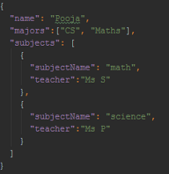

이 포스트는 구글의 flutter 엔지니어인 Pooja Bhaumik 허락을 받아, [Parsing complex JSON in Flutter](https://medium.com/flutter-community/parsing-complex-json-in-flutter-747c46655f51)를 번역한 글 입니다. 독자분의 이해를 도우려 의역을 한 부분도 있습니다. 첫 번역글이라 읽으시며 부족한 점을 느끼실 수도 있습니다. 가급적 원문을 참고하시며 살펴보시는 편을 추천드립니다.

json 파싱을 위해 `dart:convert` 라이브러리를 사용할 것입니다. 이것은 가장 기초적인 방법이고, 플러터를 시작하거나, 작은 프로젝트를 진행하는 경우에 적합한 방법입니다. 그럼에도 플러터에서 JSON을 파싱하는 기초적인 방법을 아는 것은 중요합니다. 이것을 잘 이해하게 되면, 큰 프로젝트를 진행할 때 사용하는 [json_serializable](https://pub.dev/packages/json_serializable) 같은 라이브러리를 사용하게 될 때 어떤 코드로 이루어졌는지 고려할 수 있을거라 생각이 됩니다. 만약 가능하다면 향후 포스트에서 소개하겠습니다.

예시 코드는 [sample project](https://github.com/PoojaB26/ParsingJSON-Flutter)에 있습니다. 이번 포스트에서 다루고 있는 모든 코드를 포함하고 있습니다.

### JSON 구조 #1 : 간단한 MAP

먼저 간단한 JSON style student.json 으로 시작해볼게요.

```dart
{
  "id":"487349",
  "name":"Pooja Bhaumik",
  "score" : 1000
}
```

규칙 #1 : 구조를 확인합니다. JSON 문자열은 Map(key-value pair) 혹은, List of Maps 입니다.

규칙 #2 : curly braces {}로 시작한다면 Map 입니다. Square bracket [] 으로 시작한다면, List of Map 입니다.

`student.json` 은 명백한 map 형태 입니다. 해당 json을 PODO(Plain Old Dart Object) 로 변환시켜보겠습니다. 이 코드는 [student_model.dart](https://github.com/PoojaB26/ParsingJSON-Flutter/blob/master/lib/model/student_model.dart) 에 sample code가 있습니다.

```dart
class Student{
  String studentId;
  String studentName;
  int studentScores;

  Student({
    this.studentId,
    this.studentName,
    this.studentScores
 });
}
```

좋습니다.

정말 그런가요? json map과 PODO 사이에 맵핑을 해주는 코드블록이 없습니다. 또한 entity name도 일치하지 않습니다. 아직 끝나지 않았습니다. 우리는 이 클래스의 요소들을 json 형태로 맵핑해줘야 합니다. 이를 수행하기 위해, `factory` method 를 사용해야 합니다. Dart 문서에 따르면, 생성자가 항상 해당 클래스의 새로운 instance를 생성하지 **않을 때**, `factory` 키워드를 사용합니다. 지금 우리의 상황처럼요.

```dart
factory Student.fromJson(Map<String, dynamic> parsedJson){
    return Student(
      studentId: parsedJson['id'],
      studentName : parsedJson['name'],
      studentScores : parsedJson ['score']
    );
  }
```

새로운 factory method `Student.fromJson` 를 생성했습니다. 이 method의 목적은 간단하게 json을 deserialize 하는 것 입니다.

serialization 과 deserialization에 대해서 먼저 살펴보겠습니다. serialization은 **data 를 string**으로 변환하는 작업입니다. deserialization은 반대로 **string** 을 **data**로 변환하는 작업입니다. Raw data(가공되지 않은 데이터)를 받아 object model로 재생성 하는 것입니다. 이번 글에서는 deserialization을 주로 다루게 될 것입니다. 첫번째 파트에서 우리는 deserialization을 통해 json string을 student.json 으로 변환하는 작업을 하겠습니다. factory method는 converter method로 부를 수도 있겠네요.

또한, `fromjson` method의 인자를 살펴봐야 합니다. `Map<String, dynamic>` 은 `String` key 와 `dynamic` value로 이루어진 map 이라고 정의한 부분입니다. 이것이 구조를 확인해야할 이유가 되는데요, 만약 json이 map의 list라면 달라져야할 부분이기 때문입니다.

**_근데 왜 dynamic 일까요?_**



`name`은 Map<String, String>, `majors`은 문자 배열 그리고 List<String>, `subjects`는 String 객체, List <Object> 입니다. 핵심은, key는 언제나 문자열이고, value는 여러 타입이 될 수 있으므로 안전하게 `dynamic`을 설정한 것 입니다.

`student_model.dart`의 모든 코드를 확인하려면 [여기](https://github.com/PoojaB26/ParsingJSON-Flutter/blob/master/lib/model/student_model.dart)를 클릭해주세요.

### Object에 접근하기

`student.fromJson` 를 실행하고 `Student`로 부터 변수를 가져오는`student_services.dart` 의 코드를 작성해볼게요.

#### Snippet #1 : imports

```dart
import 'dart:async' show Future;
import 'package:flutter/services.dart' show rootBundle;
import 'dart:convert';
import 'package:flutter_json/student_model.dart';
```

마지막 부분은 model 파일로 유동적으로 바꿔주세요.

#### Snippet #2 : Json Asset 불러오기

```dart
Future<String> _loadAStudentAsset() async {
  return await rootBundle.loadString('assets/student.json');
}
```

asset folder에 있는 `student.json`을 불러오는 `_loadAStudentAsset`함수를 만들어 json을 불러오겠습니다. 지금은 이렇게 하지만 만약 json file이 클라우드나 네트워크 요청을 보내야 한다면 그렇게 해주세요.

#### Snippet #3 : 응답 처리하기

```dart
Future loadStudent() async {
  String jsonString = await _loadAStudentAsset();
  final jsonResponse = json.decode(jsonString);
  Student student = new Student.fromJson(jsonResponse);
  print(student.studentScores);
}
```

`loadStudent()` 함수를 설명하겠습니다.

1번 줄 : 가공되지 않은 json 문자열을 가져옵니다.

2번 줄 : 가져온 json 문자열을 dart가 이해할 수 있게 해독 합니다.

3번 줄 : `Student.fromJson` 메소드를 활용해 해독한 json 응답을, `Student` 객체에 적합하게 deserializing 합니다. 이제 우리는 Student 객체에 key 값에 접근할 수 있습니다.

4번 줄 : `studentScore` 값에 접근하여 출력합니다.

_출력된 값을 확인하려면 Flutter 콘솔을 확인해보세요 (안드로이드 스튜디오에서는 Run Tab 안에 있습니다)_

축하드립니다 ! 이제 당신은 첫번째 Json 파싱을 하셨습니다.

_앞서 나온 3가지 Snippet 들을 기억해주세요. 앞으로 진행할 json 예제에서 사용할거에요 (파일 이름, 함수명은 변경될 수 있어요). 그곳에서 다시 반복하지 않을거지만, 모든 코드는 예시 코드에서 확인할 수 있습니다._

### JSON 구조 #2 Simple structure with arrays

이제 우리는 위에 있는 JSON 형태는 파싱할 수 있게 되었는데요, 이번에는 value의 값으로 배열을 포함하는 JSON을 파싱해볼게요.

```dart
{
  "city": "Mumbai",
  "streets": [
    "address1",
    "address2"
  ]
}
```

[adress.json](https://github.com/PoojaB26/ParsingJSON-Flutter/blob/master/assets/address.json) 예제를 보면, city 는 간단한 문자열을 가지고 있지만, streets는 문자열로 이루어져있는 **배열**입니다. 제가 아는 한 Dart는 array 데이터 형태를 가지고 있지 않은데요, 대신에 List<datatype> 을 가지고 있습니다. 그래서 streets의 경우에는 List<String> 이 됩니다.

이제 우리는 **Rule#1 과 Rule#2**를 체크해봐야 합니다. adress.json은 중괄호 {}로 시작하기 때문에 Map이 됩니다. 하지만`streets`는 `List`형태 인데요, 이 것은 우선 신경쓰지 않도록 해요.

그래서 `adress_model.dart` 는 일단 이렇게 될거에요.

```dart
class Address {
  final String city;
  final List<String> streets;

  Address({
    this.city,
    this.streets
  });
}
```

Adress의 경우 Map 이기 때문에, `Adress.fromJson` method는 여전히 `Map<String, dynamic>` 인자를 받고 있습니다.

```dart
factory Address.fromJson(Map<String, dynamic> parsedJson) {

  return new Address(
      city: parsedJson['city'],
      streets: parsedJson['streets'],
  );
}
```

이제 `address_services.dart` 에 위에서 언급한 3가지 snippets 를 추가해 구현하겠습니다. _꼭 기억해주셔야 할 내용은 알맞은 파일, 메소드 이름을 사용하셔야 합니다. 예제 코드는 미리 `adress_services.dart`를 포함하고 있습니다_

이제 코드를 실행하게 되면, 에러를 만나게 될거에요. :/

```dart
type 'List<dynamic>' is not a subtype of type 'List<String>'
```

제가 말씀드렸다 싶이, 이 에러는 dart를 사용해 개발하며 자주 접했던 에러인데요, 아마 독자분들도 그러실 거에요. 제가 이 에러가 어떤 것을 뜻하는지 알려드릴게요. 우리는 `List<String>`을 요구하고 있지만, `List<dynamic>` 을 응답으로 받는 경우입니다. 왜냐하면 우리 어플리케이션은 아직 type을 알아차리지 못하기 때문이에요.

그래서 우리는 명시적으로 `List<String>` 타입이라고 명시를 해줘야만 합니다.

```dart
var streetsFromJson = parsedJson['streets'];
List<String> streetsList = new List<String>.from(streetsFromJson);
```

여기서, 첫번째로 우리는 `streetsFromJson` 변수에 `streets` 깂을 매핑하고 있습니다. `streetsFromJson`은 아직 `List<dynamic>` 타입이에요. 이제 우리는 명시적으로 새로운 `List<String> streetsList` 를 생성할거에요. `streetsList`는 모든 `streetsFromJson` 의 요소를 포함하고 있게 됩니다.

반환하는 JSON 형태에 유의해서 [여기서](https://github.com/PoojaB26/ParsingJSON-Flutter/blob/master/lib/model/address_model.dart) method 가 업데이트 된 것을 확인해보세요. 이제 `adress_service.dart`는 완벽하게 동작할 거에요.

### JSON 구조 #3 : 간단한 nested 구조

만약 JSON이 [shaped.json](https://github.com/PoojaB26/ParsingJSON-Flutter/blob/master/assets/shape.json) nested 구조라면 어떻게 될까요?

```dart
{
  "shape_name":"rectangle",
  "property":{
    "width":5.0,
    "breadth":10.0
  }
}
```

여기서, `property` 는 기본적인 원시타입과 함께 **객체형태**를 포함하고 있는데요, 여기서 PODO는 어떻게 될까요? 이제 쪼개볼게요.

`shape_model.dart`안에서, `Property` class를 만들어볼게요.

```dart
class Property{
  double width;
  double breadth;

  Property({
    this.width,
    this.breadth
  });
}
```

새로 생성된 class `Property`는 첫번째 class `shaped` 의 property 인자에 속해있는 Object 입니다.

**Rule#3**: nested 구조에는, class 와 생성자를 먼저 만들고, *아래 단계*의 factory method를 추가해주면 됩니다.

*아래 단계*를 조금 더 자세히 설명하면, 먼저 우리는 `Property`를 해결하고, 한 단계 위인 `Shape` class로 이동합니다. 이것은 저의 추천이고 flutter의 규칙은 아닙니다.

```dart
factory Property.fromJson(Map<String, dynamic) json){
	return Property(
    width: json['width'],
    breadth: json['breadth']
	);
}
```

간단한 map 입니다.

그러나 `Shape` class를 위한 factory method는 아래와 같이 하면 됩니다.

```dart
factory Shape.fromJson(Map<String, dynamic> parsedJson){
	return Shape(
			shapeName: parsedJson['shape_name'],
			property: parsedJosn['property']
			);
}
```

먼저 `property : parsedJson['property']` 는 아래의 type 에러를 발생시킬거에요.

`type '_InternalLinkedHashMap<String, dynamic>' is not a subtype of type 'Property'`

우리는 `Property` class를 만들었지만 아직 아무 곳에서도 사용하지 않았어요.
맞아요. 여기서 Property를 맵핑해줘야 해요.

```dart
factory Shape.fromJson(Map<String, dynamic> parsedJson){
  return Shape(
    shapeName: parsedJson['shape_name'],
    property: Property.fromJson(parsedJson['property'])
  );
}
```

간단히 보면, `property` entity에서, `Property` class에 있는 `Property.fromJson` 메소드를 불러와 맵핑해주는거에요. [여기서](https://github.com/PoojaB26/ParsingJSON-Flutter/blob/master/lib/model/shape_model.dart) 코드를 확인해보세요.

이제 `shape_services.dart` 를 실행시켜보세요 !

### JSON 구조 #3 : List를 포함한 nested 구조

이번 예시인 [product.json](https://github.com/PoojaB26/ParsingJSON-Flutter/blob/master/assets/product.json) 입니다.

```json
{
    "id": 1,
    "name": "ProductName",
    "images": [
        {
            "id": 11,
            "imageName": "xCh-rhy"
        },
        {
            "id": 31,
            "imageName": "fjs-eun"
        }
    ]
}
```

네 맞아요. 점점 구조가 깊어지고 있어요. 객체 안에서 **배열**이 보이네요.

이번 JSON은 요소에 객체로 이루어진 배열이 포함되어 있어요, 하지만 여전히 객체입니다. (**Rule #1** and **Rule#2** 를 참고해주세요). 이제 **Rule#3** 을 통해 `product_model.dart`를 생성해 볼게요.

먼저 두개의 새로운 class, `Product`와 `Image`를 생성할게요.
_Note:_ `Product`는 `Image`의 배열을 가지고 있습니다.

```dart
class Product {
  final int id;
  final String name;
  final List<Image> images;

  Product({this.id, this.name, this.images});
}

class Image {
  final int imageId;
  final String imageName;

  Image({this.imageId, this.imageName});
}
```

`Image` factory method는 간단해요.

```dart
factory Image.fromJson(Map<String, dynamic> parsedJson){
 return Image(
   imageId:parsedJson['id'],
   imageName:parsedJson['imageName']
 );
}
```

다음은 `Product` 의 factory method 입니다.

```dart
factory Product.fromJson(Map<String, dynamic> parsedJson){
  return Product(
    id: parsedJson['id'],
    name: parsedJson['name'],
    images: parsedJson['images']
  );
}
```

당연히 runtime 에러가 생길거에요.

`type 'List<dynamic>' is not a subtype of type 'List<Image>'`

그러면 이렇게 고쳐볼게요.

```dart
images: Image.fromJson(parsedJson['images'])
```

아직 부족해요. 왜냐하면 `Image` object에 `List<Image>` 를 할당하지 않았기 때문에 에러가 발생해요.

그래서 `List<Image>` 를 먼저 생성하고, `images`를 할당해줄게요

```dart
var list = parsedJson['images'] as List;
print(list.runtimeType); //returns List<dynamic>
List<Image> imagesList = list.map((i) => Image.fromJson(i)).toList();
```

여기서 `list`는 list<dynamic> 형태에요. 앞서 선언한 배열(list) 의 각각의 요소를 매핑합니다. 이 때 `Image.fromJson` 호출해 `image` 형태로 변환해주고, `List<Image> imageList` 에 저장하겠습니다.

모든 코드블록은 [여기서](https://github.com/PoojaB26/ParsingJSON-Flutter/blob/master/lib/model/product_model.dart) 확인할 수 있어요.

### JSON 구조 #5 : List of maps

이제 map의 배열, [photo.json](https://github.com/PoojaB26/ParsingJSON-Flutter/blob/master/assets/photo.json) 을 확인해 볼게요.

```dart
[
  {
    "albumId": 1,
    "id": 1,
    "title": "accusamus beatae ad facilis cum similique qui sunt",
    "url": "http://placehold.it/600/92c952",
    "thumbnailUrl": "http://placehold.it/150/92c952"
  },
  {
    "albumId": 1,
    "id": 2,
    "title": "reprehenderit est deserunt velit ipsam",
    "url": "http://placehold.it/600/771796",
    "thumbnailUrl": "http://placehold.it/150/771796"
  },
  {
    "albumId": 1,
    "id": 3,
    "title": "officia porro iure quia iusto qui ipsa ut modi",
    "url": "http://placehold.it/600/24f355",
    "thumbnailUrl": "http://placehold.it/150/24f355"
  }
]
```

**Rule #1** 와 **Rule #2** 를 통해 이번 형태는 map 이 아닌것을 알 수 있어요. 대괄호 [] 로 시작하기 때문이에요. 이번 형태는 객체로 이루어져있는 배열 (list of object) 인데요, object 에 해당하는 것은 `photo` 입니다.

```dart
class Photo{
  final String id;
  final String title;
  final String url;

  Photo({
    this.id,
    this.url,
    this.title
}) ;

  factory Photo.fromJson(Map<String, dynamic> json){
    return new Photo(
      id: json['id'].toString(),
      title: json['title'],
      url: json['json'],
    );
  }
}
```

아직 부족해요, 우리는 List<Photo> 형태가 필요해요.

```dart
class PhotosList {
  final List<Photo> photos;

  PhotosList({
    this.photos,
  });
}
```

또한, 이번에 다루는 json 형태는 List of maps를 기억해야 해요. 그래서 이번 factory method의 인자는 `Map<String, dynamic>`이 아닌, `List<dynamic>`이 되어야 합니다.

```dart
factory PhotosList.fromJson(List<dynamic> parsedJson) {
    List<Photo> photos = new List<Photo>();

    return new PhotosList(
       photos: photos,
    );
  }
```

이렇게 되면 에러가 발생할거에요.

`Invalid value: Valid value range is empty: 0`

아직 `Photo.fromJosn` 메소드를 사용하지 않았기 때문이에요. List 생성문 뒤에 다음 코드를 추가해주면 어떨까요?

`photos = parsedJson.map((i)=>Photo.fromJson(i)).toList();`

지난번 사용했던 개념과 같아요, 단지 map 형태가 아닌, list 형태이기 때문에 Map의 key에 할당을 안해줘도 되는 것 뿐이에요. [여기서](https://github.com/PoojaB26/ParsingJSON-Flutter/blob/master/lib/model/photo_model.dart) 모든 코드를 확인할 수 있습니다.

### JSON 구조 #6 : 복잡한 nested 구조

[page.json](https://github.com/PoojaB26/ParsingJSON-Flutter/blob/master/assets/page.json)
이번에는 글을 읽는 독자분께서 직접 해결해볼 차례에요. sample project에 포함되어 있어요. Model과 services 파일을 구현하면 되요. 문제를 해결할 때 필요한 힌트와 팁을 먼저 드릴게요.
**Rule#1** 과 **Rule#2** 는 그대로 적용되요. 먼저 구조를 파악해 주세요. 이번 json 형태는 map 이에요. 1-5번의 json 구조가 도움이 될거에요
**Rule #3** 을 통해 classes와 생성자를 먼저 만들어 주세요. 그리고 하위 모델에 factory method를 추가해 주세요. 다른 팁을 드리자면, 하위 모델의 class 들을 추가해주세요. 이번 json 을 통해 예를 들면, `Image` class를 먼저 만들고, 그 다음에 `Data`와 `Author` class를 main class `Page` 안에 생성해주세요 그리고 factory methods를 추가해 주는 것이 전에 말씀드린 순서와 같습니다.

`Image` 와 `Data` class는 json structure #4 ,

`Author` class는 json structure #3 을 참고해주세요.

_Beginner's tip_ : _새로운 asset 추가가 필요할 때 pubspec.yaml 파일에 추가하는 것을 기억하세요_

이 글이 최선의 JSON 파싱을 위한 글이 아닐 수 있겠지만, 독자분께서 적어도 시작하실 때 도움이 되었으면 좋겠네요. 이것으로 이 글을 마치겠습니다.
