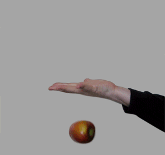
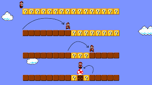

### 재귀?

위에서 사과를 받아서, 사과를 밑으로 던지면, 다시 위에서 사과를 받는다. 위에서 부터 사과를 계속 받고, 밑으로 사과를 던져준다. 재귀함수의 동작 원리와 유사점이 있다. 코드로 옮겨보자.

```python
def pass_an_apple(apple):
    return pass_an_apple(apple)
```

사과를 받아, 사과를 건내주는 재귀함수다. 뒤에서 정리하겠지만, 함수의 인자가 변하지 않고, 탈출조건도 없다. 위 사람은 한번 실행된 이상 계속 반복 할 수밖에 없다(ㅋㅋ).

### 재귀함수의 패턴

재귀함수는 **_원하는 결과가 나올 때 까지, 혹은 탈출 조건을 만족할 때 까지_** 함수 자체를 반복 실행한다. 그렇지 않으면 위의 그림처럼 무한으로 함수가 반복되고, 스택이 흘러 넘치 stack overflow 가 발생한다.

**재귀함수의 패턴**을 세 부분으로 정리했다.
**_핵심은 문제를 나누어 해결하는 것이다._**

1. 함수가 실행될 때 해결할 수 있는 부분은 해결하고 (메인 로직)
2. 나머지 부분은 다음번 실행될 때 수행한다.
3. 원하는 결과가 나오면 함수를 탈출한다.

실제로 문제에 활용해보자. 앞에 나와있는 패턴 1, 2, 3에 따라 쉬운 예제부터 재귀함수의 국민예제 하노이의 탑까지 구현하자. 아. 재귀로 접근할 수 있는 문제는 반복문으로도 해결이 가능하다.

### 재귀함수를 사용 예제

#### 1. Flip

먼저, 간단한 예시로 array의 인자의 순서를 뒤집는 `flip` 함수를 재귀적으로 구현해보자. 인자로 `my_list`를 받아, 거꾸로 뒤집은 `my_list`를 반환하면 된다. javascript 의 Array.prototype.reverse 함수와 같은 역할을 한다. `flip([1,2,3,4,5]) => [5,4,3,2,1]`

##### (1)함수가 한 번 실행될 때 해결할 수 있는 부분

`flip` 함수를 재귀적으로 구현해보자. 무리하지 말자. 한번 실행으로 할 수 있는 부분만 하자. 이 경우에는 **맨 마지막에 있는 인자를 맨 앞으로 꺼내면 된다.**
`[1,2,3,4,5]` 가 주어지면. 맨 인자를 앞으로 꺼내기만 하면 된다.
코드로 구현하면

```python
def flip(my_list):
	return my_list[-:1]

flip([1,2,3,4,5])
//[5]
```

이 경우에 코드는 `my_list[-1:]` 가 된다. 파이썬 문법에서 새로운 list에 마지막 인자를 담아 return 하는 문법이다. 잘 몰랐지만 저렇게 하면 리스트의 맨 뒤에있는 인자를 구할 수 있다.

##### (2) 다음번 실행될 때로 넘겨줘 !

함수가 한 번 실행될 때 해결할 부분, 즉 맨 뒤에있는 인자를 제일 앞으로 가져오는 코드를 위에서 구현했다. 벌써 반을 해결했다. 이제 함수가 함수 자체를 실행하면서, 다음 실행할 때로 나머지 계산을 미뤄보자.
함수 자체를 반복하는 재귀함수의 특성상 동일한 식을 인자에 적용한다. 같은 인자와 같은 식을 반복하면 우리가 원하는 문제를 풀 수 없으므로, 재귀적인 로직을 사용할 때는, 다음 함수에 넘기는 인자를 바꿔주는(축소시키는) 방법을 사용하자.

```python
def flip(my_list):
    return my_list[-:1]

flip([1,2,3,4,5])
//[5]

```

(1)번에서 인자 `my_list`의 맨 뒤에있는 인자를 새로운 배열에 추가했다. 그럼 다음 함수에서 실행할 땐 [1,2,3,4,5]에서 5를 뺀 [1,2,3,4]를 인자로 넣어준다면, 새로운 배열에 4를 추가한다.

```python
def flip(my_list):
    return my_list[-:1] + flip(my_list[:-1])

flip([1,2,3,4,5])
//[5,4,3,2,1]
```

따라서 실행될 때마다 my_list[-:1]의 값에 flip(my_list[:-1]) 더해주면 된다.

##### (3) 재귀함수 탈출조건

위 예제에서는 쓰지 않았지만 재귀함수를 반복해서 실행할때 특정조건이 되면 재귀함수를 탈출할 조건이 필요할 때가 있다. 예를 들어 `flip` 예제에서 array 요소를 뒤에서부터 5개 까지만 출력한다고 할 때,

```python
def flip(my_list):
    if len(my_list)== 6:
        return ['리스트 끝']
    return my_list[-1:] + flip(my_list[:-1])

print(flip([1,2,3,4,5,6,7,8,9]))
# [9, 8, 7, 6, 5, '리스트 끝']
```

이렇게 사용하면 된다.

#### 2. 이진탐색(binary search tree)

`flip` 함수는 어렵지 않았다. 이진탐색을 재귀함수를 활용해 구현해보자.

```python
    def binary_search(element, some_list, start_index=0, end_index=None):
        # end_index가 따로 주어지지 않은 경우에는 리스트의 마지막 인덱스
        if end_index == None:
            end_index = len(some_list) - 1

    print(binary_search(2, [2, 3, 5, 7, 11]))
    print(binary_search(0, [2, 3, 5, 7, 11]))
    print(binary_search(5, [2, 3, 5, 7, 11]))
    print(binary_search(3, [2, 3, 5, 7, 11]))
    print(binary_search(11, [2, 3, 5, 7, 11]))
```

##### (1) 함수가 한번 실행될 때 해결할 수 있는 부분

binary search 의 중요 로직인 list의 가운데 요소의 값을 비교하면 된다.
some_list에서 **가운데 값과 element가 같은지를 확인하는 작업이다. 가운데 값이 맞다면, 해당 인자의 index를 리턴한다.**

따라서

```python
    middleIndex = (startIndex + endIndex)/2 -0.5 # 리스트의 중앙 인덱스값을 구한다
    some_list[middleIndex] == element # 값이 같은지 확인
```

이제 재귀함수를 통해 여러번 반복하면 된다.

##### (2) 다음번 실행할 때로 넘겨줘 !

다음 실핼될 때 함수는 (1) 축소된 리스트를 인자로 받거나 (2) 변경된 시작, 끝의 index 를 넘겨주면 된다. 이번 문제에서는 (2)번 개념을 활용했다. 아래 슈퍼마리오 그림을 보자.


슈퍼마리오가 내려가는 과정은 binary search 를 하는 과정이다. 슈퍼마리오는 위에서부터 ?박스의 가운데를 확인한다. 비교결과에 따라 반씩 제외하며 밑으로 내려간다. ?박스가 한 층에 반씩 줄어든다.

재귀함수로 binary search algorithm 구현할 때도 같다.
리스트의 중앙값이 element 값보다 큰지 작은지 판별해서 startIndex, endIndex를 다음 실행할 때 반영한다.

```
if some_list[mid] > element :
    return binary_search(element, some_list, start_index, mid-1)
elif some_list[mid] < element:
    return binary_search(element, some_list, mid+1, end_index)
```

##### (3) 재귀함수를 탈출할 조건을 구해보자

마지막으로 재귀함수를 탈출할 조건을 구하면 끝이다. 함수의 초입에 탈출 조건을 설정해두고, 매번 실행될 때마다 조건에 해당하는지에 대한 여부를 따져본다.

binary search 알고리즘의 결과는 이 두가지다.

1. 값을 찾았을 때는 리스트의 index를 리턴하면 된다 (끝까지 다 안돌아도 됨)
2. 끝까지 찾아봤는데 인자와 같은 값이 없다면, 이번 경우에는 None 을 리턴하자.

코드로 구현하면

```python
    if some_list[mid] == element:
        return mid

    elif end_index - start_index < 1: # 끝까지 다 돌았을 때
        return None
```

여태까지 3단계로 나누어 작성했던 코드를 합치면 다음과 같이 완성된다. binary search algorithm 을 재귀적으로 구현한 코드의 최종본이다.

```python
    def binary_search(element, some_list, start_index=0, end_index=None):
        # end_index가 따로 주어지지 않은 경우에는 리스트의 마지막 인덱스
        if end_index is None:
            end_index = len(some_list) -1
        mid = (start_index+end_index)//2
        if some_list[mid] == element:
            return mid
        elif end_index - start_index < 1:
            return None
        if some_list[mid] > element :
            return binary_search(element, some_list, start_index, mid-1)
        elif some_list[mid] < element:
            return binary_search(element, some_list, mid+1, end_index)
    print(binary_search(2, [2, 3, 5, 7, 11]))
    print(binary_search(0, [2, 3, 5, 7, 11]))
    print(binary_search(5, [2, 3, 5, 7, 11]))
    print(binary_search(3, [2, 3, 5, 7, 11]))
    print(binary_search(11, [2, 3, 5, 7, 11]))
```

#### 3.하노이의 탑

마지막으로 하노이의 탑이다.


하노이의 탑은 재귀함수의 유용성을 보여주는 가장 적절한 예라고 한다. 이해하기 어려워, 풀이를 먼저 보고 해결했다. 혹시 정리한 부분이 독자분들께도 도움이 될까 이해한 방식을 적어본다.

```python
def move_disk(disk_num, start_peg, end_peg):
    print("%d번 원판을 %d번 기둥에서 %d번 기둥으로 이동" % (disk_num, start_peg, end_peg))

def hanoi(num_disks, start_peg, end_peg):
    # your code

# 테스트 코드
hanoi(3, 1, 3)
```

##### 어떻게 접근할지 모르겠다.

처음 봤을 때 이런 생각이 들었다. 다시 처음으로 돌아가자. 3단계로 정의한 부분을 간략하게 돌아보면 이렇다.

1. 함수가 한번 실행할 때의 메인 로직만 신경쓰자.
2. 나머지 부분은 다음번 실행될 때 수행한다.
3. 원하는 결과가 나오면 함수를 탈출한다.

##### (1) 메인 로직

하노이의 탑은 더욱이 메인 로직을 파악하는 것에 중점을 두어야 잘 이해할 수 있다고 생각한다. 위키피디아에서 하노이의 탑 정의를 가지고 왔다.

> 하노이의 탑(Tower of Hanoi)은 퍼즐의 일종이다. 세 개의 기둥과 이 기둥에 꽂을 수 있는 크기가 다양한 원판들이 있고, 퍼즐을 시작하기 전에는 한 기둥에 원판들이 작은 것이 위에 있도록 순서대로 쌓여 있다. 게임의 목적은 다음 두 가지 조건을 만족시키면서, 한 기둥에 꽂힌 원판들을 그 순서 그대로 다른 기둥으로 옮겨서 다시 쌓는 것이다. from wiki

**결국 하노이의 탑의 가장 핵심 로직은 n번 자리에서 m번 자리로 원반을 옮기는 것이다. 더 자세히 얘기하면 n번 자리의 가장 밑에 있는 원반을 옮기는 것이다**

코드에서 보면 start_peg 의 가장 큰 수의 원반을 end_peg 로 옮겨야 한다. 하지만 이 때 몇가지 규칙이 들어간다.
(1) 한번에 한개 씩만 옮길 수 있고 (2) 큰 원반은 작은 원반 위로 옮기지 못한다. 그럼 결국, start_peg 에서 옮기고 싶은(제일 밑에있는 원반)을 **_제외한_** 나머지를 다른 원반(other_peg)로 옮겨 놓고, 가장 큰 원반을 start_peg -> end_peg 로 옮기면 된다.

pseudocode

```
1-1 **가장 큰 숫자의 원반을 제외한** 나머지 원반을 다른 곳, `other_peg` 로 옮겨놓는다.
1-2 가장 큰 숫자의 원반을 start_peg 에서 end_peg 로 옮긴다
1-3 옮겨놓은 `other_peg`에서 end_peg 로 옮긴다
```

코드로 옮기면 이렇다.

```python
hanoi(?, start_peg, other_peg)
# 1-1 가장 큰 원반을 제외한 나머지를 start_peg 에서 다른 peg로 옮긴다

move_disk(num_disks, start_peg, end_peg)
# 1-2 start_peg의 가장 큰 원반을 end_peg 로 옮긴다

hanoi(?, other_peg, end_peg)
# 1-3 other_peg에 옮겨놓은 것들을 다시 end_peg 로 옮긴다
```

#### (2) 다음번 실행할 때로 넘겨줘 !

위의 코드에서 ?로 표시된 부분을 보자. 위에서 재귀함수를 정의할 때, 다음 번 실행할 함수에 인자를 넘겨줄 때는 **_축소된 인자_**를 넘겨주는 경우가 많다고 했다. (`flip` 함수에서 `flip(list[:-1])`을 인자로 넘겨준 것 과 같은 원리)
하노이의 탑의 경우에는 어떻게 적용하면 될까.

```python
def hanoi(num_disks, start_peg, end_peg):

    hanoi(?, start_peg, other_peg)  # 1-1 가장 큰 원반을 제외한 나머지를 start_peg 에서 다른 peg로 옮긴다

    move_disk(num_disks, start_peg, end_peg) # 1-2 start_peg의 가장 큰 원반을 end_peg 로 옮긴다

    hanoi(?, other_peg, end_peg) # 1-3 other_peg에 옮겨놓은 것들을 다시 end_peg 로 옮긴다
```

두개의 ?만 풀면 하노이의 함수는 거의 끝난다.
먼저 3번줄을 보면, 가장 큰 원반을 제외한 나머지를 옮기는 것이기 때문에, `num_disk-1` 개를 옮겨야 한다.
7번줄은 약간 햇갈릴 수 있는데, 천천히 살펴보자.
other_peg 에서 end_peg 로 갈 때도 똑같이 `hanoi` 함수를 사용해야 한다. 같은 규칙이 적용되기 때문이다. 그러면 결국 7번줄에서 또 hanoi 를 함수를 실행한다는 얘기인데, 이 경우에도 `num_disk-1`이 들어가게 된다. 마지막 num_disk 번째의 원반은 다음 번 실행될 함수에서 `move_disk` 함수에서 최종적으로 end_peg로 때문이다.


처음에 이해가 안간다. 당연하다. 머리 싸매지 말고 함수의 흐름을 따라가보자.

##### (3) 탈출 조건

원반이 하나라면 어떻게 될까?
`start_peg`에서 `end_peg`로 한번에 넘어가면 된다.

```python
if num_disks == 1:
    move_disk(1, start_peg, end_peg)
    return
```

마지막으로 1,2,3 번의 코드를 합치자.

```python
def move_disk(disk_num, start_peg, end_peg):
    print("%d번 원판을 %d번 기둥에서 %d번 기둥으로 이동" % (disk_num, start_peg, end_peg))

def hanoi(num_disks, start_peg, end_peg):
    # 코드를 입력하세요.
    if num_disks == 1:
        move_disk(1, start_peg, end_peg)
        return

    other_peg = 6 -start_peg -end_peg

    hanoi(num_disks-1, start_peg, other_peg)
    move_disk(num_disks, start_peg, end_peg)
    hanoi(num_disks-1, other_peg, end_peg)

# 테스트 코드
hanoi(3, 1, 3)
```

#### 마치며

재귀적인 접근을 시도할 때는, 해당 함수의 가장 중요한 로직이 무엇인지 여러번 생각하는 것이 중요하다.
추상화 단계별로 생각해서 simulation 하자 !
