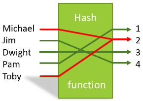

## Hash table 정리

hash table은 key-value 쌍의 데이터를 저장하는 자료구조다. 파이썬의 `dictionary`, 자바스크립트의 `object`가 대표적인 hash table로 구현된 추상 자료형이다.

### 특성

한개의 key에는 하나의 value만 있어야 한다.
예를 들어 key `today` 에 value `sunday` 가 저장 되어있다면, key 값 `today` 에 다른 value 저장하지 못한다 (덮어 쓰기는 가능하다).

### hash table 구현

해시함수는 배열로 구현된다.

1. 고정된 크기에 배열을 만들고
2. **해시함수**를 이용해 key값을 원하는 자연수로 바꾼다
3. 바꾼 자연수 index에 `key`-`value`쌍을 저장한다.

몇가지 의문이 생기는데 천천히 알아보자.
먼저 아래는 1번 **_고정된 크기의 배열_**을 만든다면, 생기는 의문점이다.

-   하나의 key에 하나의 value만 저장할 수 있는 hash table은 저장할 수 있는 데이터에 한계가 있을 수 있다.
-   이를 최소화 하기 위해 `hash table`을 구현 할 때마다, 무지 큰 배열을 만들면 사용하지 않는 메모리 공간 낭비가 심할 수 있다.

결론부터 말하면 hash table은 공간을 효율적으로 사용하기 위해, **_적당한_** 길이의 배열을 메모리에 할당한다. 그리고 예외상황 (충돌)을 관리한다. 자세히 말하면, 해시함수의 결과값은 배열의 index다. 배열의 같은 index에 여러개의 데이터를 저장해야 하는 경우를 **해시충돌** 이라고 한다. 이를 처리하는 한가지 방법은 각 bueckt에 `linkedlist`를 저장한다. 이 방법을 hash table의 `chaining`이라고 한다. 해시함수를 먼저 알아보자.

#### 해시함수?

해시함수는 `key`값이 어떤 자료형이라도(string, int ...) hash table의 length보다 작은 자연수로 변환한다. 많이 쓰이는 방법은 나누기 방법과 곱하기 방법, 두가지가 있다.

```python
def hash_function_remainder(key, array_size):
    """해시 테이블의 key를 나누기 방법으로 0 ~ array_size - 1 범위의 자연수로 바꿔주는 함수"""
    """나머지는 몫보다 클 수 없다"""

    return key % array_size


print(hash_function_remainder(40, 200))
print(hash_function_remainder(120, 200))
print(hash_function_remainder(788, 200))
print(hash_function_remainder(2307, 200))
```

```python
def hash_function_multiplication(key, array_size, a):
    """해시 테이블의 key를 곱셈 방법으로 0 ~ array_size - 1 범위의 자연수로 바꿔주는 함수"""
    temp = a * key # a와 key를 곱한다
    temp = temp - int(temp) # a와 key를 곱한 값의 소숫점 오른쪽 부분만 저장한다

    return int(array_size * temp) # temp와 배열 크기를 곱한 수의 자연수 부분만 리턴한다


print(hash_function_multiplication(40, 200, 0.61426212))
print(hash_function_multiplication(120, 200, 0.61426212))
print(hash_function_multiplication(788, 200, 0.61426212))
print(hash_function_multiplication(2307, 200, 0.61426212))
```

### hash table의 충돌



위 그림에서 key `Michael` 과 `Toby` 는 같은 index `2`에 저장되어야 한다. 다른 key값이 해시함수를 통해 나온 결과가 달랐을 때, 해시충돌이 일어나게 된다. 충돌을 다루는 방법 중 크게 두가지를 살펴보자.

#### hash table chaining

충돌이 일어났을 때, chaining을 사용할 수 있다, bucket에 `linkedList` 를 저장하는 방법이다.
(이 때의 링크드 리스트의 node는 `key`값도 포함할 수 있어야 한다.)

```python
class HashTable:
    """해시 테이블 클래스"""

    def __init__(self, capacity):

        # 파이썬 리스트 수용 크기 저장
        self._capacity = capacity

        # 파이썬 리스트 인덱스에 링크드 리스트 저장
        self._table = [LinkedList() for _ in range(self._capacity)]

```

리스트 인덱스에 링크드 리스트가 저장되었다면, key-value 쌍을 삽입하는 방법은 다음과 같다.

1. 해시 함수를 통해 key 에 해당하는 값을 list의 인덱스로 바꾼다.
2. 해당 index의 row 로 접근한다.
3. linked list에서 input 값으로 주어진 key 가 있는지 찾는다
    1. 있다면 덮어쓰고
    2. 없다면 새로 추가한다.

아래는 해시 테이블의 `insert`에 해당하는 코드.

```python
def insert(self, key, value):
    """
    새로운 key - value 쌍을 삽입시켜주는 메소드
    이미 해당 key에 저장된 데이터가 있으면 해당 key에 해당하는 데이터를 바꿔준다
    """
    existing_node = self._look_up_node(key)  # 이미 저장된 key인지 확인한다

    if existing_node is not None:
        existing_node.value = value  # 이미 저장된 key면 데이터만 바꿔주고
    else:
        # 없는 key면 링크드 리스트에 새롭게 삽입시켜준다
        linked_list = self._get_linked_list_for_key(key)
        linked_list.append(key, value)
```

**Chaining 을 쓰는 해시테이블의 시간복잡도**

-   삽입
    탐색을 안하고 삽입을 하면, 같은 key-value 쌍이 중복으로 저장될 수 있다.
    만약 key가 존재한다면 **수정, 그렇지 않다면 추가한다**

    -   해시함수 계산 + 배열 인덱스 접근 + 링크드 리스트 탐색 + 링크드 리스트 추가
    -   O(1) + O(1) + O(n) + O(1) = O(n)

-   삭제

    -   해시함수 계산 + 배열 인덱스 접근 + 링크드 리스트 탐색 + 링크드 리스트 삭제
    -   O(1) + O(1) + O(n) + O(1) = O(n)

-   탐색
    -   해시함수 계산 + 배열 인덱스 접근 + 링크드 리스트 탐색
    -   O(1) + O(1) + O(n) = O(n)

링크드 리스트 탐색이 O(n)의 시간복잡도를 가지므로, 해시테이블의 시간복잡도는 O(n)인것 처럼 보인다.
**하지만 !! 다음 표를 살펴보자**


m = `key-value` 쌍의 갯수
n = hash table이 사용하는 배열의 크기

chaining 갯수는 m/n 이다.

그럼 위의 최악의 상황(O(n))이 아니라 평균적인 상황에는 O(m/n) 시간복잡도가 소요된다.

하지만 해시함수를 사용할 때는 배열의 크기를 항상 key-value 쌍보다 크거나 같다고 가정을 한다.
m=n 정도를 유지한다고 하는건데,

그럼, O(m/n) = O(1)이 된다.

따라서 해시함수의 삽입, 추가, 삭제 연산은 평균적으로 O(1)이다.

#### open addressing 으로 충돌 다루기

open adressing은 linkedlist를 저장하지 않고, 다른 비어있는 주소에 저장하는 것이다.
**_다른 비어있는 index를 어떻게 찾을까?_**

1. 선형탐사 linear probing
   다음 빈칸을 보면서 비어있는지에대한 여부를 찾는다, 비어있으면 거기에 저장한다

2) 제곱탐사 Quadratic Probing
   다음 인덱스를 찾고, 인덱스 + 1의제곱, 누적 인덱스 + 2의제곱, 누적 인덱스 + 3의제곱 형태로 찾는 형태
