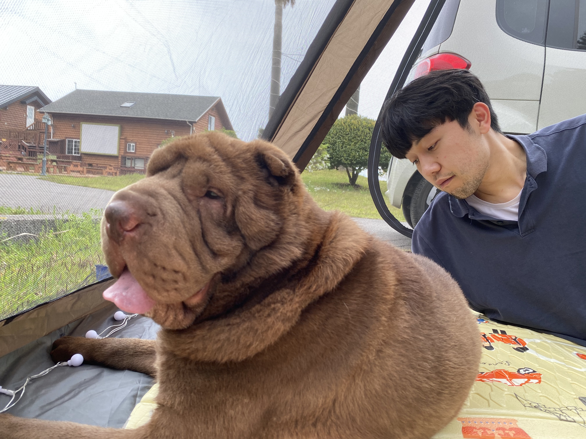

연휴를 맞아 장군이와 함께 제주 여행을 떠났다.

할머니 말씀에 따르면 제주도는 고사리 천국이다. 다음 날 아침 일찍 고사리를 캐러 장군이와 함께 한라산 중턱 야산에 갔다. 인적이 드문 곳이라 목줄을 풀러줬다. 장군이는 이사람 저사람에게 뛰어다녔다. 행복해 보였다.

문제는 다음이였다. 장군이의 배와 입 주변, 발 끝 등 여러 부위에서 진드기를 발견했다. 족히 200마리는 넘어보였다.

사실 산에서 돌아오며 외부기생충 예방약을 발라줬다. 48시간 내에 장군이의 신체에 있는 모든 기생충으로부터 보호해주는 약이였다. 하지만, 몸에 다닥다닥 붙어있는 진드기를 지켜보기 힘들었다. 핀셋으로 떼기 시작했다. 장군이의 살갗을 꼭 물고있는 진드기보다, 예방을 하지 않았던 나에게 화가 났다.
꼬리가 바짝 내려가있었다. 카밍 시그널에 의하면, 반려견이 보호를 받고 있다고 느끼는 신호라고 한다. 진작 장군이를 지켜주지 못해 미안했다.

여행을 떠나기 며칠 전 강형욱님의 교육 영상을 접했다. 반려견의 심리를 파악하고, 인간적으로 그들을 대해주는 모습이 감명깊었다. 어떤 이유인지는 모르겠지만, 강형욱 훈련사님은 꼭 '보호자' 님이라고 부른다. 강훈련사님의 의도가 들어갔다고 생각한다.

나는 장군이 보호자다. 장군이와 함께한지 4년정도 되었다. 첫 일년은 한국에 올 준비, 그 다음엔 아토피와의 전쟁, 취업이다 뭐다 신경을 잘 써주지 못한 기간에도, 한창 진드기 철에 예방 하지 않고 야산에 함께했던 순간에도 나는 장군이 보호자였다.

그렇게 장군이도 나도 잠을 설치고, 이튿날이 되었다. 테라스에서 책을 읽고 있는데 멀리서 이모가 오고있었다. 장군이는 이모를 알아보지 못하고 경계태세를 하며 짖고 있었다. "너 이모한테 왜그래" 했지만 그 때 생각했다.

장군이도 나를 지켜주고 싶었던 것 같다.

