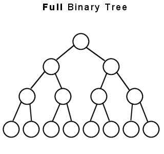

Tree는 데이터의 **상-하 (계층적)** 관계를 저장하는 자료구조다.


### 특징
1. 계층적 관계가 있는 자료를 자연스럽게 저장할 수 있다.
2. 정렬, 압축 등을 효율적으로 해결할 수 있다.
3. dict, set, queue 등의 추상 자료형을 구현할 수 있다.
4. Binary Tree, Heap, Binary Search Tree 등 특성에 따라 구분된다.


## Binary Tree (이진 트리)

이진트리는 노드가 최대 두 개의 자식 노드(왼쪽, 오른쪽)를 갖는 자료구조다. 트리의 루트 노드는 모든 노드의 조상이다.

1. 포화 이진트리



포화 이진트리는 모든 내부 노드가 두개의 자식 노드를 가지며, 말단 노드가 같은 깊이 또는 레벨을 가진다. 위 트리의 경우 깊이(depth)가 4인 포화 이진트리다.

포화 이진트리는 말단 노드의 수를 n, 높이를 h라고 할 때 다음과 같은 계산이 가능하다.
n = 2^h
h = logn


2. 완전 이진 트리


완전 이진 트리는 마지막 레벨을 제외한 모든 레벨이 완전히 채워저 있고, 마지막 레벨의 모든 말단 노드는 왼쪽에 있는 경우다.


````python
class Node:
	"""이진 트리 노드 클래스"""
	def __init__(self, data):
		"""데이터와 두 자식 노드에 대한 레퍼런스를 갖는다"""
		self.data = data
		self.left_data = None
		self.right_data = None


root_node = Node(2)
node_b= Node(3)
node_c= Node(5)
node_d= Node(7)
node_e= Node(11)

root_node.left_child = node_b
root_node.right_child = node_c

````

##### 완전 이진트리 배열로 구현하면 다음과 같이 구현할 수 있다.

`complete_binary_tree = [None, 1, 5, 12, 11, 9, 10, 14, 2, 10]`

- 부모 노드 index : n // 2 (2로 나눈 몫)
- 왼쪽 자식 index: n *2
- 오른쪽 자식 index : n*2 + 1


## Heap

- 힙은 완전 이진트리다.
- 모든 부모노드의 데이터는 자식노드보다 크거나 같다.

2번째 속성 만족하기 위한 `heapify` 함수.

````python

def swap(tree, index_1, index_2):
    """완전 이진 트리의 노드 index_1과 노드 index_2의 위치를 바꿔준다"""
    temp = tree[index_1]
    tree[index_1] = tree[index_2]
    tree[index_2] = temp


def heapify(tree, index, tree_size):
    """heapify 함수"""

    # 왼쪽 자식 노드의 인덱스와 오른쪽 자식 노드의 인덱스를 계산
    left_child_index = 2 * index
    right_child_index = 2 * index + 1

    # 일단 부모 값이 제일 크다고 설정,
    largest_element= index

    # 왼쪽 자식 값과 비교
    if tree[largest_element] < tree[left_child_index] and tree[right_child_index] < tree[left_child_index] < tree_size:
    	largest_element = left_child_index

   	# 오른쪽 자식 값과 비교
	if tree[largest_element] < tree[right_child_index] and tree[left_child_index] < tree[right_child_index] < tree_size:
	    	largest_element = right_child_index

	# largest 값이 부모가 아니라면, 바꿔준 후 heapify 실행
	if largest_element != index:
		swap(tree, largest_element, index)
		heapify(tree, largest_element, tree_size)
		
	return 
````

조금 전에 구현한 `heapify` 함수의 시간복잡도는 이진 트리의 ***최대 높이***만큼 실행되므로 시간복잡도는 O(log(n))이 된다.

heapify 함수를 tree의 모든 노드에 실행하면 힙을 사용한 정렬, **힙 정렬**이다. 
- 시간 복잡도는 n * log(n) = nlog(n)이다 
- 사실상 모든 노드에 `heapify` 함수를 호출하지 않아도 되므로, 


### 우선순위 Queue
 
자료구조 `heap` 을 사용해서 우선순위 queue 를 구현할 수 있다. 데이터를 `dequeue` 할 때, 우선순위가 높은 순서대로 추출한다. 우선순위 Queue의 삽입, 추출 과정을 알아보자.


#### 우선순위 Queue의 삽입, 추출
**삽입**
- heap에 마지막 부분에 삽입하고, 힙 속성을 만족하기 위해 `reverse_heapify` 메소드를 호출한다. 힙 속성을 만족할 때 까지 삽입할 노드를 부모와 바꾸어주는 작업이다.

**추출**
- heap의 root 노드를 제거하고, 마지막 leaf를 root에 올린다. 그 후 heap 속성을 만족할 때 까지 heapify를 호출한다.


````python
def reverse_heapify(tree, index):
    """삽입된 노드를 힙 속성을 지키는 위치로 이동시키는 함수"""
    parent_index = index // 2  # 삽입된 노드의 부모 노드의 인덱스 계산
    # 코드를 쓰세요.
    if not tree[parent_index]:
        return
    if len(tree) > parent_index:
        if(tree[index] > tree[parent_index]):
            swap(tree, index, parent_index)
            reverse_heapify(tree, parent_index)
    else:
        return

class PriorityQueue:
    """힙으로 구현한 우선순위 큐"""
    def __init__(self):
        self.heap = [None]  # 파이썬 리스트로 구현한 힙


    def insert(self, data):
        """삽입 메소드"""
        self.heap.append(data)
        reverse_heapify(self.heap, len(self.heap)-1)
    
    def extract_max(self):
	    """최우선순위 데이터 추출 메소드"""

	    return_value = self.heap[1] # return value 저장
	    swap(self.heap, 1, len(self.heap)-1) 
	    self.heap.pop()
	    heapify(self.heap, 1, len(self.heap))
    	return return_value

    def __str__(self):
        return str(self.heap)
````

시간복잡도는 추출과 삽입 모두 O(lg(n))이 걸린다. (최대 높이만큼 부모/자식간에 비교를 수행하기 때문)


## 이진 탐색 트리 (binary search tree)
이진 탐색 트리는 부모 노드를 기준으로 작은 값은 왼쪽, 큰 값은 오른쪽 자식에 저장한다.


**삽입**

````python
 
 def insert(self, data):
        """이진 탐색 트리 삽입 메소드"""
        new_node = Node(data)  # 삽입할 데이터를 갖는 노드 생성

        # 트리가 비었으면 새로운 노드를 root 노드로 만든다
        if self.root is None:
            self.root = new_node
            return

        temp = self.root  # 저장하려는 위치를 찾기 위해 사용할 변수. root 노드로 초기화한다


        # 원하는 위치를 찾아간다
        while temp is not None:
            if data > temp.data:  
            	# 삽입하려는 데이터가 현재 노드 데이터보다 크다면
                # 오른쪽 자식이 없으면 새로운 노드를 현재 노드 오른쪽 자식으로 만듦
                if temp.right_child is None:
                    new_node.parent = temp
                    temp.right_child = new_node
                    return
                # 오른쪽 자식이 있으면 오른쪽 자식으로 간다
                else:
                    temp = temp.right_child
            else:  
            	# 삽입하려는 데이터가 현재 노드 데이터보다 작다면
                # 왼쪽 자식이 없으면 새로운 노드를 현재 노드 왼쪽 자식으로 만듦
                if temp.left_child is None:
                    new_node.parent = temp
                    temp.left_child = new_node
                    return
                # 왼쪽 자식이 있다면 왼쪽 자식으로 간다
                else:
                    temp = temp.left_child

````

**탐색**
````python
    def search(self, data):
        """이진 탐색 트리 탐색 메소드, 찾는 데이터를 갖는 노드가 없으면 None을 리턴한다"""
        temp = self.root
        while temp is not None:
            if data == temp.data:
                return temp
            elif data > temp.data:
                temp = temp.right_child
            else:
                temp = temp.left_child
                
        return None
````

**삭제**

이진 탐색트리에서 element를 삭제할 때 주의할 점은, 지우려는 노드의 특성 따라 분기한다.

1. leaf 노드일 때: parents node에서 연결을 끊어주면 된다.
2. 자식이 하나인 노드일 때: 자식과 부모와의 연결을 맺는다. 부모와 연결을 끊는다.
3. 자식이 둘인 노드일 때 : 오른쪽 자식노드에서 가장 작은 값과 바꾼다 (`find_min` 함수), leaf 노드인 경우에 삭제한다.


````python
    def delete(self, data):
        """이진 탐색 트리 삭제 메소드"""
        node_to_delete = self.search(data)  # 삭제할 노드를 가지고 온다
        parent_node = node_to_delete.parent  # 삭제할 노드의 부모 노드

        # 경우 1: 지우려는 노드가 leaf 노드일 때
        if node_to_delete.left_child is None and node_to_delete.right_child is None:
            if self.root is node_to_delete:
                self.root = None
            else:  # 일반적인 경우
                if node_to_delete is parent_node.left_child: 
                    parent_node.left_child = None
                else:
                    parent_node.right_child = None

        # 경우 2: 지우려는 노드가 자식이 하나인 노드일 때:
    	# 지우려는 노드가 오른쪽 자식만 있을 때:
        elif node_to_delete.left_child is None: 
            # 지우려는 노드가 root 노드일 때
            if node_to_delete is self.root:
                self.root = node_to_delete.right_child
                self.root.parent = None
            # 지우려는 노드가 부모의 왼쪽 자식일 때
            elif node_to_delete is parent_node.left_child:
                parent_node.left_child = node_to_delete.right_child
                node_to_delete.right_child.parent = parent_node
            # 지우려는 노드가 부모의 오른쪽 자식일 때
            else:
                parent_node.right_child = node_to_delete.right_child
                node_to_delete.right_child.parent = parent_node

        elif node_to_delete.right_child is None:  
        	# 지우려는 노드가 왼쪽 자식만 있을 때:

            # 지우려는 노드가 root 노드일 때
            if node_to_delete is self.root:
                self.root = node_to_delete.left_child
                self.root.parent = None
            # 지우려는 노드가 부모의 왼쪽 자식일 때
            elif node_to_delete is parent_node.left_child:
                parent_node.left_child = node_to_delete.left_child
                node_to_delete.left_child.parent = parent_node
            # 지우려는 노드가 부모의 오른쪽 자식일 때
            else:
                parent_node.right_child = node_to_delete.left_child
                node_to_delete.left_child.parent = parent_node

        # 양쪽 다 자식이 있을경우
        # 오른쪽 자식에서 가장 작은 값을 대체한다
        else:
            successor = self.find_min(node_to_delete.right_child)
            temp_data = successor.data
            self.delete(successor.data)
            node_to_delete.data = temp_data

````

