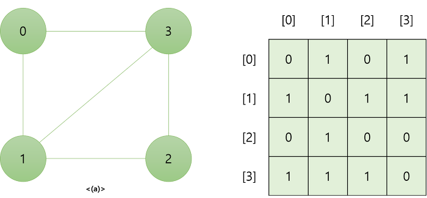
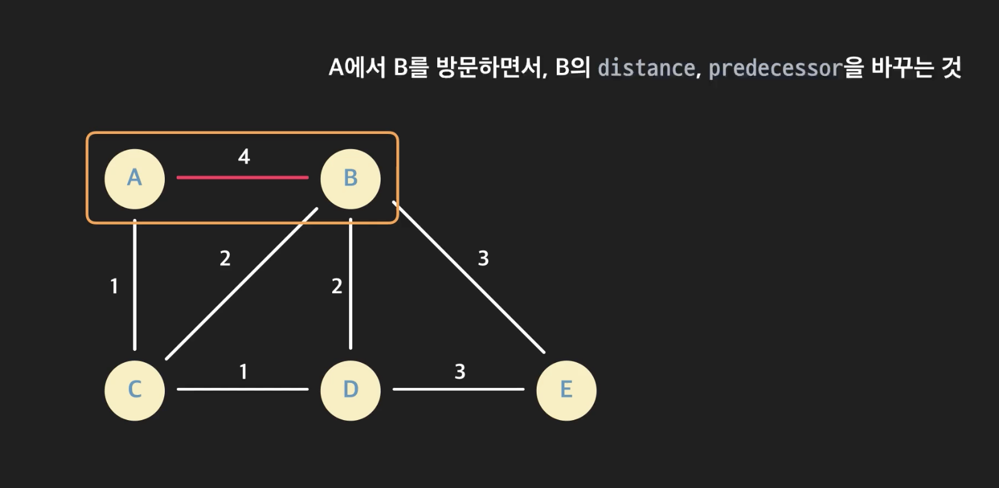

그래프는 데이터 간에 **연결관계**가 있는 자료구조다. 사회 연결망(SNS), 위치 데이터 에서 친구 관계를 나타내거나 A와 B 지점사이의 거리 등을 저장할 때 효과적으로 사용된다.


-   노드(node): 그래프에서 하나의 데이터 단위를 나타내는 객체. SNS 그래프에서는 하나의 유저가 하나의 노드다. 위 그래프에서는 각가지 색의 원이 노드.

-   엣지(edge): 데이터 간에 **연결관계**를 나타내주는 데이터. 엣지의 특성에 따라 "방향 그래프"와 "가중치 그래프"로 그래프가 나뉠 수 있다.

-   뱡향 그래프: edge가 방향성을 갖는 그래프를 말한다. 인스타그램의 팔로우 관계는 페이스북의 친구 시스템과는 다르게 방향성이 있다. A ->B 와 B ->A 관계가 각각 존재한다.

-   가중치 그래프: edge에 연결관계와 어떤 정보를 의미하는 수치가 포함되어 있다. 예를 들어, A -> B 도시로 가는 항공편은 8시간이 걸린다. 이 때 가중치는 비행시간을 의미한다.

-   차수: 하나의 노드에 연결된 **엣지의 수**
-   경로: 한 노드에서 다른 노드까지 가는 길. **_이때 경로는 최단거리 뿐만아니라 A-> B로 연결된 모든 경우를 포함한다_**

### 엣지(Edge) 구현

노드간에 연결관계를 나타내는 엣지를 구현하는 방법은 **(1)인접행렬**과 **(2)인접 리스트** 두가지 방법이 있다.

#### 인접 행렬

n개의 노드가 존재한다고 할 때, n x n 2차원 행렬에 노드의 연결관계를 참/거짓으로 저장하는 방법이다.



```python
# n * n 빈 행렬 만들기
adjacency_matrix = [[0 for i in range(4)] for i in range(4)]

# 노드 0의 edges
adjacency_matrix[0][1] = 1
adjacency_matrix[0][3] = 1

# 노드 1의 edges
adjacency_matrix[1][0] = 1
adjacency_matrix[1][2] = 1
adjacency_matrix[1][3] = 1

..
```

#### 인접 리스트

인접한 노드를 `list`에 저장하는 방법이다. **방향그래프 에서는 A ->B일 때, A노드에서 B를 저장한다.**
위 그래프를 인접리스트로 구현한다면,

```python
Node[0].adj_list = [Node[1], Node[3]]
Node[1].adj_list = [Node[0], Node[2], Node[3]]
...

```

이런 방식이 된다.

#### 인접 행렬 vs 인접 리스트, 시/공간복잡도

##### 공간복잡도

**노드**를 저장하는 공간은 O(V)로 행렬과 리스트 두 경우 모두 같다.
**간선(Edges)**를 저장하는 공간에서 차이가 있다.

-   **인접행렬**이 차지하는 공간은 **O(V^2)**다. 연결의 여부와 관련없이 n x n의 이차원 행렬을 만들기 때문이다.

-   **인접리스트**는 각 노드마다 리스트 저장 **O(V)** + 간선의 갯수 **O(E)** = O(V+E)의 공간을 차지한다.

##### 시간복잡도

**두 노드가 연결됐는지 확인하는데 걸리는 시간**
인접행렬 : O(1) ex) `adjacency_matrix[3][5]`
인접리스트: 노드에 접근 O(1)해 선형탐색으로 리스트를 확인해야 한다. 최악의 경우 O(V)

**한 노드에 연결된 모든 노드들을 알아내는데 걸리는 시간**

인접행렬: 모든 노드에 접근해 연결상태를 확인한다. **O(V)**
인접리스트: 각 노드가 자신과 인접한 노드들에 대한 레퍼런스만 가지고 있어 더 효율적이다.

### 그래프 탐색

그래프 탐색은 모든 노드를 방문한다. (1)너비 우선 탐색(BFS), (2)깊이 우선 탐색(DFS)등 이 있다.
두가지 방법을 일반화 하면 아래와 같다.

#### Breadth First Search (BFS)

-   너비 우선 탐색

1. 시작 노드를 방문 표시 후, 큐에 삽입
2. while queue:
    1. dequeue()
    2. 이 인접한 노드를 모두 보면서
        1. 방문한 노드 표시를 해준다.
        2. 큐에 넣어준다

#### Depth First Search (DFS)

-   너비 우선 탐색

1. 시작 노드를 방문 표시 후, 스택에 삽입
2. while stack:
    2. stack.pop()
    3. 이 노드에 인접한 노드를 돌면서
        1. 방문 안한 노드면
            1. 방문 처리하고
            2. 스택에 넣는다

#### 최단경로

그래프의 특성에 따라 사용되는 최단거리 알고리즘이 다르다.

-   BFS

    -   **비 가중치 그래프**에서만 구할 수 있음
    -   각 노드가 어디서 왔는지에 대한 `predecessor` 를 저장
    -   목적지 노드에서 backtracking 방식으로 접근한다. (F -> C -> B -> A)
    -   왜 BFS 가 최단경로인가?
        -   A 가 시작점이고, F가 도착점이라고 했을 때, A 에서 출발해 F를 처음 맞닥드리는 순간이, 제일 빨리 찾을 수 있는 경우다. 이 때 F에 접근할 수 있는 노드는 predecerssor 에 저장한다

-   Dijkstra
    -   가중치 그래프에서 사용할 수 있음
    -   "현재까지 알고있던 최단 경로를 계속해서 갱신한다"
    -   다이나믹 프로그래밍 (최단거리는 여러 개의 최단거리로 이루어져있기 때문)
    -   distance: 최단 거리 예상치 (현재까지 아는 정보로 계산한 최단 거리)
    -   predecessor : 최단거리일 때, 직전 노드
    -   complete: 노드까지의 최단 경로를 찾았다고 표시하기 위한 변수



**✔️relaxation** : 현재 최단 거리 예상치와, predecessor를 더 작은 경우에 업데이트 해주는 작업.

-   모든 distance는 ∞로 설정한다.
-   start point : A

1. A와 연결되어있는 모든 노드들에 **_relaxzation_** 해준다
2. A-B = 4, A-C =1이다.
3. A는 방문했다고 check 해준다.
4. 그 다음 A와 연결되어있는 distance 중, 최소값 C에 가면 되는데 **이 때 A-C는 최소값이다. 왜냐하면, C-B가 연결되어있다고 해도 최소값이 업데이트 되기 위해서는 A-C 보다 작아야 한다.**
5. C 로 간다
6. A는 **이미 방문했으므로 더이상 건들이지 않는다**
7. C-B의 관계는, distance 보다 새로운 거리가 작으므로, 업데이트 해준다. (relaxization)

## 마치며

-   graph는 데이터 간에 연결관계를 저장할 때 유용하게 쓰이는 자료구조다.
-   인접행렬과 인접리스트를 사용해 구현할 수 있다.
-   대표적인 탐색방법은 BFS, DFS 다.
-   최단경로는 BFS, Dijkstra 알고리즘을 통해 구현할 수 있다.
