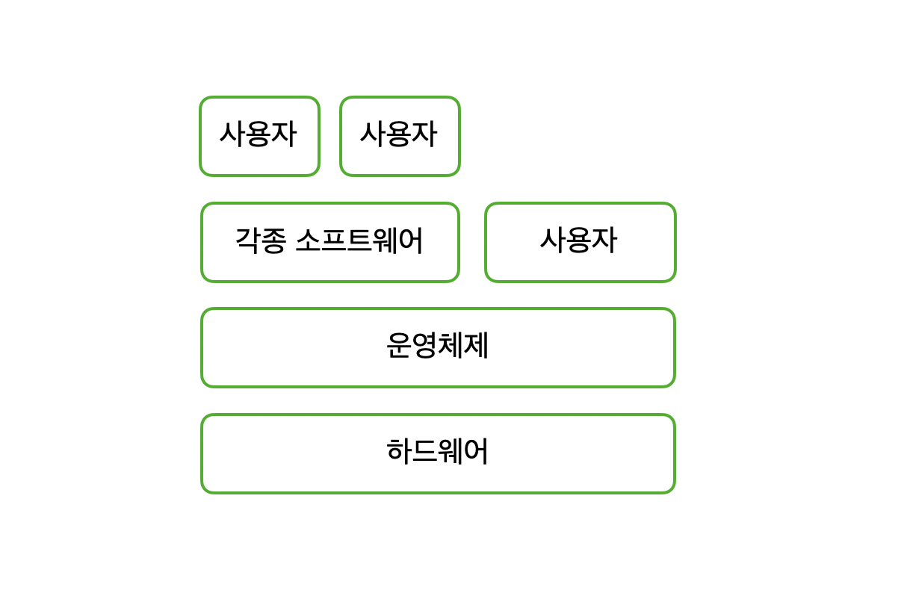

본 포스팅은 kowc에서 제공하는 [반효경 교수님의 운영체제](http://www.kocw.net/home/search/kemView.do?kemId=1046323&ar=pop) 강의를 듣고 정리한 글 입니다.

### 운영체제(Operating System) 란?

컴퓨터 하드웨어 바로 위에 설치되어 사용자 및 다른 소프트웨어와 하드웨어를 연결하는 소프트웨어 계층이다. 일반적으로 운영체제라 함은 각종 시스템 유틸리티를 포함한 개념이지만, software 관점에서는 운영체제의 핵심으로 메모리에 상주하는 부분인 **커널** 을 뜻한다.

### 운영체제를 왜 사용할까?

컴퓨터 시스템의 **자원을 효율적으로 사용** 하고, 사용자가 **편리하게 컴퓨터를 사용** 할 수 있게 해준다.
1. 자원의 효율적 사용
- 주어진 하드웨어 장치 (프로세서(CPU), 기억장치, 입출력 장치) 로 최대한의 효율을 내도록.
- 사용자 간의 형평성 있는 자원을 분배

2. 사용자의 편리성
- 실행중인 프로그램에 CPU를 짧은 시간에 번갈아 할당하여 **사용자/프로그램**이 독자적인 환경에서 수행하는 것 같은 환상을 제공한다.
- 실행중인 프로그램에 **메모리 공간을 적절히 분배** 하여, 하드웨어를 직접 다루는 복잡한 부분을 운영체제가 대행한다.

### 운영체제의 분류

운영체제는 동시 작업 여부, 사용자의 수, 처리 방식에 따라 나뉜다.
- 동시 작업 가능 여부
    - 단일 작업 : 한 번에 하나의 작업만 처리 (ex, MS-DOS)
    - 다중 작업 : 동시에 두 개 이상의 작업 처리 (ex, UNIX, MS Windows)
- 사용자의 수 : 동시에 접근할 수 있는지
    - 단일 사용자
    - 다중 사용자
- 처리 방식
    - 일괄 처리 (batch processing)
        - 작업의 일정량을 **모아 한꺼번에 처리**
        - 작업이 완전 종료될 때 까지 기다려야 함
    - 시분할 (time sharing)
        - 여러 작업을 수행할 때 컴퓨터가 처리 능력을 일정한 시간 단위로 분할하여 사용
        - 일괄 처리 시스템에 비해 짧은 응답 시간을 가짐
        - interative한 방식
    - 실시간 (Realtime OS)
        - 정해진 시간 안에 어떠한 일이 반드시 종료됨이 보장되어야 하는 실시간 시스템을 위한 OS
        - 예) 원자로/공장 제어, 미사일 제어, 반도체 장비, 로보트 제어
    - 실시간 시스템의 개념 확장
        - Hard realtime system(경성 실시간 시스템)
        - Soft realtime system(연성 실시간 시스템)

### 운영 체제의 예

- 유닉스(Unix)
    - 대부분을 **C언어**로 작성
    - 높은 이식성(portability)
    - 최소한의 커널 구조
    - 복잡한 시스템에 맞게 확장 용이
    - 소스 코드 공새
    - 프로그램 개발에 용이
    - 다양한 버전

- DOS(disk operating system)
    - MS사의 1981년 IBM-PC를 위해 개발
    - 단일 사용자용 운영체제, 메모리 관리 능력의 한계 (주 기억 장치: 640KB)

- MS windows
    - MS 사의 다중 작업용 GUI 기반 운영 체제
    - plug and play, network environment 강화
    - DOS용 응용 프로그램과 호환성 제공
    - 불안정성
    - 풍부한 지원 소프트웨어

- Handheld device를 위한 OS
    - palmOS, Pocket PC(WinCE), Tiny OS

