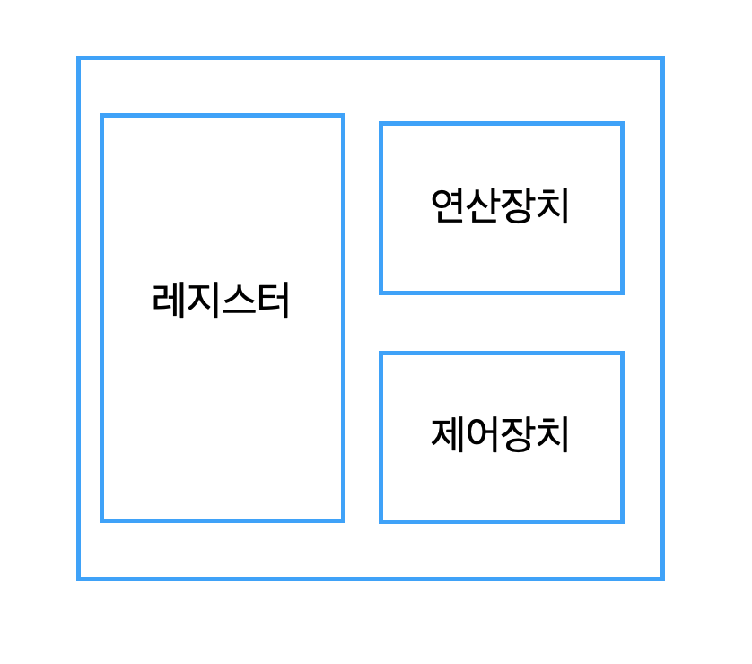

kowc에서 제공하는 [반효경 교수님의 운영체제](http://www.kocw.net/home/search/kemView.do?kemId=1046323&ar=pop) 강의를 듣고 정리한 글 입니다.

| chapter                                                                                                                                                                                                                                                                                             | 핵심 내용                               |
| --------------------------------------------------------------------------------------------------------------------------------------------------------------------------------------------------------------------------------------------------------------------------------------------------- | --------------------------------------- |
| 1. [운영체제 란?](<https://oowgnoj.dev/%EC%9A%B4%EC%98%81%EC%B2%B4%EC%A0%9C%20(kernel)>)                                                                                                                                                                                                            | 운영체제의 개요                         |
| 2. [시스템 구조](https://oowgnoj.dev/%EC%96%B4%EB%96%BB%EA%B2%8C%20%ED%94%84%EB%A1%9C%EA%B7%B8%EB%9E%A8%EC%9D%B4%20%EC%8B%A4%ED%96%89%EB%90%A0%EA%B9%8C%20feat.%20%EC%8B%9C%EC%8A%A4%ED%85%9C%20%EA%B5%AC%EC%A1%B0)                                                                                 | 컴퓨터 시스템 구조에 대한 개괄적인 설명 |
| 3. [프로세스](https://oowgnoj.dev/%ED%94%84%EB%A1%9C%EC%84%B8%EC%8A%A4%20-%20%EC%9A%B4%EC%98%81%EC%B2%B4%EC%A0%9C%EA%B0%80%20%EC%8B%A4%ED%96%89%EC%A4%91%EC%9D%B8%20%ED%94%84%EB%A1%9C%EA%B7%B8%EB%9E%A8%EC%9D%84%20%EA%B4%80%EB%A6%AC%ED%95%98%EB%8A%94%20%EB%B0%A9%EB%B2%95)                      | 실행중인 프로그램 : 프로세스            |
| 4. [프로세스 스케줄링](https://oowgnoj.dev/%EC%BB%B4%ED%93%A8%ED%84%B0%EA%B0%80%20%EC%9E%90%EC%8B%A0%EC%9D%98%20%EA%B0%80%EC%9E%A5%20%EB%B9%84%EC%8B%BC%20%EC%9E%90%EC%9B%90%EC%9D%84%20%EA%B4%80%EB%A6%AC%ED%95%98%EB%8A%94%20%EB%B0%A9%EB%B2%95%20-%20CPU%20%EC%8A%A4%EC%BC%80%EC%A4%84%EB%A7%81) | 운영체제의 프로세스 스케줄 관리         |
| 5. [프로레스 동기화](https://oowgnoj.dev/%EB%82%B4%EA%B0%80%20%EB%8D%B0%EC%9D%B4%ED%84%B0%EB%A5%BC%20%EC%93%B0%EA%B3%A0%EC%9E%88%EC%96%B4%20%EC%9E%A0%EC%8B%9C%20%EA%B8%B0%EB%8B%A4%EB%A0%A4%EC%A4%98%20-%20%ED%94%84%EB%A1%9C%EC%84%B8%EC%8A%A4%20%EB%8F%99%EA%B8%B0%ED%99%94)                     | 프로세스 동기화                         |
| 6. [메모리 관리](https://oowgnoj.dev/%EC%9A%B4%EC%98%81%EC%B2%B4%EC%A0%9C%EA%B0%80%20%EB%A9%94%EB%AA%A8%EB%A6%AC%EB%A5%BC%20%EA%B4%80%EB%A6%AC%ED%95%98%EB%8A%94%20%EB%B0%A9%EB%B2%95)                                                                                                              | 운영체제의 메모리 관리, 페이징 기법     |
| 7. [가상 메모리](https://oowgnoj.dev/%EA%B0%80%EC%83%81%20%EB%A9%94%EB%AA%A8%EB%A6%AC)                                                                                                                                                                                                              | 가상 메모리와 demand paging 기법        |

### 컴퓨터 시스템 구조

컴퓨터 시스템 구조에서 가장 중요한 역할을 하는 hardware device는 CPU, 메모리, 그리고 각종 I/O 장치들이다. I/O 장치는 hard disk, 키보드, 모니터, 마우스 등을 포함한다.

### CPU

CPU(Central Processing Unit)는 번역하면 중앙처리장치로 컴퓨터에서 두뇌와 같은 역할을 담당한다. 간단히 CPU의 구조를 살펴보면 연산을 수행하는 산술논리장치(ALU), 제어 명령을 전달하는 컨트롤 장치(CU), 결과 값을 일시적으로 기억하는 레지스터(register)로 구성이 되어있다.

CPU는 메모리로부터 기계어를 불러와 연산을 수행한다. **register인 program counter가 CPU가 어떤 작업을 수행해야 하는지 알려준다.** 컴퓨터가 사용자의 요청이 무엇인지 처음부터 명확하게 파악하고 있다면, CPU는 정해진 프로그램을 순차적으로 실행하면 되지만 **대다수의 경우 사용자 혹은 클라이언트와의 interaction(I/O)을 기반으로 많은 작업을 수행하게 된다.**

#### 현대의 운영체제는 interrupt에 의해 구동된다.

따라서 CPU는 program counter의 다음 instruction을 실행하기 전에, **interrupt가 있는지 확인한다.** 들어온 I/O 요청이 있는지 확인하는 것이다. interrupt line에서 확인할 수 있고, 있다면 CPU 제어권이 OS로 넘어가게 된다.

모든 I/O 요청은 특권 명령이다. OS가 CPU 제어권을 가진 상태에서 I/O 작업을 수행한다.

사용자 프로그램이 OS에게 I/O 요청을 부탁하는 것은 **system call** 이라고 한다. 사용자 프로그램이 I/O 요청을 위해 자발적으로 interrupt 를 거는 것이 아니라, 프로그램이 오류를 범한 경우에도 interrupt가 걸린다. 이를 **Exception**이라고 부른다.

사용자 프로그램을 사용하면 I/O 요청을 끊임없이 보내게 된다. 예를 들어, youtube를 보며 채팅을 한다고 했을 때의 I/O 요청을 간단하게 살펴보면, 네트워크 요청, 화면 출력, 키보드 입력 등이 있다. 사용자 프로그램의 모든 I/O요청이 들어올 때 마다 interrupt가 걸리고, 사용자 프로그램에서 OS가 제어권을 넘겨주는 것을 초당 500타에 4K 영상을 스트리밍 하고 있다고 생각해보자. 상당한 overhead가 발생된다.

#### intterupt 줄이기, DMA controller

**DMA controller는 이때 CPU의 interrupt 걸리는 빈도를 줄여주는 역할을 한다.** 직접 memory에 접근할 수 있는 controller다. byte 단위가 아닌 block/page 단위의 데이터를 다룬다. DMA가 device 내부의 local buffer에 있는 데이터를 memory에 복사하고, 이 작업이 끝나면 CPU에 interrupt를 건다.

각 I/O 장치마다 device controller를 가지고 있다. device controller는 해당 I/O 장치를 관리하는 일종의 작은 CPU다. I/O 장치와 CPU 사이에서 의사소통을 담당해준다. 예를 들어, CPU가 모니터에 동영상 스트림을 전송한다고 하면, 모니터에 직접 stream을 보낼 수 없다. 따라서 모니터를 담당하는 device controller에게 '이 스트림 데이터를 모니터에 표현해줘!' 하고 요청을 보내면 모니터 device controller 내부의 data register에서 해당 데이터를 읽어 화면에 그려준다. 키보드 input 요청이 있을 때에도, 키보드로 타자를 치면 어떤 값을 사용자가 입력했는지 keyboard device controller 가 data register 안에 그 값을 저장(local buffer) 한다.

하지만 모든 I/O를 DMA가 수행하는 것은 아니다. CPU가 해당 I/O요청에 대해 memory controller가 작업할지, DMA가 작업할지 정해준다.

#### 시간적 독점을 막는 장치, timer

**Timer는 특정 프로그램이 CPU를 시간적으로 독점하는 것을 막는 장치다.** CPU는 다음 instruction이 실행되기 전, 실행될 수 있는 한계 시간을 정하는데 이 때 시간을 기록하는 것이 Timer의 역할이다. Timer와 CPU가 상호작용 하는 것은 다음과 같다.

1. 운영체제가 실행되다 프로그램 A로 넘어갈 때, timer에 시간 값을 설정한다.
2. 시간이 끝나면 timer는 CPU에 interrupt를 건다.
3. CPU 제어권이 프로그램 A 로부터 OS로 넘어간다
4. OS는 다시 사용자 프로그램 B에 CPU 제어권을 넘겨주고, Timer 설정을 다시 한다.
5. 프로그램이 종료되면 CPU 제어권은 자동 반납된다.

**mode bit은 CPU의 제어권이 현재 누구에게 있는지 확인하는 역할을 한다.** 1: 사용자 프로그램, 0: 운영체제 에서 CPU를 사용하고 있음을 나타낸다.

### 동기적, 비동기적 입출력 (synchronous and asynchronous I/O)

보통 synchronous 는 동기적, 순차적으로 해석된다. 평소에 잘 사용하지 않은 단어이기도 하고, 어떤 방식으로 해석하는지에 따라 오해를 낳을 수도 있어 잘 이해하는것이 필요하다. I/O 요청이 동기적으로 수행되면, 해당 I/O가 끝날 때까지 기다려야만 다음 instruction을 실행할 수 있다. 비동기적으로 수행될 경우에는 해당 I/O 작업이 시작되면, 끝나기를 기다리지 않는다. 그 즉시 CPU 제어권이 사용자 프로그램에게 넘어가 다음 instruction을 수행한다.

### 저장장치 계층구조

그림에서 위에 위치할 수록 speed, cost, volability가 증가된다. 속도가 빨라지고, 가격이 올라가고, 휘발성(전원이 꺼지면 정보를 더이상 저장하지 못함)의 특징을 가진다. primary 저장장치의 특성은 CPU가 직접 접근이 가능하고, byte 단위 접근이 가능하다. 그리고 CPU가 실행가능한 특성을 가지고 있다. secondary 영역에 있는 저장장치는 CPU가 직접 접근이 불가하고, sector 단위의 접근이 가능하다.

### 그렇다면 프로그램은 어떻게 실행되는가

사용자 프로그램이 실행되게 되면, 각 프로그램의, virtual memory 가 생성된다. 각 프로그램에서 함수 단위로 나누어져 있을 때, 함수 A를 실행할 차례에는 그것만 물리적 메모리에 올려서 사용한다. 이미 실행되었거나 대기하는 코드는 disk(swap area)에 내려놓고 사용한다.
