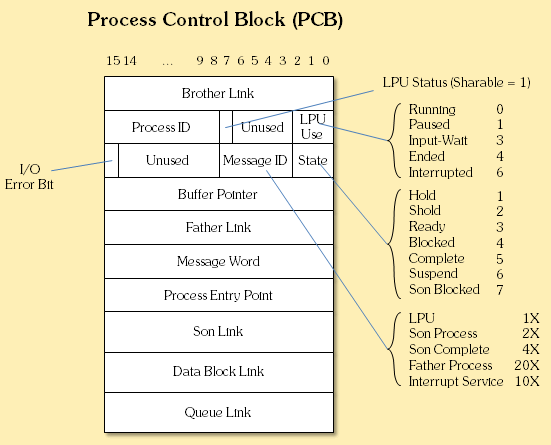

kowc에서 제공하는 [반효경 교수님의 운영체제](http://www.kocw.net/home/search/kemView.do?kemId=1046323&ar=pop) 강의를 듣고 정리한 글 입니다.

### 프로세스

프로세스는 **실행되고 있는** 프로그램을 말한다. 문맥 (context), 상태(state)를 가지고 있다.

##### 프로세스의 문맥

현재 상태를 나타내는데 필요한 모든 요소를 문맥(context)라고 한다. 프로세스의 문맥을 구성하는 요소는 하드웨어 문맥, 프로세스의 주소공간(메모리), 프로세스 관련 커널 자료구조로 이루어진다.

해당 프로세스의 차례가 되어 프로그램이 수행되면, 어디까지 수행되었는지 CPU가 기억하고 그 다음부터 수행해야 한다.하드웨어 문맥인 program counter와 각종 register가 프로세스를 어디서부터 실행할지에 대한 정보를 담고있다. 프로그램마다 가지고있는 code, data, stack은 메모리에 올라가 CPU가 필요한 데이터를 사용할 수 있다. 마지막으로 운영체제가 각 프로세스를 관리하기 위해 커널에 자료구조를 유지하고 있다. **PCB**, kernerl stack에 보관한다

##### PCB(Process control block)

-   OS가 관리상 사용하는 정보: process state, process id, scheduling information, priority
-   CPU 수행 관련 하드웨어 값: program counter, registers
-   메모리 관련: code, data, stack의 위치 정보
-   파일 관련: open file descriptors..

#### 프로세스의 상태 (state)

프로세스는 실행되고있는 프로그램이다. 프로세스는 ready, running, block 등 프로세스가 생성되어 종료될 때 까지 **_상태(state)_** 값을 가지며, 상태가 변경되며 수행된다.

-   new: process가 생성중인 상태
-   ready: 작업을 수행하기 위해 CPU를 기다리는 상태
-   run: CPU 소유권을 가지고 instruction을 수행중인 상태
-   block (wait, sleep): CPU를 주어도 어떠한 이유로 당장 instruction을 수행할 수 없는 상태. - process 자신이 요청한 event가 만족되지 않아 CPU를 소유해도 instruction을 수행할 수 없는 경우. - 예) disk에서 file을 읽어와야 하는 경우, 다 읽어오기 전까지 process는 block 상태가 된다. - **자신이 요청한 event가 만족되면 ready 상태**가 된다

-   suspended(stopped) : **외부**적인 이유로 프로세스 수행이 정지된 상태 - 프로세스는 통째로 디스크에 swap out 된다. - 예) 사용자 프로그램을 일시정지 시킨 경우(break key) - 예) 시스템이 여러 이유로 프로세스를 잠시 중단시킴 (중기 스케줄러) - **외부에서 resume하면 active 상태가 된다**

-   terminated: 수행(execution)이 끝난 상태

## 문맥 교환 (context switch)

CPU를 한 프로세스에서 다른 프로세스에 넘겨주는 과정을 process context switch라고 한다.
사용자 process에서 다른 사용자 process를 수행하는 경우, CPU를 내어주는 프로세스의 상태를 그 프로세스의 **PCB**에 저장하고, 새롭게 수행되는 프로세스의 PCB를 읽어온다

**_system call이나 interrupt 발생시 반드시 context switch가 일어나는 것은 아니다._**
사용자 프로세스 A가 작업을 수행하다가 system call이 발생해 kernel 모드로 전환되었다가 다시 사용자 프로세스 A가 CPU 소유권을 갖고 instructions 을 수행하는 경우에는 문맥교환을 하지 않아도 된다.

## 프로세스 스케줄링

한 프로세스를 실행 가능한 지점까지 실행하고, I/O등 CPU를 사용하지 않는 작업을 할 때는 다른 프로세스를 실행한다면, CPU 사용 효율을 높일 수 있다. 오늘날의 운영체제는 프로세스 스케줄링을 통해 위 작업을 구현한다.

### 프로세스를 스케줄링 하기 위한 Queue

-   job queue: 현재 시스템 내에 있는 모든 프로세스의 집합
-   ready queue: 현재 메모리 내에 있으면서 CPU요청을 기다리는 프로세스의 집합
-   device queues: 각 devices들의 queue

### 스케줄러 (scheduler)

스케줄러는 CPU가 어떤 작업을 수행해야 하는지 스케줄을 잡아주는 역할을 한다. 특성에 따라 long-term, short-term, medium-term 스케줄러로 나뉜다.

1. long-term scheduler (job scheduler)
   프로세스에 memory를 줄지 안줄지를 결정하고, 시작 프로세스 중 일부 프로세스를 ready queue로 보내는 역할을 한다. 메모리에 여러 프로그램이 올라가는 degree of multiprogramming을 제어한다. **_time sharing system에는 보통 장기 스케줄러가 없다_** 왜냐하면 일단 모든 프로그램이 memory에 올라가고, 여유가 필요하다면 메모리를 빼앗아 disk로 쫓아내는 방법을 사용하고 있다.

2. short-term scheduler (CPU scheduler)
   다음 어떤 프로세스에게 CPU를 줄지 (running 시킬지) 결정한다. millisecond 단위를 지원한다.

3. medium-term scheduler (swapper)
   위에서 언급한 것과 같이 time sharing system을 사용하는 운영체제는 시작하면 모든 프로세스를 메모리에 올리는데, 상황에 따라 메모리의 공간이 부족할 수 있다. 이 때 medium-term scheduler가 **_프로세스로부터 메모리를 빼앗아 디스크로 쫓아낸다_**. 따라서 swapper라고도 불리운다. long-term scheduler는 주는 것으로 degree of multiprogramming을 지원했다면, medium-term scheduler는 빼앗는 것으로 제어한다.

### 쓰레드 (thread)

프로세스 내부에 CPU 실행 단위가 여러개 있는 경우를 쓰레드라고 한다. 쓰레드는 PCB (Process control block)에서 프로그램 하나에 주소공간 하나를 두고, 프로그램이 어떤 부분을 실행하는지에 대한 정보를 여러개 둔다.

같은 일을 하는 프로세스가 **_code, data는 공유하고, CPU 실행 단위(program counter, register set, stack)를 다르게 가져갈 때 주소공간을 함께 사용함으로써 메모리 낭비를 줄여준다_**

#### 쓰레드의 장점

1. 자원 공유: 메모리 자원 효율성
2. 반응성 : 동일한 일을 하는 다중 스레드가 협력하여 높은 처리율(throughtput)과 성능 향상
3. 경제성: 같은 작업을 수행한다면, process를 생성하는 것 보다 thread를 사용하는 것이 경제적이다.
4. Utilization of MP architectures (multi processor): CPU가 다수인 컴퓨터인 경우, 병렬성을 높일 수 있다.

예) 서버 프로세스가 I/O 작업을 진행하여 block 상태일 때 다른 스레드가 실행(running) 되는 경우,
예) 네이버에 접속시, 네트워크 요청(I/O) 작업을 수행하는데, 프로세스 전체가 block되면 네트워크 작업이 모두 끝난 후 html을 그리는 작업이 되어야한다. 이러한 경우에 스레드를 사용해 thread-1은 network 요청을 수행하고, thread-2는 html 파일을 읽는다

## 프로세스의 생성과 종료

### 프로세스의 생성

프로세스의 생성은 부모로부터 **_자기 자신을 복제한 프로세스_**를 생성하는 것으로 시작된다. 부모와 자식간에 관계로 계층 구조(트리)가 형성된다. 프로세스가 생성되면 자원을 필요로 하게 되는데, (1) 운영체제에서 받거나 (2) 부모와 공유한다. 부모와 자원을 공유하는 경우에도 모든 자원을 공유하거나, 일부를 공유하는 모델이 있다. 운영체제에서 자원을 받게되면 전혀 공유하지 않게 된다.

자식 프로세스는 부모 프로세스를 복제하며 생성되는데, 자식 프로세스에 변화가 있기 전 까지는, 부모와 같은 code, data, stack을 가지고 있다. **_write가 발생하면 부모와 그 때부터 다른길을 걷게 되는데_** 복제를 미뤘다가, write가 발생하면 부모를 복재하는 copy-on-write 기법이 있다.

#### 예) 유닉스 & 시스템 콜

1. fork() **_새로운 프로세스_**를 생성한다. PID와 binary를 제외한 부모의 데이터를 그대로 복사해서, 주소 공간에 할당한다.
2. exec() **_새로운 프로그램_**을 메모리에 올린다
3. exit() 프로세스 종료

### 프로세스의 종료

프로세스가 종료되는 경우는 3번의 경우처럼 exit() 시스템 콜 실행 되거나 명시적으로 적어주지 않아도 main 함수가 return 되는 위치에 컴파일러가 넣어준다. 앞의 두 경우는 프로그램이 자발적으로 종료되는 경우다. 반면에 (1) 부모가 자식 프로세스를 종료시키거나, (2) kill, break등의 명령어를 친 경우, (3) 부모가 종료되는 경우에는 프로그램이 비자발적으로 종료된다. 프로세스의 각종 자원들이 운영체제에게 반납이 된다.

(1) 부모가 자식 프로세스를 종료시키는 경우는 (abort) 자식이 할당 자원의 한계치를 넘어서거나, 태스크가 더이상 필요하지 않거나 하는 경우다.

### 프로세스 간 협력

기본적으로 프로세스는 각자의 주소공간을 가지고 수행되기 때문에, 다른 프로세스의 수행에 영향을 미치지 못한다.
하지만 프로세스 간 협력 메커니즘(IPC interprocess communication)을 통해 메세지를 전달하거나, 주소 공간을 공유함으로써 프로세스 간 협력이 가능하다.

##### message passing

커널을 통해 메시지를 전달하는 방식이다. direct / indirect communication 방법이 존재하는데, 프로세스에 직접 전달하는 방법과 mailbox (또는 port)를 통해 간접적으로 전달하는 방법이 있다.

##### shared memory

다른 프로세스 간에 일부 주소 공간을 공유하여, 자원을 공유하는 경우다. 메모리를 매핑할 때 의도적으로 메모리가 공유되도록 구현한다.

##### Threads?

사실상 프로세스 하나의 프로세스로 프로세스간 협력으로 보기 어렵겠지만 동일한 process를 구성하는 thread 간에는 주소 공간을 공유하므로 협력이 가능하다.
