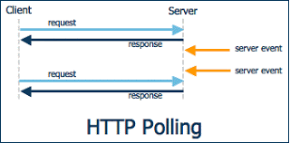
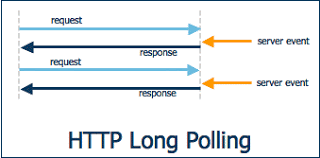
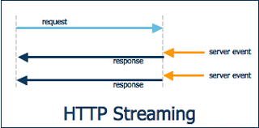
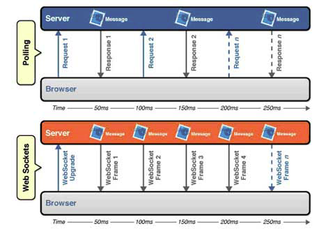
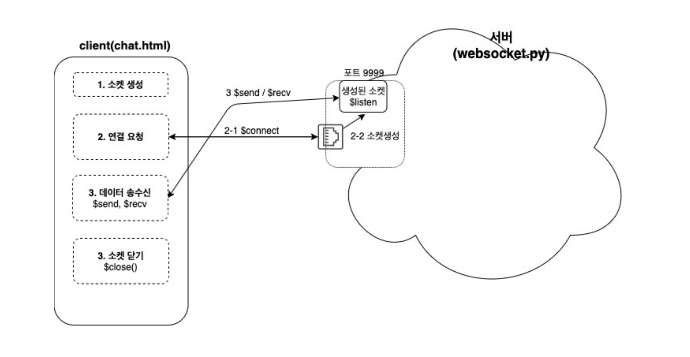

상호작용하는 어플리케이션을 만들기 위해 `http` 요청에는 한계가 있었다. `http` 요청은 응답이 보내지면 연결을 끊는 비연결성과 상태를 보존하지 않는 무상태로 리소스를 줄일 수 있는 장점이 있었지만, **서버에서 응답을 하기 위해 클라이언트의 요청이 필수적이였다.** 따라서 클라이언트와 서버가 상호작용하는 프로그램을 만들기 위해 polling, long polling, streaming 등의 약간 억지스러운 방법을 사용했었다. 

 

### polling



먼저 polling 방식은 client에서 server에게 끊임없이 http request 를 요청하는 방식이다. 그냥 계속 request를 날리고, 서버는 업데이트가 되었건 안되었건 response를 응답하는 방식이다. 보통 1-2초에 한번씩 계속 request, response를 받게 되어 서버의 부담이 급증하게 된다.

### long polling



long polling 방식은 폴링방식에서 조금 진화된 방식인데,  client에서 request를 보내고 **server는 connection을 유지하다가 이벤트가 발생되면 response를 보내고, client는 response를 받으면 다시 request를 보내는 방식이다.**

### streaming



streaming 방식은, client에서 reqeust를 보내면 서버에서 클라이언트로 응답할 때 요청을 끊지 않고 필요한 이벤트에 대한 메세지만 보내는(flush) 방식이다.

위 세가지 방식을 사용해 클라이언트 간에 상호작용하는 프로그램을 구현한다면, 클라이언트 끼리 상호작용하는 것 처럼 보이지만 **결국 클라이언트에서 많은 요청을 통해 단방향 요청을 커버하는 것이다.**

서버에서 클라이언트로 요청을 보내 필요할 때 마다 클라이언트를 업데이트 해주는 방법이 필요했고, 그래서 탄생한 기술이 웹소켓 프로토콜이다.

## 웹소켓 프로토콜

web socket 서버간에 양방향 통신을 위해 만들어진 HTML5 표준 기술 스팩이다.


웹소켓 프로토콜을 사용한 프로그램을 구현하면, **서버에서 클라이언트에게 데이터를 업데이트 하는 요청을** 보낼 수 있어 불필요한 요청/응답이 줄어들게 된다.

클라이언트 / 서버 간에 웹소켓 프로토콜을 사용하려면 먼저 '웹소켓 프로토콜을 사용해 통신할꺼야'의 약속을 맺어야 한다. 이 과정을 **'핸드쉐이크'** 라고 한다. 클라이언트는 **웹소켓 열기 핸드쉐이크** 를 HTTP 1.1 **프로토콜을 사용해 서버에 요청하면, 서버는 핸드쉐이크 수락 응답을 보낸다.**

아래는 [websocket protocl rfc](https://tools.ietf.org/html/rfc6455) 문서의 서버/클라이언트 handshake 예시이다

```python
The handshake from the client looks as follows:

        GET /chat HTTP/1.1
        Host: server.example.com
        Upgrade: websocket
        Connection: Upgrade
        Sec-WebSocket-Key: dGhlIHNhbXBsZSBub25jZQ==
        Origin: http://example.com
        Sec-WebSocket-Protocol: chat, superchat
        Sec-WebSocket-Version: 13

 The handshake from the server looks as follows:

      HTTP/1.1 101 Switching Protocols
      Upgrade: websocket
      Connection: Upgrade
      Sec-WebSocket-Accept: s3pPLMBiTxaQ9kYGzzhZRbK+xOo=
      Sec-WebSocket-Protocol: chat
```

클라이언트 / 서버 간에 handshake 를 통한 web socket protocol 규약이 만들어졌다. 이제 서버에서 클라이언트로 자유롭게 양방향 데이터를 주고받을 수 있는 연결환경이 구성되었다. 


## **flask x socket**


- 클라이언트 소켓
1. 소켓 생성 $socket()
2. 서버 연결 요청 $connect()  *(Block 방식으로 동작)*
3. IF 서버 OK, 데이터 송수신 ($send/$recv)
    - send(), recv() API 사용 *block 방식으로 동작
    - 요청: send() 사용
    - 응답: recv() 실행후, 별도의 스레드에서 응답 대기
4. 소켓 닫는다 close
    - send, recv API를 통해 송수신 완료되면 close() 사용해 소켓 닫는다

*연결이 종료된 후 다시 데이터를 주고 받고자 한다면, 다시 생성, 연결 과정을 거쳐야 함*

### **서버 사이드 소켓**

1. 소켓 생성 $socket
2. 서버 소켓 바인딩 $bind
    - 소켓을 포트 번호에 바인딩
    - 각기 다른 소켓에 포트를 부여하기 위해 (포트 중복 피하기 위해)
3. 클라이언트 연결 요청 대기 $listen
    - 클라이언트의 연결 요청을 받고, 수행하기 위해 대기
    - 요청 수신 / 에러 발생 / socket close() 세가지 경우에 대기상태 탈출
4. 클라이언트 연결 수립 $accept
    - 연결 요청을 받아들여 소켓 간 연결을 수립
    - 최종적으로 클라이언트의 소켓과 연결이 이루어지는 **새로운 소켓 생성 (2-2)**
        1. 새로운 소켓은 클라이언트의 정보가 세팅되어 있음
    - 서버소켓은 다시 새로운 연결에 대한 listen (혹은 close) 상태
5. 데이터 송수신 $send/$recv 클라이언트와 동일
6. 소켓 연결 종료 $close

[예제코드](https://github.com/oowgnoj/flask_socket)