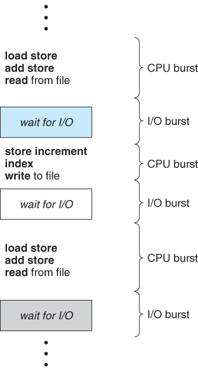

kowc에서 제공하는 [반효경 교수님의 운영체제](http://www.kocw.net/home/search/kemView.do?kemId=1046323&ar=pop) 강의를 듣고 정리한 글 입니다.

## CPU Scheduling

### 필요성

CPU는 컴퓨터에서 가장 빠르고 비싼 연산장치 중 하나다.
본래 CPU는 `ready queue`에서 instruction을 하나씩 실행하는 것이 역할이다.
ready queue는 현재 메모리 내부에 있으면서 CPU 요청을 기다리는 프로세스의 집합이다.
**CPU Scheduling**은 ready queue 에서 어떤 프로세스에게 CPU를 줄지에 대한 메커니즘을 말한다.

### 이점

-   프로세스의 특성(IO bound, CPU bound)에 따라 효율적인 CPU 및 I/O device의 사용
-   유저에게 intreractive 환경 제공(마치 여러가지 일을 동시에 처리하는듯 한 환상)

### CPU Scheduler and dispatcher

**CPU Scheduler**는 운영체제 내부에 CPU 스케줄링 담당하는 알고리즘이다. ready 상태의 프로세스 중에서 CPU를 할당할 프로세스를 고른다.
**Dispatcher**는 CPU의 제어권을 선택된 프로세스에게 넘겨주는(context switch) 역할을 한다.

#### 스케줄링이 필요한 경우

CPU 스케줄링이 필요한 경우는 프로세스에게 다음과 같은 상태 변화가 있는 경우이다.

-   running -> blocked (예 I/O 요청 system call)
-   running → ready (예: 할당시간 만료로 timer interrupt)
-   blocked → ready (i/o 완료 후 interrupt)
-   terminate

### CPU burst, I/O burst

프로그램이 실행될 때 각 단계에서 CPU를 사용하는지, I/O 작업을 수행하는지에 따라 CPU burst, I/O burst 라고 부른다.

CPU bound job은 CPU에서 복잡한 계산을 수행한다. 프로그램당 소요시간이 길다. 반면에 I/O bound job은 I/O 요청이 주를 이루어 CPU를 사용하는 시간은 짧지만 많은 instruction을 수행한다.

**각각의 특성을 가진 job이 ready queue 내부에 무분별하게 섞여있어 CPU 스케줄링이 필요하다**

### 성능 척도 (performance index)

##### 시스템 측면

시스템 측면에서는 전체 시간에서 얼마나 CPU가 instruction을 수행했는지 측정하는 **CPU Utilization**과, 주어진 시간동안의 작업 처리량인 **throughput**을 성능 척도로 사용한다.

##### 프로세스 측면

프로세스 측면에서는 CPU를 사용하러 들어와서 사용 후 나갈 때 까지의 소요시간 **turnaround time** 과, 대기시간 **waiting time**, 처음으로 CPU를 얻기 까지 기다린 시간인 **response time**으로 측정한다.

### Scheduling algorithm

preemitive: 운영체제가 프로세스의 CPU 점유를 제어
nonpreemptive: 프로세스가 자진 반납 때까지 OS는 관여하지 않는다

#### FCFS(First Come First Serve)

process 실행 순서를 **선착순**으로 정하는 알고리즘이다. 앞서 수행되는 프로세스에 따라 나머지 프로세스에 waiting time에 상당한 영향을 미치게 된다. (convoy effect)

#### SJF (Shortest Job First)

CPU 수행시간이 가장 짧은 프로세스를 먼저 수행하는 방법이다. 과거의 CPU 사용을 기반으로 **_CPU 예상 사용시간을 측정한다._** 프로세스 전체의 average waiting time을 최소화 한다. 하지만 단점으로 CPU 사용시간이 긴 프로세스가 CPU를 할당받지 못하는 `starvation` 문제가 일어날 수 있다.

#### Priority scheduling

우선순위가 제일 높은 프로세스에게 CPU를 준다. 앞서 살펴본 SJF도 우선순위 알고리즘에 일종이다. 한가지 문제점은 우선순위가 낮은 process들은 우선순위가 높은 프로세스가 계속 실행된다면, CPU를 사용하지 못한다. 이에 대처하는 방법으로 **aging**: waiting time에서 일정 시간이 지나면 우선순위를 올려주는 방법도 있다.

#### Round Robin (RR)

CPU를 줄 때 timer에 시간을 설정하고, 정해진 시간만큼 CPU를 사용한다. 더 필요하면 process는 ready queue에 다시 줄 선다. cpu를 길게 사용하는 프로세스는 여러번 다시 줄을 서야하고, 짧게 사용하는 프로세스는 한 두 차례에 사용을 마친다. 공정한 알고리즘이다.
n 개의 프로세스가 q 만큼 시간이 걸릴 때 최대 reponse time 은 (n-1)q 이다. response time이 짧다.

-   q large ⇒ FCFS
-   q small ⇒ context switch overhead가 커진다
-   적당한 규모의 time quntum (10 - 100ms)

#### Muitilevel Queue

우선순위가 높으면 먼저 처리되는 방식인데, ready queue를 우선순위에 따라 여러개로 분할한다.

각 ready는 **독립적인 스케줄링 알고리즘을 가진다** 유저와 interaction이 있는 foreground에는 round robin algorithm을 사용하고, background 에는 FCFS 알고리즘을 사용한다. 각 queue에 CPU time 을 적절한 비율로 할당하는 것이 중요하다.

#### Multilevel feedback queue

프로세스가 우선순위가 다른 큐로 이동 가능하다.

프로세스가 처음 CPU를 가질 때는 우선순위가 제일 높은 큐로 간다. 다음번에는 CPU 사용시간이 조금 더 긴 queue로 이동하는데, CPU는 맨 위 큐가 비었을 때만 그 다음 큐와 FCFS 를 처리한다. RR 알고리즘에 비해 과거를 바탕으로 한 예측이 필요 없다.

#### Multiple-processor scheduling

CPU가 여러 개인 경우 스케줄링은 더욱 복잡해진다.

-   Homogeneous process인 경우
    -   queue에 한줄로 세워 각 프로세서가 알아서 꺼내가게 할 수 있다
        -   반드시 특정 프로세서에서 수행되어야 하는 프로세스가 있는 경우 복잡해진다
-   load sharing
    -   일부 프로세서에 job이 몰리지 않도록 부하를 적절히 공유하는 메커니즘 필요
    -   별개의 queue vs 공동 queue
-   Symmetric multiprocessing (SMP)
    -   각 프로세서가 각자 알아서 스케줄링 결정
-   Asymmetric multiprocessing
    -   하나의 프로세서가 시스템의 접근과 공유를 책임

## 정리

-   scheduling algorithm은 효율적인 CPU 사용으로 user/program에게 적절한 응답을 주기 위해 고안되었다.
-   FCFS, SJF, RR, MQ 등의 알고리즘에는 각각의 특성과 장/단점이 있다.
