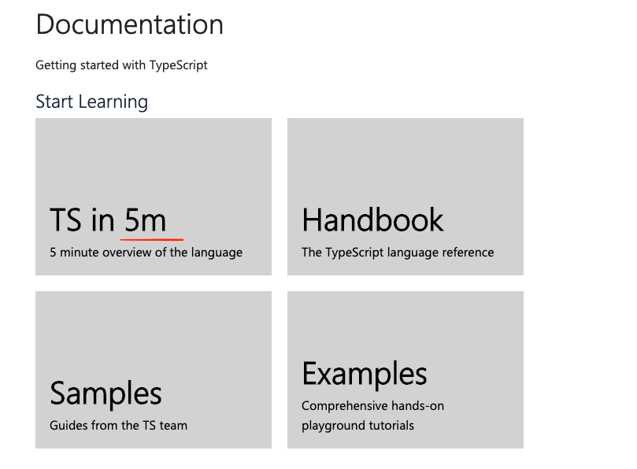
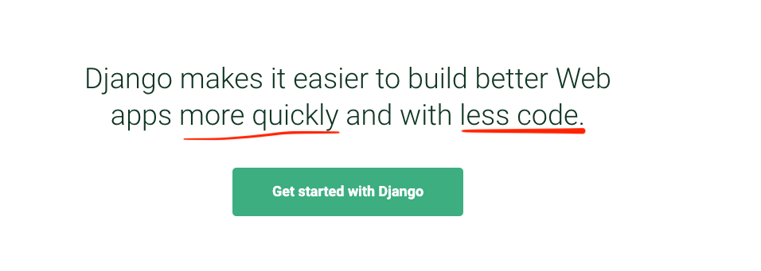

## Summary

개발자의 가치는 주어진 문제의 크기(가치)와 해결력의 수준이라고 생각합니다. 가치 향상을 위해 1. 기초의 중요성, 2. 구체적인 분야 3. 궁극적으로 해결하고 싶은 문제에 대한 고민과 정의 가 필요하다고 생각했습니다.

## Points

### 🌲 1. 기초는 중요 합니다.

데이터 시대를 사는 소프트웨어 개발자를 위한 **생존 가이드** - 삼성전자 임백준 상무

신기술은 기존 기술이 가진 한계를 보안하여 탄생하는 경우가 많고, 토대가 되는 '변하지 않는 것' 에 학습 해야 한다. 더해서 사람 자체의 문제해결 능력이 중요하다. 철학/윤리/태도의 영역과 기본에 실력을 갖춘 개발자가 되어야 한다.

주니어 개발자를 채용하는 경우 data structure & algorithm 과 같은 기초를 테스트 하는 경우가 많습니다. **하지만 시니어 개발자를 채용하는 경우에도** 저희가 들어보지 못한 기술이나 최신 트렌드를 요구하는 경우는 드문 것 같습니다. 아래는 제가 참고했던 (최소) 2년 이상의 front-end / 웹 개발자의 자격요건 입니다. 웹 개발에 기초에 대한 언급이 많습니다.

제가 채용 과정을 참고한 이유는 시장에서 요구하는 개발자의 역량 이기도 하지만, 입사하면 같은 팀원들이 원하는 역량이라고 판단해 중요한 정보라고 생각했습니다.

---

[강남언니]

• 동작 성능을 고려한 개발

• 시맨틱 마크업 및 Sass, Stylus 등 CSS Preprocessor를 활용한 개발

• 코드 및 제품 _테스트 자동화_ (Unit, E2E 등 )

[COUPANG]

-   *Java/JS 기반의 분산 시스템을 경험*하신 분
-   MVC web application 기반의 _대규모_ 서비스 개발을 경험 하신 분
-   JS/Web application _성능 최적화, 유지보수 그리고 트러블 슈팅 경험_ 있으신 분

[JANDI]

• 브라우저 렌더링 행위 및 성과에 대한 강한 이해

• Require.js 및 AMD와 같은 JavaScript 모듈 로더와 친숙

• 비동기식 요청 처리, _부분적인 페이지 업데이트_, AJAX에 대한 강한 이해

[WATCHA]

• 웹 프론트 기술 흐름에 지속적으로 관심갖는 분

• 좋은 소프트웨어에 대한 고민과 통찰이 있는 분

• React, MobX, JS, TS 사용이 능숙하신 분

• view, business 로직의 차이를 아시는 분

파란색 부분은 회사/서비스/환경 에 따라 깊숙한 부분까지 해결이 필요한 상황으로 보여집니다.

기초에 더불어 **한 두가지 영역에 전문성과 경험, 섬세한 부분까지에 대한 이해가 있다면 차별화된 senior 개발자로 성장할 수 있을거라 생각합니다.** 따라서 ...

### 🔎 2. 범위를 좁히는 것이 필요할 것 같습니다.

**개발자의 가치 = 문제 해결력 의 수준이기 때문입니다.**

일하며 기초를 탄탄히 학습 하기에도 가용할 수 있는 자원이 한정적 입니다.그래서 더욱 _내가 잘하거나 관심이 있는 분야_ 에 대한 의사결정을 해야 한다고 생각합니다.

기본에 대한 이해가 충분한 상태에서 **특정 분야에서 만큼은** **대체하기 어려운 인력이 되어야 한다는 말입니다.**
주니어 라면 범위를 좁히기 위한 탐색과 결정이 필요하다고 생각합니다.

1. 생각보다 알아야 할 것이 많은 웹 생태계

[roadmap.sh](https://roadmap.sh/)

http 기술에 대한 rfc 문서: [rfc-http](https://tools.ietf.org/html/rfc2616)

2. library, framework 가 발전하며 어려운 기술을 사용하기 쉽게 만들어 주고 있습니다.
   개발 수고를 덜어주는 측면에서는 장점이지만 그만큼 많은 사람들이 **전보다 수월하게 같은 기능**을 구현할 수 있다는 피할 수 없는 사실이기도 합니다.

3. (가능하다면) + 도메인 지식

### 🧑‍💻 3. 어떤 문제를 해결하고 싶은가요?

그래서 마지막으로 자신이 어떤 분야에 관심이 있고, 어떤 문제를 해결하고 싶은지에 대한 이해가 필요하다고 생각합니다.

-   구글의 인재채용 방식

1. 지속적으로 학습할 수 있는 흥미를 지녔느냐
2. 알고 있는 지식을 어떻게 자발적으로 적용할 수 있냐

**예시)**

-   프론트엔드 - 복잡한 UI를 추상화해 잘 관리하는 know-how
-   서버 - streaming 서버에서 대용량 traffic을 처리할 수 있는 기술
-   서버 - RDBMS와 캐시, 데이터 구조
-   서버 - 분산 시스템, 대규모 서비스 개발 경험
-   프론트엔드 - community managning ([진유림님 github](https://github.com/milooy))
-   PO(PM) - 기존에 있는 기술로 서비스를 잘 기획하는 능력 (notion)
-   문서 장인 (?)

조직 내 어떤 유형의 개발자인지 진단해보는 사이트

[What Type of Developer Are You?](https://www.12types.dev/quiz)

### References

[https://www.youtube.com/watch?v=9Moy_b-H-CM&t=2336s](https://www.youtube.com/watch?v=9Moy_b-H-CM&t=2336s)

근본에 대한 공부 7할, library/framwork 기술을 익히는데 3할 정도의 자원을 투자해야 한다. 신기술은 기존 기술이 가진 한계를 보안하여 탄생하는 경우가 많고, 토대가 되는 '변하지 않는 것' 에 학습 해야 한다. 더해서 사람 자체의 문제해결 능력이 중요하다. 철학/윤리/태도의 영역과 기본에 실력을 갖춘 개발자가 되어야 한다.
