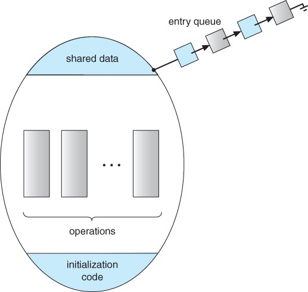

kowc에서 제공하는 [반효경 교수님의 운영체제](http://www.kocw.net/home/search/kemView.do?kemId=1046323&ar=pop) 강의를 듣고 정리한 글 입니다.

|chapter|핵심 내용|
|---|------|
|1. [운영체제 란?](https://oowgnoj.dev/%EC%9A%B4%EC%98%81%EC%B2%B4%EC%A0%9C%20(kernel))|운영체제의 개요|
|2. [시스템 구조](https://oowgnoj.dev/%EC%96%B4%EB%96%BB%EA%B2%8C%20%ED%94%84%EB%A1%9C%EA%B7%B8%EB%9E%A8%EC%9D%B4%20%EC%8B%A4%ED%96%89%EB%90%A0%EA%B9%8C%20feat.%20%EC%8B%9C%EC%8A%A4%ED%85%9C%20%EA%B5%AC%EC%A1%B0)|컴퓨터 시스템 구조에 대한 개괄적인 설명|
|3. [프로세스](https://oowgnoj.dev/%ED%94%84%EB%A1%9C%EC%84%B8%EC%8A%A4%20-%20%EC%9A%B4%EC%98%81%EC%B2%B4%EC%A0%9C%EA%B0%80%20%EC%8B%A4%ED%96%89%EC%A4%91%EC%9D%B8%20%ED%94%84%EB%A1%9C%EA%B7%B8%EB%9E%A8%EC%9D%84%20%EA%B4%80%EB%A6%AC%ED%95%98%EB%8A%94%20%EB%B0%A9%EB%B2%95)|실행중인 프로그램 : 프로세스|
|4. [프로세스 스케줄링](https://oowgnoj.dev/%EC%BB%B4%ED%93%A8%ED%84%B0%EA%B0%80%20%EC%9E%90%EC%8B%A0%EC%9D%98%20%EA%B0%80%EC%9E%A5%20%EB%B9%84%EC%8B%BC%20%EC%9E%90%EC%9B%90%EC%9D%84%20%EA%B4%80%EB%A6%AC%ED%95%98%EB%8A%94%20%EB%B0%A9%EB%B2%95%20-%20CPU%20%EC%8A%A4%EC%BC%80%EC%A4%84%EB%A7%81)|운영체제의 프로세스 스케줄 관리|
|5. [프로레스 동기화](https://oowgnoj.dev/%EB%82%B4%EA%B0%80%20%EB%8D%B0%EC%9D%B4%ED%84%B0%EB%A5%BC%20%EC%93%B0%EA%B3%A0%EC%9E%88%EC%96%B4%20%EC%9E%A0%EC%8B%9C%20%EA%B8%B0%EB%8B%A4%EB%A0%A4%EC%A4%98%20-%20%ED%94%84%EB%A1%9C%EC%84%B8%EC%8A%A4%20%EB%8F%99%EA%B8%B0%ED%99%94)|프로세스 동기화|
|6. [메모리 관리](https://oowgnoj.dev/%EC%9A%B4%EC%98%81%EC%B2%B4%EC%A0%9C%EA%B0%80%20%EB%A9%94%EB%AA%A8%EB%A6%AC%EB%A5%BC%20%EA%B4%80%EB%A6%AC%ED%95%98%EB%8A%94%20%EB%B0%A9%EB%B2%95)|운영체제의 메모리 관리, 페이징 기법|
|7. [가상 메모리](https://oowgnoj.dev/%EA%B0%80%EC%83%81%20%EB%A9%94%EB%AA%A8%EB%A6%AC)|가상 메모리와 demand paging 기법|


## Process synchronization

컴퓨터는 데이터를 읽어오는 곳 과 데이터를 처리하는곳이 다르다. 연산은 여러 군데에서, 저장은 한 곳에서 이루어진다. 동일한 데이터를 동시에 접근해 연산한다면 데이터의 불일치 문제가 발생될 수 있다.

### Race condition

여러 프로세스들이 동시에 공유데이터를 접근해, 데이터의 최종 연산 결과가 마지막 그 프로세스에 따라 달라지는 경우. race condition을 방지하기 위해 **concurrent process는 동기화 되어야 한다.**

#### 발생하는 경우

두개 이상의 프로세스가 동시에 같은 데이터에 접근해 연산을 수행하는 경우 발생한다.

-   공유 메모리를 사용하는 프로세스가 있을 때
-   운영체제 내부 1. `system call` 내부에서 다른 `system call`이 호출되는 경우 (기본적으로 system call은 커널 내부 변수를 수정한다) 2. 커널 루틴 수행 중 -> CPU preempt -> 다른 커널모드 루틴 수행시 3. multi-processor

## 해결방법

### 프로그램적 해결방법의 충족 조건

1. Mutual exclusion(상호 배제): 프로세스 Pi가 critical section 부분을 수행중이면 다른 process 는 그들의 critical section에 들어가면 안 된다
2. Progress : critical section에 아무도 없을 때 들어가고자 하는 프로세스가 있다면 critical section에 들어갈 수 있어야 한다.
3. Bounded waiting(유한 대기) : 프로세스가 critical section에 들어가려고 요청한 후 부터 그 요청이 허용될 때 까지 다른 프로세스들이 critical section에 들어가는 횟수에 한계가 있어야 한다.

```
do {
	flag[i] = true #my intention is to enter..
	turn = j # set to his turn 상대방 턴으로 바꾸어 놓는다
	while (flag[j] && turn ==j) #wait only if..
	critical section
	flag[i] = false;
	remainder section
} while(1)

```

### 하드웨어적 해결방법

기본적으로 process synchronization이 수행되어야 하는 이유는 **읽고 쓰는것이 한개의 instruction으로 수행될 수 없었기 때문이다.** read & write 과정에서 언제든지 CPU를 다른 프로세스에게 빼앗길 수 있었다. `test_and_set`은 hardware의 지원으로 read & write 과정을 한번에(atomic) 수행한다.

```
Synchronization variable:
	boolean lock = false

Process P
	do {
		while (Test_and_Set(lock));
		critical section
		lock = false;
		remainder section
	}
```

### 프로그래머의 입장에서 해결방안

Semaphore, monitor는 `test_and_set`을 추상화 시켜 프로그래머가 보다 편하게 사용할 수 있게 고안된 방법이다.

#### Semaphore

-   `lock & unlock` 의 과정에서도 언제든지 CPU 를 빼앗길 수 있기 때문에 자원을 획득하고 반환하는 atomic 연산 `P` 와 `S` 에 의해서만 데이터에 접근이 가능하도록 돕는다.
-   busy waiting 방식과 block & wakeup 방식으로 구현이 가능한데, 보통의 경우에 block & wakeup 방식이 효율이 더 좋다.

##### Busy waiting vs Block and wake-up

`busy waiting`은 CPU를 사용하며 기다리는 반면,
`block-wakeup` 방식은,
(1) 커널은 block을 호출한 프로세스를 suspend 시킴
(2) 이 프로세스의 PCB를 semaphore에 대한 wait queue에 넣음
(1) block된 프로세스 P를 wakeup 시킴
(2) 이 프로세스의 PCB를 ready queue로 옮김

#### Monitor



-   Active 프로세스가 하나밖에 없도록 monitor가 자체 제어한다
-   Semaphore와 다르게 외부에서 접근을 제어한다

### Semaphore 와 monitor의 차이점

**semaphore**는 한번에 한 프로세스만 해당 변수에 대한 CRUD가 가능하도록 P(자원의 획득), S(자원의 반환) 연산을 통해서만 해당 변수에 접근이 가능하도록 만드는 방법이다.
내부에 프로세스가 변수를 사용중인지에 대한 `integer variable` 이 있다.
**Monitor**는 외부에서 프로세스가 한번에 한개만 접근이 가능하게 코드가 작성되어있다. 들어오려고 시도했던 process들은 entity queue에서 대기하게 된다. 내부에 condition variable이 포함되는데, 만약 작업이 진행되다가 어떤 이유에서 sleep을 하거나, sleep한 process를 깨우는 queue를 관리한다.

### 정리

-   process synchronization은 여러 프로세스가 공유 데이터에 접근하여 연산을 수행하는 경우 발생하는 `race condition`을 방지하기 위함이다.
-   프로그램 / 하드웨어적 해결방법`(test_and_set)`이 있다.
-   `test_and_set` 을 추상화시켜 프로그래머가 편리하게 사용할 수 있는 `Semaphore`, `Monitor`과 같은 방법으로 프로세스 간 동기화를 구현할 수 있다.
