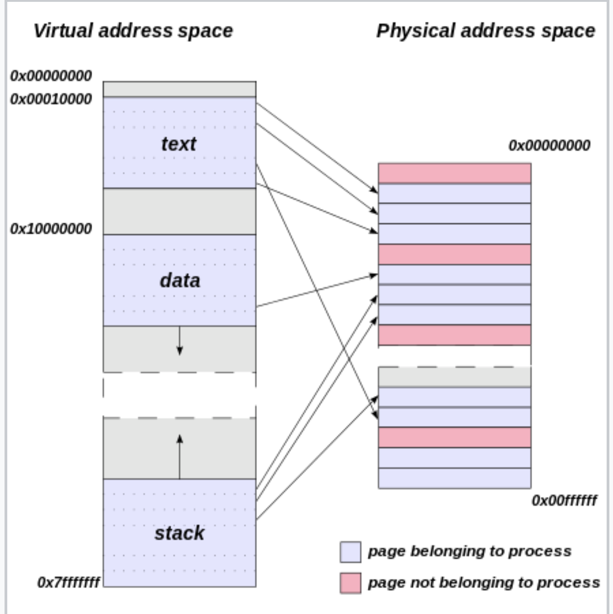
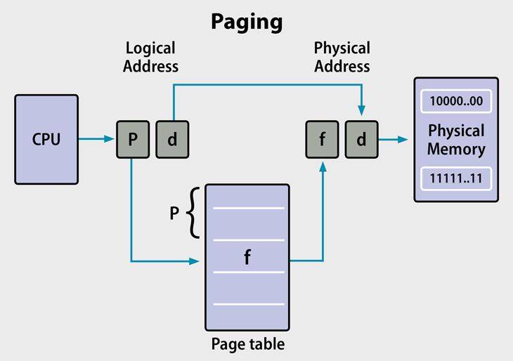
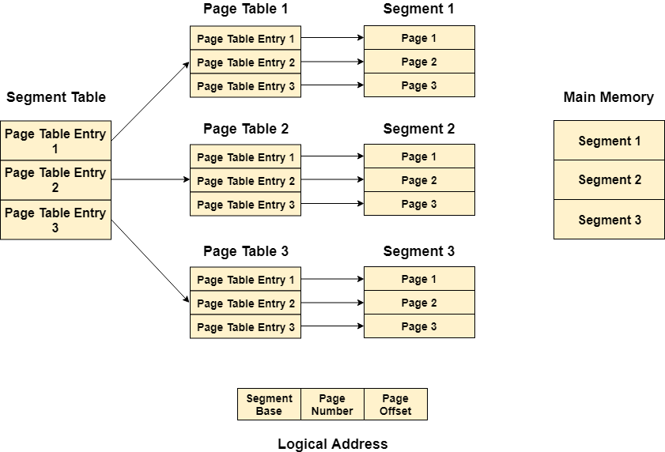

kowc에서 제공하는 [반효경 교수님의 운영체제](http://www.kocw.net/home/search/kemView.do?kemId=1046323&ar=pop) 강의를 듣고 정리한 글 입니다.

|chapter|핵심 내용|
|---|------|
|1. [운영체제 란?](https://oowgnoj.dev/%EC%9A%B4%EC%98%81%EC%B2%B4%EC%A0%9C%20(kernel))|운영체제의 개요|
|2. [시스템 구조](https://oowgnoj.dev/%EC%96%B4%EB%96%BB%EA%B2%8C%20%ED%94%84%EB%A1%9C%EA%B7%B8%EB%9E%A8%EC%9D%B4%20%EC%8B%A4%ED%96%89%EB%90%A0%EA%B9%8C%20feat.%20%EC%8B%9C%EC%8A%A4%ED%85%9C%20%EA%B5%AC%EC%A1%B0)|컴퓨터 시스템 구조에 대한 개괄적인 설명|
|3. [프로세스](https://oowgnoj.dev/%ED%94%84%EB%A1%9C%EC%84%B8%EC%8A%A4%20-%20%EC%9A%B4%EC%98%81%EC%B2%B4%EC%A0%9C%EA%B0%80%20%EC%8B%A4%ED%96%89%EC%A4%91%EC%9D%B8%20%ED%94%84%EB%A1%9C%EA%B7%B8%EB%9E%A8%EC%9D%84%20%EA%B4%80%EB%A6%AC%ED%95%98%EB%8A%94%20%EB%B0%A9%EB%B2%95)|실행중인 프로그램 : 프로세스|
|4. [프로세스 스케줄링](https://oowgnoj.dev/%EC%BB%B4%ED%93%A8%ED%84%B0%EA%B0%80%20%EC%9E%90%EC%8B%A0%EC%9D%98%20%EA%B0%80%EC%9E%A5%20%EB%B9%84%EC%8B%BC%20%EC%9E%90%EC%9B%90%EC%9D%84%20%EA%B4%80%EB%A6%AC%ED%95%98%EB%8A%94%20%EB%B0%A9%EB%B2%95%20-%20CPU%20%EC%8A%A4%EC%BC%80%EC%A4%84%EB%A7%81)|운영체제의 프로세스 스케줄 관리|
|5. [프로레스 동기화](https://oowgnoj.dev/%EB%82%B4%EA%B0%80%20%EB%8D%B0%EC%9D%B4%ED%84%B0%EB%A5%BC%20%EC%93%B0%EA%B3%A0%EC%9E%88%EC%96%B4%20%EC%9E%A0%EC%8B%9C%20%EA%B8%B0%EB%8B%A4%EB%A0%A4%EC%A4%98%20-%20%ED%94%84%EB%A1%9C%EC%84%B8%EC%8A%A4%20%EB%8F%99%EA%B8%B0%ED%99%94)|프로세스 동기화|
|6. [메모리 관리](https://oowgnoj.dev/%EC%9A%B4%EC%98%81%EC%B2%B4%EC%A0%9C%EA%B0%80%20%EB%A9%94%EB%AA%A8%EB%A6%AC%EB%A5%BC%20%EA%B4%80%EB%A6%AC%ED%95%98%EB%8A%94%20%EB%B0%A9%EB%B2%95)|운영체제의 메모리 관리, 페이징 기법|
|7. [가상 메모리](https://oowgnoj.dev/%EA%B0%80%EC%83%81%20%EB%A9%94%EB%AA%A8%EB%A6%AC)|가상 메모리와 demand paging 기법|

## Memory management

프로세스의 데이터 저장 방법에 대한 관리법

### 메모리 주소

-   symbolic address : 코드 단에서 설정하는 address (ex a= 10)
-   virtual(logical) address: 프로그램이 이상적으로 사용하는 주소 체계
-   physical address : 실제 memory의 주소

### 주소 바인딩

virtual address에서 physical address로 변환하는 과정을 주소 바인딩이라고 한다. Memory Management Unit (MMU)에서 두 개의 register를 사용해 주소 바인딩을 수행한다. MMU는 실질적으로 주소를 변환하는 relocation register와 요청된 주소와 program의 최대 주소를 비교해 다른 프로세스의 memory로 접근하는지 확인하는 limit register 로 구성되어 있다.

주소 바인딩은 프로그램이 컴파일될 때 수행되며, 특성에 따라 아래 3가지로 분류된다.

1. compile time binding : logical memory가 physical memory 그대로 올라간다.
2. load time binding : logical memory는 physical memory에 비어있는 부분으로 올라간다.
3. run time binding : physical memory에 비어있는 부분으로 올라간다. **프로그램이 실행된 후에도 physical memory 내 주소가 변할 수 있다.**

### 사용자 프로세스 영역의 할당 방법

physical memory의 낮은 주소 영역에는 OS, 높은 부분은 사용자 프로세스가 올라간다.
메모리가 할당되는 방식은 프로세스의 데이터가 분할되어 physical memory에 올라가는지에 대한 여부에 따라 연속 할당, 불연속 할당으로 구분된다.

#### 연속 할당 (contiguous allocation)

**고정 분할 방식**

-   물리적 메모리를 여러 크기로 나누어 자르고, virtual 메모리 프로세스의 크기에 맞게 할당한다.
-   1번 공간에 프로세스 A가 할당 되었다가 프로세스 B가 올라갔다. 이 때 프로세스 B는 A보다 작다. 그 때 남는 공간은 내부 조각 이라고 한다.
-   외부 조각 은 물리적 메모리의 1번, 2번 프로세스 사이에 비어있는 공간을 말한다.

**가변 분할 방식**

-   메모리가 할당되는 순서대로 물리적 메모리에 차곡차곡 할당된다.
-   운영체제는 물리적 메모리 중간중간 비어있는 hole에 대한 정보를 가지고 있고, 다음 프로세스를 할당할 때 참고해야 한다.
-   Dynamic storage allocation problem
    -   size n인 요청을 만족하는 가장 적절한 hole을 찾는 문제로, 해결 방안은 first-fit, best-fit, worst-fit 등이 존재한다.
-   compaction : 실행중인 메모리를 한 군대로 몰아 hole을 처리한다.

#### 불연속 할당 (non-contiguous allocation)

#### 페이징 기법

**process의 virtual memory를 동일한 사이즈의 페이지 단위로 physical memory에 할당하는 방식이다.**
page table 연산 + 실제 메모리 접근 으로 약 2배의 시간이 소요된다

**page-table**

논리적 주소를 물리적 메모리 주소로 변환하는 과정에 사용된다. 모든 프로그램마다 page-table을 가지고 있다. 캐싱 하드웨어 `TLB`를 사용한다. page table에서 자주 사용되는 데이터의 일부분만 가지고 있고, `parallel search`가 가능하다.\
TLB는 각 페이지의 physical memory address, Valid(v) / Invalid(i) Bit, protection bit를 가지고 있다.

**Two(multi)-level page table**

page table 자체를 page로 구성해 hard-disk에 저장하고 있다가 필요시 메모리(on demand)로 로드하는 방식을 사용한다.
비유하자면 10000개의 서류를 보관할 때, 표(table)에 서류 10000개에 대한 모든 정보 (제목, 날짜, 수정일 등)를 가지고 있는 것이 아니라,\
10개로 나누어 한 테이블에 1000개에 대한 정보를 저장하는 방식이다.

프로그램이 실행되면 반복적으로 자주 쓰이는 부분이 존재하기에 에러처리 등 가끔 쓰이는 부분등 모든 부분을 물리적 메모리에 올리지 않아 저장공간을 확보할 수 있다.

**Inverted page table**

기존 page table의 단점을 보완하는 방식이다.
기존 테이블은 모든 프로세스마다 logical address에 대응하는 모든 page에 대해 page table entry가 존재하는 반면,\
`inverted page table`은 system-wide 하게 한 개의 page table이 존재한다. page table entry에는 물리적 메모리의 page frame이 담고 있는 내용을 표시한다. (pid, process의 logical address)
프로세스가 수행될 때, 테이블 전체를 탐색해야 하는 단점이 있지만 associative register를 사용해 병렬 탐색이 가능하다.

**shared page**

-   **read-only**로 하여 프로세스 간에 하나의 code 만 메모리에 옮긴다.
-   shared code는 모든 프로세스의 logical address space에서 동일한 위치에 있어야 한다

### Segmentation

불연속 할당의 한 방법으로 **physical memory에 의미 단위로 나누어 올리는 기법이다.**
의미 단위로 쪼개어 segment table이 가볍고, 공유(sharing)와 보안(protection)에 있어 paging 보다 효과적이다.
하지만 메모리 공간 사용의 측면에서 segment의 크기가 동일하지 않으므로 가변 분할 방식과 같은 문제점이 발생한다.(first fit / best fit, external fragment 발생)

-   Logical address 는 segment-number, offset으로 변경
-   Segment table
    -   base : 물리적 메모리에서 해당 segment의 시작주소
    -   limit : segment가 접근할 수 있는 한계
-   주소변환을 위해 제공되던 CPU 레지스터
    -   segment-table-base-register : 물리적 메모리에서의 segment table의 위치
    -   segment-table-length-register : 프로그램이 사용하는 segment 의 수, entry 갯수가 몇 개인지

---

### Paged Segmentation

의미 분할, 공유, 보안 등은 segment 단위로, 물리적 메모리에 올라갈 때는 page 단위로 올라간다.

### 주소 변환에서 운영체제의 역할?

운영체제가 하는 역할은 하나도 없다.
프로세스가 CPU를 가지고 있었을 때 메모리에서 instruction을 실행할 때 주소변환을 사용하는데, 이 때 마다 OS 로 제어권이 넘어가진 않는다.

### 정리

-   CPU는 RAM에 있는 데이터를 읽어 instruction을 수행한다.
-   연속 할당이 저장공간 관리 측면에서 한계가 있어 `paging` 기법이 사용되고 있다.
-   paing 기법에서 프로그램이 실질적으로 사용하는 주소는 일부지만, 모든 메모리에 대한 주소값을 저장하고 있어 비효율이 발생하는 부분은 multi-level 페이징 기법으로 해결했다.
-   segmentation 기법은 데이터를 의미 단위로 쪼개어 메모리에 올리는 방법이다.
