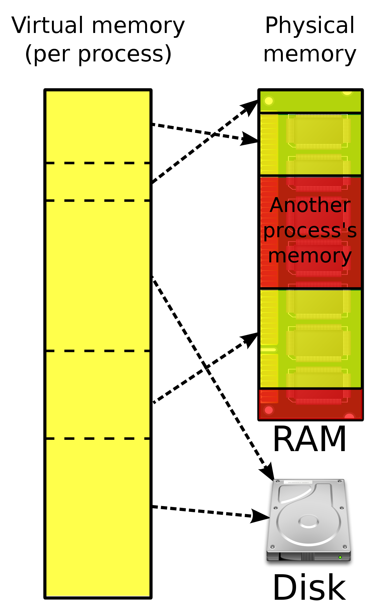
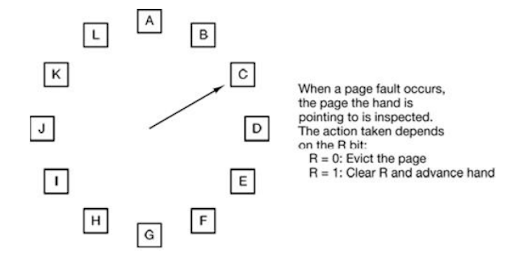
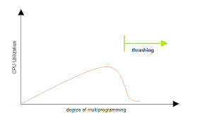

kowc에서 제공하는 [반효경 교수님의 운영체제](http://www.kocw.net/home/search/kemView.do?kemId=1046323&ar=pop) 강의를 듣고 정리한 글 입니다.

| chapter                                                                                                                                                                                                                                                                                             | 핵심 내용                               |
| --------------------------------------------------------------------------------------------------------------------------------------------------------------------------------------------------------------------------------------------------------------------------------------------------- | --------------------------------------- |
| 1. [운영체제 란?](<https://oowgnoj.dev/%EC%9A%B4%EC%98%81%EC%B2%B4%EC%A0%9C%20(kernel)>)                                                                                                                                                                                                            | 운영체제의 개요                         |
| 2. [시스템 구조](https://oowgnoj.dev/%EC%96%B4%EB%96%BB%EA%B2%8C%20%ED%94%84%EB%A1%9C%EA%B7%B8%EB%9E%A8%EC%9D%B4%20%EC%8B%A4%ED%96%89%EB%90%A0%EA%B9%8C%20feat.%20%EC%8B%9C%EC%8A%A4%ED%85%9C%20%EA%B5%AC%EC%A1%B0)                                                                                 | 컴퓨터 시스템 구조에 대한 개괄적인 설명 |
| 3. [프로세스](https://oowgnoj.dev/%ED%94%84%EB%A1%9C%EC%84%B8%EC%8A%A4%20-%20%EC%9A%B4%EC%98%81%EC%B2%B4%EC%A0%9C%EA%B0%80%20%EC%8B%A4%ED%96%89%EC%A4%91%EC%9D%B8%20%ED%94%84%EB%A1%9C%EA%B7%B8%EB%9E%A8%EC%9D%84%20%EA%B4%80%EB%A6%AC%ED%95%98%EB%8A%94%20%EB%B0%A9%EB%B2%95)                      | 실행중인 프로그램 : 프로세스            |
| 4. [프로세스 스케줄링](https://oowgnoj.dev/%EC%BB%B4%ED%93%A8%ED%84%B0%EA%B0%80%20%EC%9E%90%EC%8B%A0%EC%9D%98%20%EA%B0%80%EC%9E%A5%20%EB%B9%84%EC%8B%BC%20%EC%9E%90%EC%9B%90%EC%9D%84%20%EA%B4%80%EB%A6%AC%ED%95%98%EB%8A%94%20%EB%B0%A9%EB%B2%95%20-%20CPU%20%EC%8A%A4%EC%BC%80%EC%A4%84%EB%A7%81) | 운영체제의 프로세스 스케줄 관리         |
| 5. [프로레스 동기화](https://oowgnoj.dev/%EB%82%B4%EA%B0%80%20%EB%8D%B0%EC%9D%B4%ED%84%B0%EB%A5%BC%20%EC%93%B0%EA%B3%A0%EC%9E%88%EC%96%B4%20%EC%9E%A0%EC%8B%9C%20%EA%B8%B0%EB%8B%A4%EB%A0%A4%EC%A4%98%20-%20%ED%94%84%EB%A1%9C%EC%84%B8%EC%8A%A4%20%EB%8F%99%EA%B8%B0%ED%99%94)                     | 프로세스 동기화                         |
| 6. [메모리 관리](https://oowgnoj.dev/%EC%9A%B4%EC%98%81%EC%B2%B4%EC%A0%9C%EA%B0%80%20%EB%A9%94%EB%AA%A8%EB%A6%AC%EB%A5%BC%20%EA%B4%80%EB%A6%AC%ED%95%98%EB%8A%94%20%EB%B0%A9%EB%B2%95)                                                                                                              | 운영체제의 메모리 관리, 페이징 기법     |
| 7. [가상 메모리](https://oowgnoj.dev/%EA%B0%80%EC%83%81%20%EB%A9%94%EB%AA%A8%EB%A6%AC)                                                                                                                                                                                                              | 가상 메모리와 demand paging 기법        |

# Virtual Memory

프로그램이 실행되면 **당장 필요한 부분**만 주기억장치에 올려 사용하고, 나머지는 그대로 보조기억장치에 두어 사용하는 것을 말한다.
불필요한 I/O를 줄여주고, 실제의 메모리 용량보다 큰 프로그램이나 여러 개의 프로그램을 실행할 수 있도록 한다.
프로그램의 코드는 한 번에 극히 일부와 반복적인 코드를 주로 사용한다는 특성에 기인했다.

### Demand paging

실제 필요할 때 page를 메모리에 올리는 기법이다. Page table의 valid, invalid bit가 물리적 메모리에 저장되어있는지에 대한 여부를 저장하고, 사용되지 않거나 물리적 메모리에 없는 경우 MMU가 **page fault(trap)**을 발생시켜 디스크로부터 해당 페이지를 물리적 메모리에 저장한다.
만약 물리적 메모리의 저장공간이 부족하면, **replace**를 수행한다.

#### page fault

1. invalid page 접근 —> (physical) get empty page frame —> (없다면) **_replace_** —> disk I/O
2. disk I/O가 끝날 때 까지 프로세스는 CPU block
3. disk read —> page table entry 기록 —> valid/invalid —> ready queue process inserted

####replace

**clock algorithm** : 가장 최근에 참조되지 않은 페이지를 삭제하는 algorithm

-   CPU가 logical memory 주소 —> 주소변환 하드웨어 —> 페이지에 접근 —> valid —> **page table의** `reference bit` 를 1로 설정한다.
-   운영체제가 페이지 삭제를 위해 reference bit이 0 인 것을 찾는다. 이 때 `reference bit` 가 1 이라면 0으로 설정한다.
-   만약 자주 사용되는 페이지라면 reference bit = 1
-   `modified bit` 를 함께 사용해 I/O 동반 여부를 체크하기도 한다.

#### cf) 다양한 replace algorithm

-   LRU(Least Recently Used) : 가장 오래전에 사용된 페이지 삭제
    -   linkedList 로 구현, O(1)
-   LFU(Least Frequently Used) : 가장 적게 사용된 페이지 삭제
    -   heap , 최대 O(log n)

**Page sytem에서 LRU, LFU 가능한가?**
page fault trap이 걸려 운영체제로 제어권이 넘어가 physical memory에서 LRU, LFU를 하는 것인데, **page fault 가 나지 않는다면 운영체제는 해당 페이지에 접근했는지에 대한 시간이나 횟수를 모른다.**

### Page allocation

해당 프로그램의 메모리 참조 명령어를 실행하게 되면 명령어, 데이터 등 여러 페이지를 동시에 참조한다. 따라서 메모리를 참조하기 위해 최소한 할당되어야 하는 frame들이 있다. 예로 반복문을 구성하는 코드만 allocate 하게 된다면, 매 loop마다 page fault가 발생하게 된다.

#### Allocation scheme

-   Equality : 모든 프로세스에 똑같은 갯수를 할당한다.
-   Proportional: 프로세스의 크기에 비례해서 할당
-   Priority: 중요도에 따라 다르게 할당

### Thrashing

프로세스의 원활한 수행에 필요한 최소한의 page frame 수를 할당받지 못해 메모리에 적정 갯수 이상 프로그램이 실행되게 되면 반복적인 `page fault`로 CPU 사용률이 낮아지는 현상을 말한다. 해결방안은 working-set algorithm, page-fault frequency를 조정하는 방식이 존재한다.

#### working set algorithm

프로그램은 한정적인 page 를 반복해서 참조하는 특성을 이용해 메모리에 올라가있는 프로그램의 갯수를 조정한다.

**working-set** 프로세스가 과거에 참조 했던 page의 집합인데, process의 working set 전체가 메모리에 올라와 있어야 수행되고, 그렇지 않은 경우 모들 frame을 반납 후 swap out(suspend)된다.

#### page-fault frequency

프로세스의 page fault 비율에 upper, lower bound를 설정한다. upperbound를 초과한다면, process의 page frame 수를 늘리고 lowerbound 미만이라면 page frame 수를 줄인다.

빈 frame이 없으면 일부 프로세스를 swap out한다

### 정리

-   virtual memory 기법은 프로그램을 구성하는 데이터 중 당장 사용하는 부분만 물리적 메모리에 저장하는 기법이다.
-   paging system을 사용하는 경우 demand paging 기법 으로 virtual memory를 구현한다.
-   demand paging 기법은 당장 수행되는 페이지만을 물리적 메모리에 저장하는데, 실행하려는 데이터가 물리적 메모리에 올라와있지 않다면 (invalid bit) page fault를 발생시켜 물리적 메모리에 올려 사용한다.
-   물리적 메모리의 저장공간 확보를 위해 clock algorithm을 사용한다. 가장 최근에 참조되지 않은 page를 물리적 메모리에서 삭제한다.
-   Thrashing은 적정 프로그램 갯수 이상 실행되면 CPU 사용률이 급감하는 현상을 말한다.
