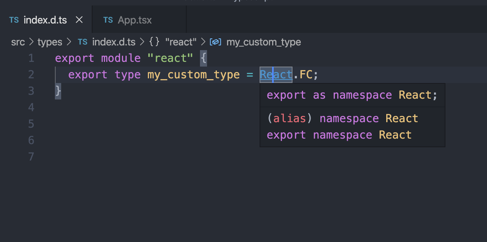

### Summary

-   Typescript compiler는 모듈에 대한 타입을 알아내기 위해 특정한 path를 따른다.
-   모듈 import 시 상대경로 / 비상대경로 에 따라 path가 다르다.
-   `tsconfig.json` 에서 custom 설정이 가능하다. (`path`, `typeRoot`, `type` 등등)

### react 에 custom type을 적용하고 싶다면?

1. 타입 정의

**src/types/index.d.ts**

```
export module "react" {
  export type my_custom_type = React.FC;
}
```

2. 모듈 이름에 따라 type을 참조할 path 정의

t**sconfig.json**

```
{
  "compilerOptions": {
    "jsx": "react",
    "baseUrl": "./",
    **"paths": {"react" : ["./src/types"]},**
    "outDir": "dist",
    "target": "es5",
    "module": "esnext",
    "strict": true,
    "esModuleInterop": true,
    "skipLibCheck": true,
    "forceConsistentCasingInFileNames": true,
    "lib": ["dom", "dom.iterable", "esnext"],
    "allowJs": true,
    "allowSyntheticDefaultImports": true,
    "moduleResolution": "node",
    "resolveJsonModule": true,
    "isolatedModules": false,
    "traceResolution": true
  },
	"include": ["src/**/*"],
  "exclude": ["node_modules", "**/*.spec.ts"]
}
```

3. 사용

**/src/index.tsx**

```
import React from "react";
import "./App.css";

~~c~~onst App: React.my_custom_type = () => {
  return (
    <div className="App">
      <header translate="no" className="App-header">
        <p>
          Edit <code>src/App.js</code> and save to reload.
        </p>
        <a
          className="App-link"
          href="https://reactjs.org"
          target="_blank"
          rel="noopener noreferrer"
        >
          Learn React
        </a>
      </header>
    </div>
  );
};

export default App;
```

## TL;DR

제가 모르고 있었던 부분을 정리했습니다.
타입스크립트 컴파일러와 컴파일러가 타입을 찾는 과정,
index.d.ts 파일 구조, ambient module에 대해 아래에서 설명합니다.

### 타입스크립트 컴파일러

**compiler 는 A language -> B language 로 바꾸는 프로그램이다.**

[microsoft/TypeScript-React-Starter](https://github.com/microsoft/TypeScript-React-Starter.git)

**타입스크립트 컴파일러**: 타입스크립트 → 자바스크립트 `tsc`

#### **타입스크립트 컴파일러가 해주는 일은?**

**당연 type checking**
정의한 type을 참고해 정의된 타입과 사용된 타입이 일치하는지 type checking 과정이 추가된 것 뿐이다.

a : string = 'jongwoo'

#### **모듈 구현과 타입 선언은 별개**

-   `d.ts` 파일로 타입을 따로 정리하게 되면, **타입 선언만** 이루어진다.
-   `.js` 파일에서는 오로지 모듈 구현만 이루어진다.
-   `.ts` 파일로 작성한 스크립트의 경우 **모듈 구현과 타입 선언**이 동시에 이루어진다.

### 타입스크립트는 어떻게 타입을 찾을까?

#### import 과정

```
import React from "react"; // 비상대경로
import React from "../node_modules/react" // 상대경로
```

### 상대경로

해당 파일 경로에 존재하는 .ts, .d.ts파일을 탐색한다. 해당 위치에 파일이 존재하지 않는 경우 컴파일 오류가 발생하게 된다.

### 비상대경로

1. `compilerOptions.path` 옵션에 설정된 패턴(모듈 이름) 과 일치한 경우 해당 경로 탐색
2. **현재 파일이 위치한 디렉토리**에서 파일 탐색
3. 루트 디렉토리(baseUrl) 옵션에 도달할 때까지 상위 디렉토리로 올라가며 파일 탐색
4. `node_module` 내부 파일 탐색
5. `node_module/[module]/package.json` 의 `main`, `types`, `typing` 필드에 설정된 경로 탐색
6. node_module/[module] 디렉토리 내의 파일 탐색

6번까지 과정에서 못찾았다면 **앰비언트 모듈 선언 에서 타입 참조**

-   cf ) tsc —traceResolution command 확인 가능

```
    File '/Users/oowgnoj/Desktop/tutorial/my-app/node_modules/yargs-parser/index.js.ts' does not exist.
    File '/Users/oowgnoj/Desktop/tutorial/my-app/node_modules/yargs-parser/index.js.tsx' does not exist.
    File '/Users/oowgnoj/Desktop/tutorial/my-app/node_modules/yargs-parser/index.js.d.ts' does not exist.
    File name '/Users/oowgnoj/Desktop/tutorial/my-app/node_modules/yargs-parser/index.js' has a '.js' extension - stripping it.
    File '/Users/oowgnoj/Desktop/tutorial/my-app/node_modules/yargs-parser/index.ts' does not exist.
    File '/Users/oowgnoj/Desktop/tutorial/my-app/node_modules/yargs-parser/index.tsx' does not exist.
    File '/Users/oowgnoj/Desktop/tutorial/my-app/node_modules/yargs-parser/index.d.ts' does not exist.
    Directory '/Users/oowgnoj/Desktop/tutorial/my-app/node_modules/yargs-parser/index.js' does not exist, skipping all lookups in it.
    File '/Users/oowgnoj/Desktop/tutorial/my-app/node_modules/yargs-parser/index.ts' does not exist.
    File '/Users/oowgnoj/Desktop/tutorial/my-app/node_modules/yargs-parser/index.tsx' does not exist.
    File '/Users/oowgnoj/Desktop/tutorial/my-app/node_modules/yargs-parser/index.d.ts' does not exist.
    Found 'package.json' at '/Users/oowgnoj/Desktop/tutorial/my-app/node_modules/@types/yargs-parser/package.json'.
```

### @types/sth의 index.d.ts 는 어떻게 생겼을까?

npm install @types/underscore

`node_module/@types/index.d.ts`

```
export = React; // CommonJD and AMD module system
export as namespace React; // UMD : 전역변수로 설정
declare namespace React { //typescript 컴파일러가 알아듣게 declare namespace
    //
    // React Elements
    // ----------------------------------------------------------------------

    type temp<P = any> =
        {
            [K in keyof JSX.IntrinsicElements]: P extends JSX.IntrinsicElements[K] ? K : never
        }[keyof JSX.IntrinsicElements] |
        ComponentType<P>;
    /**
     * @deprecated Please use `ElementType`
        */
    type ReactType<P = any> = ElementType<P>;
    type ComponentType<P = {}> = ComponentClass<P> | FunctionComponent<P>;

    type JSXElementConstructor<P> =
        | ((props: P) => ReactElement | null)
        | (new (props: P) => Component<P, any>);

    interface RefObject<T> {
        readonly current: T | null;
    }
    type RefCallback<T> = { bivarianceHack(instance: T | null): void }["bivarianceHack"];
    type Ref<T> = RefCallback<T> | RefObject<T> | null;
    type LegacyRef<T> = string | Ref<T>;

        ....
}

```

### Ambient Module이란?

한마디로 어디서든 사용할 수 있는 type 정의

third party library는 이 방식을 사용하고 있음

`declare`



#### ambient module에 custom 타입 추가하는 방법

```jsx
export = React;
export as namespace React;

export module "react" {
    import "react";
    export type jongwoo = string;
}

```

## Reference

[Module Resolution](https://www.typescriptlang.org/docs/handbook/module-resolution.html)

[Compiler Options](https://www.typescriptlang.org/docs/handbook/compiler-options.html)

[타입스크립트 컴파일러가 모듈 타입 선언을 참조하는 과정](https://medium.com/naver-fe-platform/%ED%83%80%EC%9E%85%EC%8A%A4%ED%81%AC%EB%A6%BD%ED%8A%B8-%EC%BB%B4%ED%8C%8C%EC%9D%BC%EB%9F%AC%EA%B0%80-%EB%AA%A8%EB%93%88-%ED%83%80%EC%9E%85-%EC%84%A0%EC%96%B8%EC%9D%84-%EC%B0%B8%EC%A1%B0%ED%95%98%EB%8A%94-%EA%B3%BC%EC%A0%95-5bfc55a88bb6)
