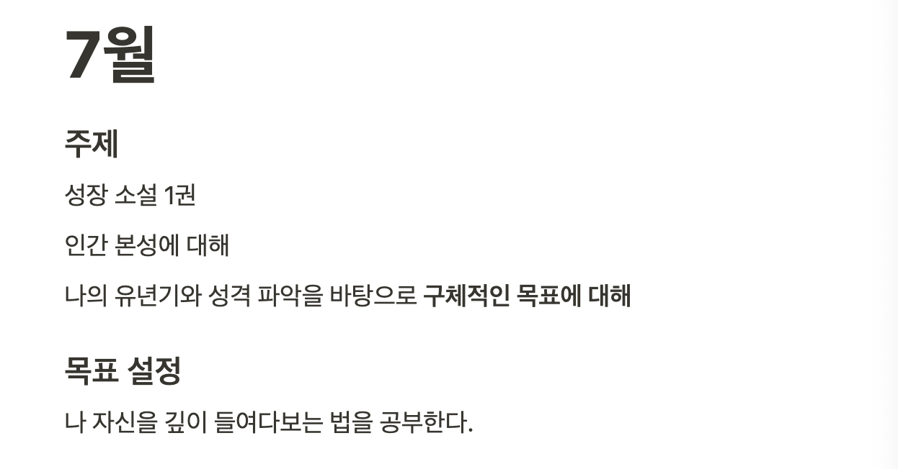
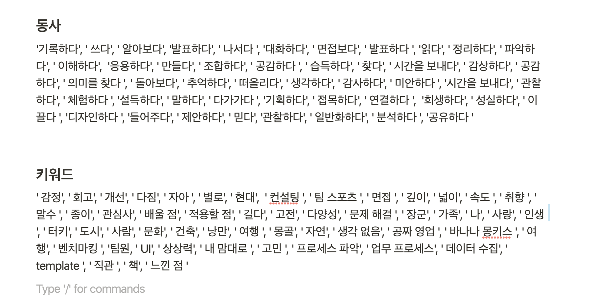
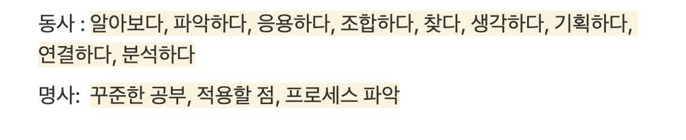
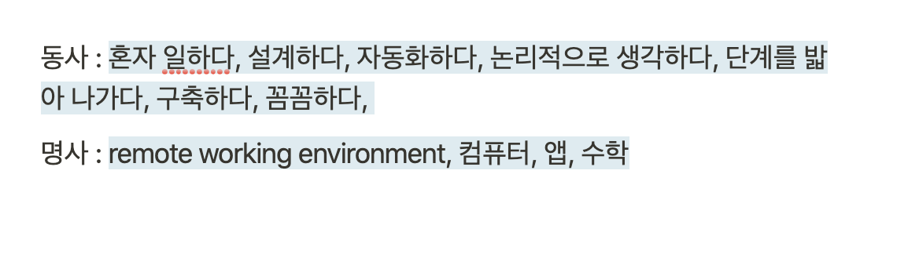
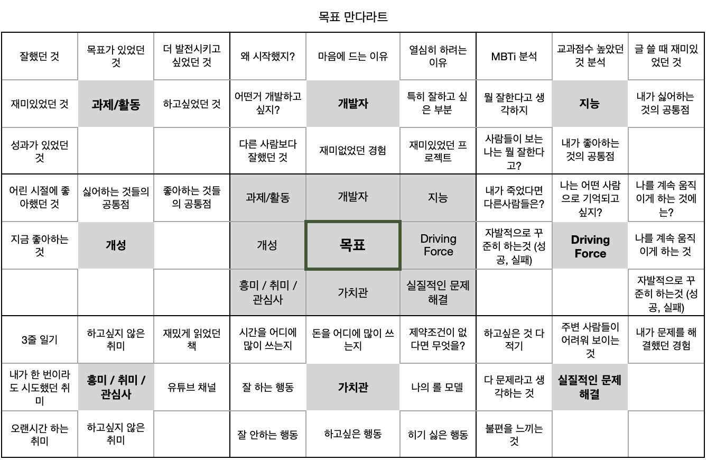

## 목표에 대해

7월 목표는 **취향, 생각, 사건, 행동 등을 바탕으로 한 문장의 잘 정돈된 목표를 세우는 것.** 엘론 머스크의 '화성' 처럼 간결하고 나에게 도전이 될 만한 무언가를 찾고 싶었다.

아래의 순서로 실행에 옮겼다.

1. 인간 본성의 법칙 - 로버트 그린 읽기
2. 독서 중 떠오르는 생각 정리
3. 어린시절 끌렸던 무언가에 대해 생각하고 정리
4. 전에 했던 활동들에 대해 주어 - 동사 형태로 정리
5. 내가 무엇을 잘하는 사람인지 생각
6. 개발자를 하며 잘하거나 좋아하는 부분을 생각

### 희망이 보였다.

대학을 졸업하고 취업을 준비하며 한번 비슷한 목표를 가졌고, 실행으로 옮겼었다. 그 때 내렸던 결론은 '생각하고 분석하는 것 만으로는 목표를 찾을 수 없다.' 라고 기억한다. (다음 번에 같은 상황이 오면 기억에 의존하지 않았으면 좋겠어 글을 쓴다) \
그 때 보다 여러 방법으로 시도했고 시간도 더 들였다. 내 자신에게 조금 더 솔직함을 느꼈고, 인간 본성의 법칙을 읽으며, 독서를 할 때는 늘 그렇듯 희망이 보였다. 분명 나는 열심히 찾고 있었다.

### 나에 대한 공부

저자의 통찰에 감탄하며 인간 본성의 법칙을 반쯤 읽었다. 7월도 반이 지나가고 있었다. 이때 쯤 이면 저자가 이야기하는 목표에 다가가야 했다. 저자는 인생의 소명이라 표현했다. 목적의식, 내면의 목소리, 방향성, 의사결정의 중요성에 대해 언급했다. 마틴 루터킹을 예로 들며 '인생의 과업'을 결정하는 데 있어 가장 주된 요소는 내가 가지고 있는 기술, 재주, 성향 이라고 주장했다.\
내가 가지고 있는 기술, 재주, 성향에 대해 알아야 했다. 길지 않은 시간이지만 27년 가량의 시간에 걸쳐 '나'를 탐구해야 했다. 기억과 짤막한 메모, 과목 이름과 A-F 까지 써 있는 성적표에 의존해 내가 가지고 있는 가장 중대한 문제를 해결해야 했다.

### 기억에 의존해 찾아보고, 분석하기

나의 개성과 지능을 알아보기 시작했다. _개성은 어린시절 이유없이 끌렸던 무언가_ 에서 실마리 찾아보려 했다. 지도를 좋아하는, 나의 존재에 대해 신기함을 가지고 있었던 측은지심이 많았던 아이 외에는 특별한 다른 생각이 나지 않았다. \
다음으로 지능, 잘한다고 느꼈거나 성과가 있었던 활동을 살펴보았다. 기억에 의존해 행동했던 것들을 낮은 단계에서 범주화했다.

활동 (동사) - 키워드 (명사) - 만족도(상, 중, 하) 형태로 정리해 무엇을(키워드) 하는 것(동사)를 좋아하는지 정리했다. 아래 단어들이 내가 좋아 했거나, 잘한다고 느꼈던 동사와 명사다.

이 목록으로 개발자와 공통점을 추려 보았는데, 아래에 있는 동사와 명사가 있었다. **한 마디로 개발자로서 내 장점 목록이다.**

**아래는 내 단점이나 새롭게 관심을 가지게 된 분야다.**

## 결론적으로 이번 달은 이것으로 만족해야 했다.

### 그럼에도 얻은 것

'음.. 그래서 .. 목표가 뭐지..?' 추려진 단어들을 보며 들었던 생각이다. 약간 김이 빠지며 과거에 찾아보며 쉽지 않았던 느낌이 다시 떠올랐다. '하루하루 살다보면 자연적으로 생기겠지.' 혹은 이직으로 주제로 이동해 빈 공허함을 채우고 싶었다. 지난 번에는 이런 상황에서 다른 고민들로 이동했고, 만족한다.\
지금은 다른 문제라고 생각한다. 내가 해결하거나, 도움을 주거나, 나를 움직이는 하나의 목표를 찾는 것을 멈추지 않겠다는 다짐이 생겼다.

## 앞으로

당분간은 나에 대해 질문하고, 답변하는 것을 유지 할 생각이다. 왜냐하면 찾을 수 있고 찾아야 한다고 생각한다. 또... 못찾아도 손해 볼 것이 없다. 만다라트 형식에 각 항목에 맞는 질문들을 정리했다. 세 줄 일기는 매일 (1) 어떤 사건이 있었고 (2) 더 나아질만한 방향에 대해 생각하고 (3) 내일은 어떻게 보내고 싶은지에 대해 세 줄로 기록하고 돌아보는 시간을 가지려고 한다.

(언젠간 찾겠지 뭐..)
