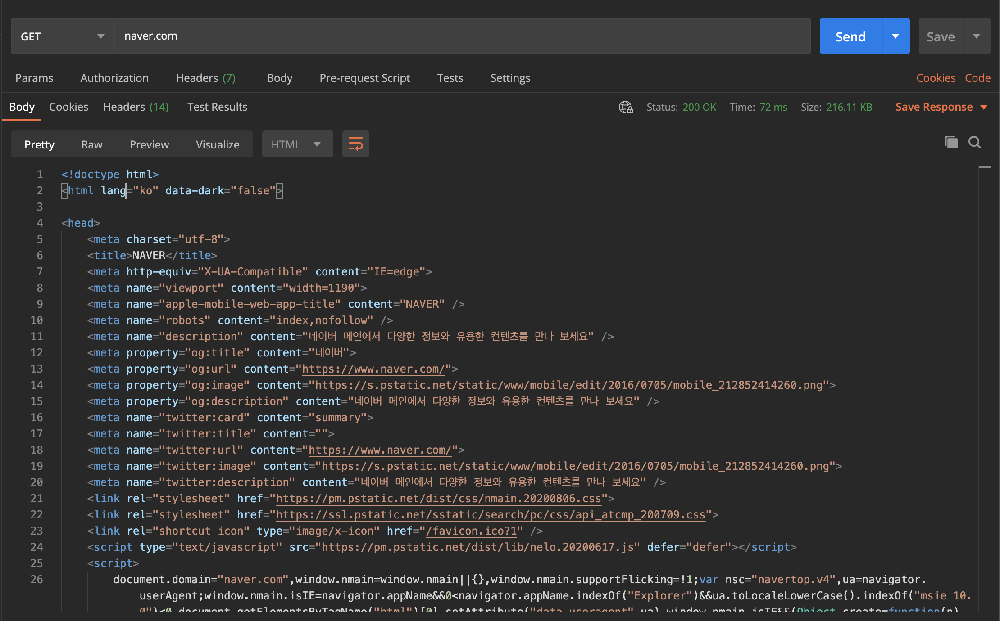
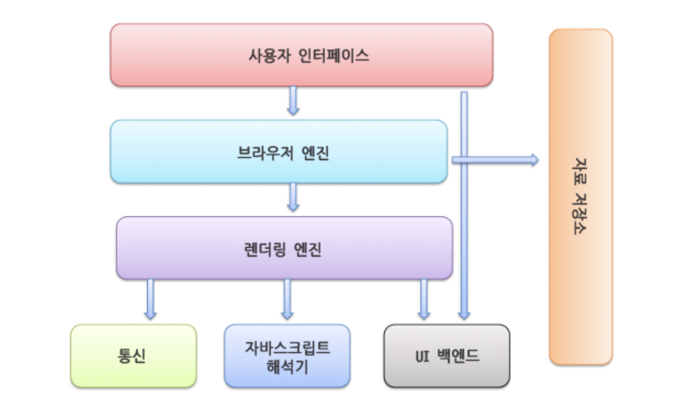
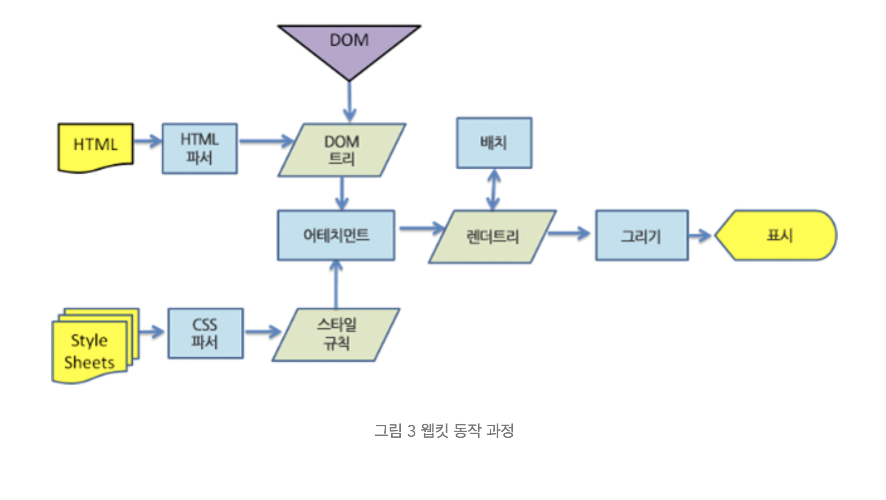
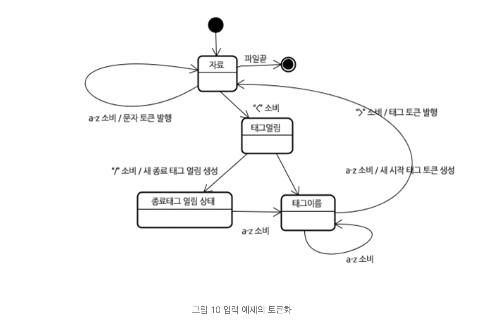
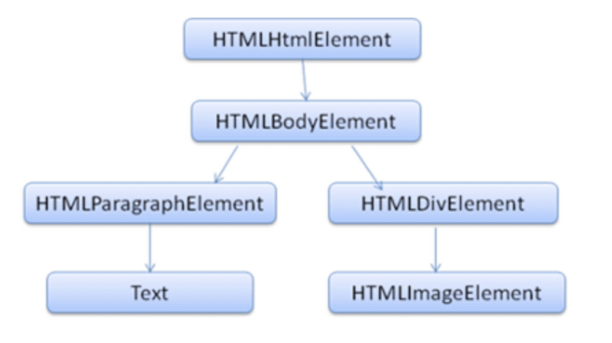

## ! warning

네이버 D2의 ['브라우저는 어떻게 작동하는가'](https://d2.naver.com/helloworld/59361) 를 보고 공부 목적으로 정리한 글입니다. 전반적인 내용은 비슷하나 이해한 내용을 바탕으로 다시 적었습니다. 일부 내용을 포함하지 않습니다. 별도의 언급이 없다면 사진과 그림은 모두 D2의 [게시글](https://d2.naver.com/helloworld/59361)에서 가져왔습니다. 

## 브라우저란?

브라우저는 영사기와 비슷하다. 필름(HTML 혹은 파일)을 **특정 작업을 거쳐** 화면에 보여준다. 다른 점은 영사기는 시간의 흐름대로 작동하고, 브라우저는 **유저의 요청에 반응해 응답을 화면에 보여준다**.

### 브라우저의 주요 기능



**브라우저의 주 기능은 웹서버에서 돌려준 코드를 유저 인터페이스로 변환한다.** HTML, CSS 코드를 **약속** 에 따라 정보를 표시하고 화면에 배치한다. 이때 사용하는 약속은 [W3C](https://www.w3.org/)라는 기구에서 정한 표준 명세다. 웹 개발을 하다 보면 브라우저에 따라 다른 결과를 보여주는 경우가 있다 (***cross-browsing 이슈***). 특정 브라우저가 W3C에서 발간하는 표준에 따르지 않았거나, 확장하여 구현해 이러한 현상이 생긴다.
영사기에 비유해보자. 우선 필름의 규격이 맞아야 영사기에 넣어 실행시킬 수 있다. 영화 제조사는 필름 국제표준(ex 가로 4cm)을 따라야 한다. 브라우저는 `.html`, `.css (.scss)`, '.js' 파일 형태로 제작된 코드를 실행한다. 국제 영화기구에서 필름 4분 지점에 영화 소개하는 트레일러가 있어야 한다는 약속을 만들었다. 브라우저의 경우엔 W3C에서 제작한 표준으로 `<head>` 내부에 해당 사이트에 대한 설명이 포함된 `<meta description>` 태그를 사이트 설명으로 유저에게 알려줄 수 있다. 약속을 잘 지켜 제작하면 대부분의 영사기(브라우저)에서도 수립된 표준을 따르고 있어 관람객(유저)에게 적절하게 보여줄 수 있다.

## 렌더링 엔진

브라우저는 위 그림처럼 구성되어 있다. 유저와 상호작용이 이루어지는 사용자 인터페이스를 통해 브라우저의 동작이 발생하게 된다. 브라우저 엔진은 사용자 인터페이스와 렌더링 엔진(뒤에서 자세히 살펴본다) 사이에서 의사소통을 담당한다. 렌더링 엔진에서 코드를 인터페이스로 변환시키는 작업을 수행하는데 브라우저마다 다른 엔진을 사용한다. 크롬과 사파리의 경우 웹킷(Webkit) 엔진을 사용하고, 파이어폭스는 모질라에서 직접 만든 게코(Gecko) 엔진을 사용한다. 이 글에서는 주로 webkit을 주로 다룰 텐데, 큰 차이가 있다면 Gecko 엔진도 포함할 예정이다.


### 렌더링 엔진의 동작 과정 (webkit)
때로는 결과물로 '이런 과정을 거치겠구나' 추측하는 것이 필자에게는 도움이 된다. 다시 한번 렌더링 엔진의 결과물을 보자.

이 그림을 브라우저의 측면에서 보면 크게 두가지 요소로 구분할 수 있다. 마크업이라고 불리는 컨텐츠 요소와, 어디에 표시될지 나타내는 스타일 요소다. 이제 아래 렌더링 엔진(webkit) 동작 과정을 나타낸 도식 도를 보자.



왼쪽 HTML과 Style Sheets(CSS)에서 시작해 '어테치먼트' 과정에서 합쳐지는 모습을 볼 수 있다. 그 후에 렌더트리라는 결과물이 나오고, 그리기 과정을 거쳐 유저에게 보여주는 '표시' 과정으로 마무리된다. (상당히 여러 과정을 거치는데 빠르게 반응해 다시 한번 브라우저의 성능과 개발하신 분께 놀란다.)

이 과정을 짧게 순서로 나타내면 아래와 같다.

1. 렌더링 엔진은 HTML과 CSS를 따로 **파싱**한 후에 결과물로 **DOM 트리**, **스타일 규칙**을 만든다.
2. DOM 트리 + 스타일 규칙을 합쳐 **렌더트리 를 만든다.**
3. 렌더트리를 배치해 브라우저 화면에 그리고 표시하게 된다.

'브라우저는 HTML과 CSS 파일을 따로 파싱(무슨 뜻인지는 모르겠지만 대충)해 보여주는구나' 라고 넘어가도 괜찮다. 하지만 조금만 더 알아보자.

### 파싱에 대해 알아보자.
파싱(parsing)은 코드를 최소 단위로 나누고(어휘 분석) + 약속된 문법을 적용해 (구문 분석) 결과물 (파싱 트리)를 생성하는 것이다. 계산식 예제를 파싱해보며 감을 익혀보자. 

**어휘분석**은 자료를 토큰으로 분해하는 과정이다. 토큰은 유효하게 구성된 단위의 집합체로 용어집이라고 할 수도 있다. 인간의 언어에서는 사전에 등장하는 모든 단어에 해당된다. 

````
INTEGER : 0|[1-9][0-9]*
PLUS : +
MINUS : -
````
계산 식 1 * 2 + 3을 어휘분석 하게 되면, `1, *, 2, +, 3` 최소단위인 숫자와 기호로 나누어진다.


**구문분석**은 언어의 구문 규칙을 적용하는 과정이다. 계산식의 경우 구문은 숫자와 기호로 이루어져 있다. 두 개의 숫자가 연달아 오지 못하고, 두 개의 기호도 역시 연달아 배치되지 못한다. 만약 배치 순서에 오류가 있으면 구문분석 과정에서 에러가 발생한다. 구문 약속은 보통 [BNF 표기법](https://perfectacle.github.io/2018/08/15/bnf/)을 따른다.

계산식 BNF 표기 예시
````
expression := term operation term
operation := PLUS | MINUS
term := INTEGER | expression
````

## HTML 파서
HTML 을 파싱하는 주체를 파서라고 한다. HTML을 파싱을 위해 모두의 약속, **표준** 이 필요하다. W3C 표준에서 어휘, 구문분석에 필요한 모든 정보가 명세로 정의했다. **하지만 일반적인 파서로는 HTML을 파싱할 수 없다. 왜냐하면 HTML은 파서가 요구하는 문맥 자유 문법(위의 계산식 BNF 표기의 형태)에 의해 쉽게 정의할 수 없기 때문이다.** 이유를 자세히 알아보자.

1. HTML은 특정 태그를 생략해 사용할 수 있다. HTML은 제작자를 위해 유연한 문법을 지원하기 때문에 딱 떨어지는 규칙을 정할 수 없다.

```html
(1) </img>

(2) 
```
(1)번과 (2) 번 코드 처럼 형식이 다를 때에도 엄격하게 규칙을 따르지 않아도 작동해야 한다. 

2. HTML 오류에 대한 브라우저의 관용
3. 변경에 의한 재파싱 (script에서 `document.write` 등과 같은 코드가 HTML을 수정하면 브라우저는 이 변경을 반영해야 한다.)


### 따라서 HTML은 파싱을 위해 별도 알고리즘을 사용한다. 


### 어휘분석 : 토큰화

HTML을 토큰화 알고리즘은 **상태 기계(State Machine)**라고도 불리운다. 왜냐하면 단어의 현재 상태(위치)에 따라 전혀 다른 결과를 내기 때문이다. HTML 특성상 같은 단어의 쓰임이 `<tag 안>`, `<tag> 밖` 에 따라 다르다. 태그의 특정 요소 값으로 들어가는 경우에도 전혀 다른 결과를 만들어 낸다. 아래 예제로 보면 이해가 쉽다.
````html
<div> style="display: none" </div>
````

````html
<div style="display: none"> </div>
````

### 트리 구축
HTML 문서의 가장 큰 특성은 <시작태그>와 </끝태그> 가 있다. 부모태그가 시작해 자식태그를 생성하고, 끝날 때 까지 부모태그는 열려있는 상태로 유지해야 한다. 따라서 토큰화 알고리즘에서는 stack 에 열린 태그를 쌓는다.  이 stack내부에서 부정확한 중첩과 종료되지 않은 태그를 교정한다.

````html
<html>
	<body>
		hello world !
	</body>
</html>
````
트리 구축 알고리즘은 `<html>` 태그가 시작되면 'html 태그 시작'으로 상태를 변경한다. W3C 명세에 따르면 `<head>` 가 있어야 하지만, 위 문서에서는 생략되었다. 이 경우 `<body>` 를 토큰화하기 전에 `<head>` 토큰이 없더라도 `HTMLHeadElement`는 묵시적으로 생성되어 트리에 추가될 것이다.
트리 구축 알고리즘이 HTML 문서의 마지막 토큰(`</body>` , `</html>`)을 받으면 파싱을 종료한다. 

### DOM
오래 걸렸다. HTML의 최종 결과물인 DOM 객체가 등장하는 순간이다. 
Document Object Model의 준말인 DOM 객체는 HTML 마크업을 **객체형태** 로 표현한 노드로 최상위 객체는 `document` 다.

````
<html>
  <body>
   <p>Hello World</p>
   <div></div>
  </body>
</html>
````

위 코드가 아래와 같은 형태의 DOM 객체(트리)로 변환된다. 각각의 DOM 요소는 속성(style 등)을 포함한 객체로 이루어져 있다. W3C에 의해 [명세](https://www.w3.org/DOM/DOMTR)가 발행되어 있다.



브라우저가 여기까지만 지원한다면 유저는 어쩌면 알아보기 힘든 형태거나, 건조한 UI를 사용해야 한다. 웹 공간을 조금 더 풍요롭고, 아름답게 만들어주는 스타일 객체와 CSS에 대해 곧 정리하는 시간을 가져야겠다.

### 정리
- 브라우저의 주 기능은 웹서버로부터 자원(코드)을 받아 우리가 사용하는 유저 인터페이스로 변환한다.
- HTML은 일반적인 파서(어휘 분석, 구문 분석)로 파싱이 불가능하다. HTML의 유연한 문법과 브라우저의 관용, 렌더링 후에도 변할 수 있는 특성 때문이다.
- 대신 별도 알고리즘을 사용한다. 토큰화를 거쳐 요소의 환경(상태)에 부합하게 변환하고 트리를 구축하는 단계를 거친다.
- 최종 결과물인 DOM 노드는 HTML 마크업을 객체 형태로 표현한 노드다.


