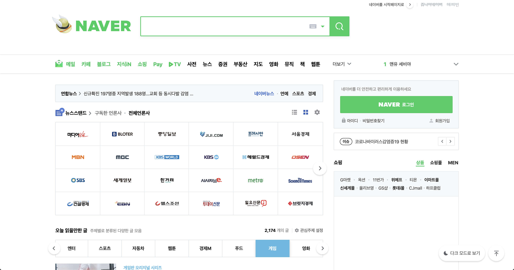

## ! warning

네이버 D2의 ['브라우저는 어떻게 작동하는가'](https://d2.naver.com/helloworld/59361) 를 보고 공부 목적으로 정리한 글 입니다. 전반적인 내용은 비슷하나 이해한 내용을 바탕으로 다시 적었습니다. 일부 내용을 포함하지 않습니다. 별도의 언급이 없다면 사진과 그림은 모두 D2의 [게시글](https://d2.naver.com/helloworld/59361)에서 가져왔습니다.

## 브라우저란?

브라우저는 영사기와 비슷하다. 필름(HTML 혹은 파일)을 **특정 작업을 거쳐** 화면에 보여준다. 다른점은 영사기는 시간의 흐름으로 작동하고, 브라우저는 **유저의 요청에 반응해 응답을 화면에 보여준다**.

### 브라우저의 주요 기능

https://www.naver.com 웹서버에서 돌려준 응답

브라우저를 사용하면 https://www.naver.com 위 그림의 html 코드를 사용자 인터페이스가 포함된 그래픽 인터페이스로 사용할 수 있다.


브라우저의 주 기능은 (1) 웹서버에서 돌려준 코드를 (2) 유저 인터페이스로 변환한다. HTML, CSS 코드를 **약속** 에 따라 정보를 표시하고 화면에 배치한다. 이 때 사용하는 약속은 [W3C](https://www.w3.org/)라는 기구에서 정한 표준 명세다. 웹 개발을 하다보면 브라우저에 따라 다른 결과를 보여주는 경우가 있다 (cross-browsing 이슈). 특정 브라우저가 W3C에서 발간하는 표준에 따르지 않았거나, 확장하여 구현해 이러한 현상이 생긴다.
영사기에 비유해보자. 우선 필름의 규격이 맞아야 영사기에 넣어 실행시킬 수 있다. 영화 제조사는 필름 국제표준(ex 가로 4cm)을 따라야 한다. 브라우저는 `.html`, `.css (.scss)`, '.js' 파일 형태로 제작된 코드를 실행한다. 국제 영화기구에서 필름 4분 지점에 영화 소개하는 트레일러가 있어야 한다는 약속을 만들었다. 브라우저의 경우에도 W3C에서 제작한 표준으로 `<head>` 내부에 해당 사이트에 대한 설명이 포함된 `<meta description>` 태그를 사이트 설명으로 유저에게 알려줄 수 있다. 약속을 잘 지켜 제작하면 대부분의 영사기(브라우저)에서도 수립된 표준을 따르고 있어 관람객(유저)에게 적절하게 보여줄 수 있다.

## 렌더링 엔진

브라우저는 위 그림처럼 구성되어 있다. 유저와 인터랙션이 이루어지는 사용자 인터페이스를 통해 브라우저의 동작이 발생하게 된다. 브라우저 엔진은 사용자 인터페이스와 렌더링 엔진(뒤에서 자세히 살펴본다) 사이에서 의사소통을 담당한다. 렌더링 엔진에서 코드를 인터페이스로 변환시키는 작업을 수행하는데 각 브라우저마다 다른 엔진을 사용한다. 크롬과 사파리의 경우 웹킷(Webkit) 엔진을 사용하고, 파이어폭스는 모질라에서 직접 만든 게코(Gecko) 엔진을 사용한다. 이 글에서는 주로 webkit을 주로 다룰텐데, 큰 차이가 있다면 Gecko 엔진도 포함할 예정이다.


### 렌더링 엔진의 동작과정 (webkit)
때로는 결과물로 내부 동작과정에서 '이런 과정을 거치겠구나' 추측하는 것이 필자에게는 도움이 된다. 다시한번 렌더링 엔진의 결과물을 보자.

이 그림을 브라우저의 입장에서 보면 크게 두가지 요소로 구분할 수 있다. 마크업이라고 불리우는 컨텐츠 요소와, 어디에 표시될지 나타내는 스타일 요소다. 이제 아래 렌더링 엔진(webkit) 동작과정을 나타낸 도식도를 보자.


왼쪽 HTML과 Style Sheets(CSS)에서 시작해 '어테치먼트' 과정에서 합쳐지는 모습을 볼 수 있다. 그 후에 렌더트리라는 결과물이 나오고, 그리기 과정을 거쳐 유저에게 보여주는 '표시' 과정으로 마무리 된다. (상당히 여러 과정을 거치는데 빠르게 반응해 다시한번 브라우저의 성능과 개발하신 분께 놀란다.)

이 과정을 짧게 순서로 나타내면 아래와 같다.

1. 렌더링 엔진은 HTML과 CSS를 따로 **파싱**한 후에 결과물로 **DOM 트리** **스타일 규칙**을 만든다.
2. DOM 트리 + 스타일 규칙을 합쳐 **렌더트리 를 만든다.**
3. 렌더트리를 배치해 브라우저 화면에 그리고 표시하게 된다.

'브라우저는 HTML과 CSS파일을 따로 파싱(무슨 뜻인지는 모르겠지만 대충)해 보여주는구나' 라고 넘어가도 괜찮다. 하지만 조금만 더 알아보자.

### 파싱에 대해 알아보자.
파싱(parsing)은 코드를 최소 단위로 나누고(어휘 분석) + 약속된 문법을 적용해 (구문 분석) 결과물 (파싱 트리)를 생성하는 것이다. 계산식 예제를 파싱해보며 감을 익혀보자. 

**어휘분석**은 자료를 토큰으로 분해하는 과정이다. 토큰은 유효하게 구성된 단위의 집합체로 용어집이라고 할 수도 있다. 인간의 언어에서는 사전에 등장하는 모든 단어에 해당된다. 

````
INTEGER : 0|[1-9][0-9]*
PLUS : +
MINUS : -
````
계산식 1 * 2 + 3을 어휘분석 하게되면, `1, *, 2, +, 3` 최소단위인 숫자와 기호로 나누어진다.


**구문분석**은 언어의 구문 규칙을 적용하는 과정이다. 계산식의 경우 구문은 숫자와 기호로 이루어져 있다. 두개의 숫자가 연달아 오지 못하고, 두개의 기호도 역시 연달아 배치되지 못한다. 만약 배치 순서에 오류가 있으면 구문분석 과정에서 에러가 발생한다. 구문약속은 보통 [BNF 표기법](https://perfectacle.github.io/2018/08/15/bnf/)을 따른다.

계산식 BNF 표기 예시

expression := term operation term
operation := PLUS | MINUS
term := INTEGER | expression


## HTML 파서
HTML 을 파싱하는 주체를 파서라고 한다. W3C 표준이 어휘, 구문분석에 필요한 모든 정보가 명세로 정의했다. **하지만 위에서 살펴본 것 과 같이 일반적인 파서로는 HTML을 파싱할 수 없다. 왜냐하면 HTML은 파서가 요구하는 문맥 자유 문법(위의 계산식 BNF 표기의 형태)에 의해 쉽게 정의할 수 없기 때문이다.**
조금 더 자세히 알아보면,
1. 특정 태그를 생략해 사용할 수 있다. (아래 (1)번과 (2) 번 코드 처럼 형식이 다를 때에도 엄격하게 규칙을 따르지 않아도 작동해야 한다)

```html
(1) </img>

(2) 
```

2. HTML 오류에 대한 브라우저의 관용

3. 변경에 의한 재파싱 (script에서 `document.write` 등과 같은 코드가 HTML을 수정하면 브라우저는 이 변경을 반영해야 한다.)


### 따라서 HTML은 파싱을 위해 별도 알고리즘을 사용한다. 
HTML을 토큰화 알고리즘은 **상태기계(State Machine)**라고도 불리운다. 토큰화 과정에서 현재 입력받은 문자열이 `<div> 토큰화...` 과정에 있는지, `<div style={토큰화..` 과정에 있는지에 따라 결과로 내어줘야 할 요소가 다르기 때문이다.

결과물로 보면 이해가 쉽다. 첫번째 시작 `<div>` 가 닫히고 '토큰화..'라고 써있는 부분은 해당 div 태그 내부에 포함되야 할 문자다. 두번째 style 내부에 있는 토큰화..는 해당 div의 style  요소로 포함될 항목으로 토큰화가 진행되어야 한다. 따라서 HTML 토큰화 알고리즘은 현재 어떤 상태인지를 기억하고, 상황에 따라 다른 결과값을 반환한다.


