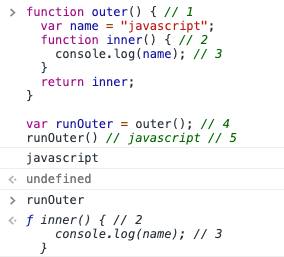

### 클로저란?

```jsx
function outer() {
    // 1
    var name = 'javascript';
    function inner() {
        // 2
        console.log(name); // 3
    }
    return inner;
}

var runOuter = outer(); // 4
runOuter(); // javascript // 5
```

대표적인 closure 예시다. 4번 줄에서 `runOuter` 변수에 `outer` 함수를 실행시킨 값을 담는다. 다음 5번 줄에서 `runOuter` 함수를 실행시킨다.

여기서 의문이 생긴다. **outer 함수는 inner 함수만을 리턴하고 있는데, `name` 변수가 어떻게 잘 출력이 될까 ?** 콘솔 창에서 `inner` 함수만 리턴하고 있는지 확인해 보자.


`runOuter` 는 `inner` 함수만을 리턴하고 있다. (name 변수는 포함하지 않는다.) 글로벌 스코프 내에도 name 변수는 없다. 그런데도 “javascript”를 출력한다.

이 쯤에서 클로저의 정의를 살펴보자.

### 클로저의 정의

클로저는 **함수와 함수가** **선언된 어휘적 환경(lexical scope)** 의 조합이다.[출처 MDN](<[https://developer.mozilla.org/ko/docs/Web/JavaScript/Guide/Closures](https://developer.mozilla.org/ko/docs/Web/JavaScript/Guide/Closures)>)

필자는 개인적으로 트위터리안 David Khourshid 의 정의가 마음에 든다. _"Closure is a stateful function"_ 그 밖에 "스코프를 기억하는 함수", "환경(Lexical scope) 를 기억하는 함수" 등 개인이 이해하기 편한 정의로 생각하자.

이번 포스트에서는 자바스크립트에서 클로저가 **실제로 유용하게 쓰이는 2가지 경우**에 대해 알아보려고 한다. 구체적으로 어떻게 작동하고 스코프가 어떻게 형성되는지는 추후 다뤄볼 예정이다.

## 클로저의 쓰임

### 1. 함수 캡슐화

웹 프론트에서 이벤트를 다룰 때 콜백 함수를 사용한다. inline에 사용하거나 `onScroll`, `onClick`, `addEventListener` 메소드를 사용할 때에도 콜백 함수를 지정한다. **클로저를 사용해 같은 비슷한 기능의 함수를 캡슐화 할 수 있다.**

아래 예제는 font-size를 변경하는 이벤트 콜백함수를 생성한다.

콜백함수를 생성하는 makeSizer 함수다. 내부에 클로저를`makeSizer` 함수는 인자로 `size`를 받아 클로저 함수를 리턴한다.

```jsx
function makeSizer(size) {
    return function () {
        document.body.style.fontSize = size + 'px';
    };
}

var size12 = makeSizer(12);
var size14 = makeSizer(14);
var size16 = makeSizer(16);
```

콜백함수를 생성하는 makeSizer 함수다. 내부에 클로저를makeSizer 함수는 인자로 size를 받아 클로저 함수를 리턴한다.

```jsx
document.getElementById('size-12').onclick = size12;
document.getElementById('size-14').onclick = size14;
document.getElementById('size-16').onclick = size16;
```

onclick 메소드에 할당하는 과정.

### 은닉화 (private method 구현)

클로저를 사용하면 **은닉화**가 가능하다**.** 내부 변수와 메서드를 안전하게 관리할 수 있다.

일반적으로 이름 규칙을 통해 (`_name` )으로 private property/method를 명시한다. 하지만 수정이 얼마든지 가능하다. 아래 예제를 살펴보자.

```jsx
function Dog(name) {
    this._name = name;
}

Dog.prototype.greeting = function () {
    console.log(this._name + 'is wagging tail. ohh!');
};

var JG = new Dog('장군');

JG.greeting(); // '장군 is wagging tail. ohh!'
JG._name = 'mosquito';
JG.say(); // 'mosquito is wagging tail. ohh!'
```

private 변수에 쉽게 접근할 수 있고, 변경도 얼마든지 가능하다. 클로저를 사용해 private 변수를 사용하는 과정을 살펴보자.

```jsx
function DogGreeting(name) {
    var _name = name;
    return function () {
        console.log(_name, 'is wagging tail. ohh!');
    };
}

var JG = DogGreeting('장군');

JG(); // '장군 is wagging tail. ohh!'
```

이제 내부변수인 `name` 을 바꿀 방법이 사라졌다.

### 하지만

클로저를 사용하면 매번 새로운 함수가 리턴되어 같은 기능을 함수가 다른 메모리 공간을 차지한다고 보면 된다. 성능 측면을 고려했을 때 꼭 필요한 경우가 아니라면 클로저를 사용하지 않는 것이 좋다.

### 정리

-   클로저를 사용하면 캡슐화를 통해 불필요한 코드의 반복을 줄일 수 있다.
-   자바스크립트에서 `private` 키워드를 사용하는 것과 같은 장점을 얻을 수 있다.
-   다만 매번 다른 함수가 메모리 공간에 저장되므로 꼭 필요한 경우에만 사용하는 편이 좋다.

### 참고한 사이트

-   [클로저](https://developer.mozilla.org/ko/docs/Web/JavaScript/Guide/Closures)
-   [자바스크립트의 스코프와 클로저 : TOAST Meetup](https://meetup.toast.com/posts/86)
-   [JavaScript 클로저(Closure)](https://hyunseob.github.io/2016/08/30/javascript-closure/)
