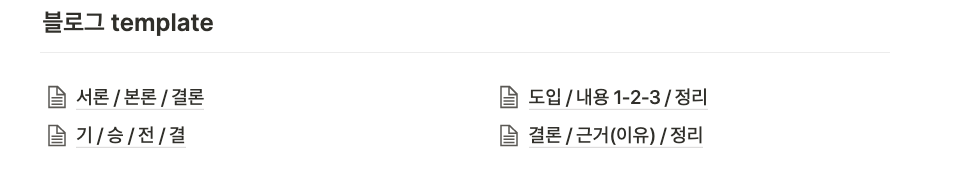
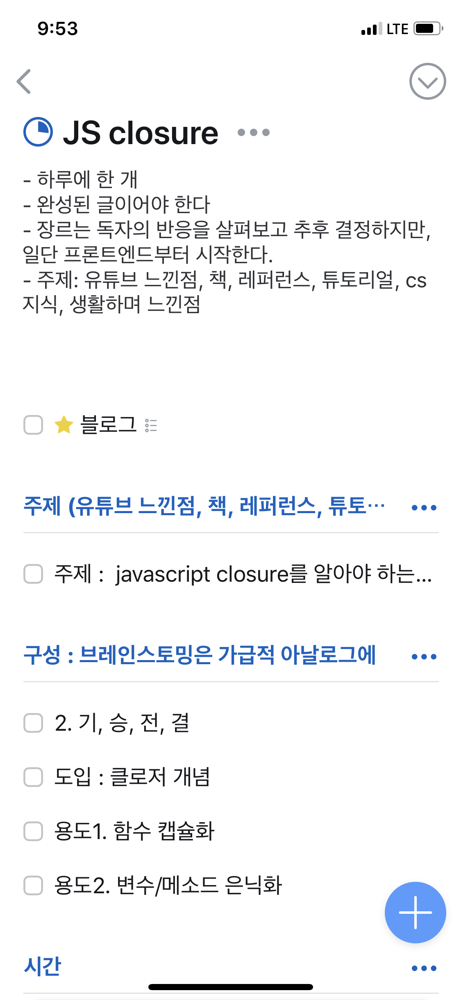
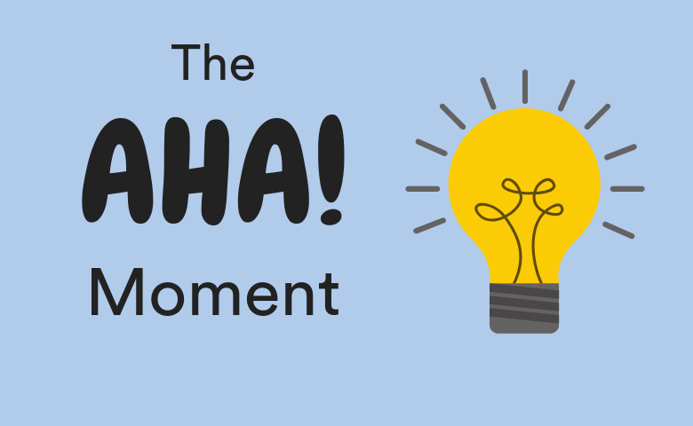

> _"작가가 되고 싶다면 반드시 해야 할 일이 2가지가 있다. **많이 읽고 많이 쓰는 것**이다. 내가 아는 한 그걸 대체할 방법은 없다. 빨리 가는 지름길도 없다"_ - 작가 스티븐 킹

시간은 소중한 자원이다. 수도권 직장인의 경우 평균 [115분](https://news.joins.com/article/23404009#:~:text=%EC%A7%80%EC%97%AD%EB%B3%84%EB%A1%9C%EB%8A%94%20%EA%B2%BD%EA%B8%B0%20%EC%A7%80%EC%97%AD%20%EC%A7%81%EC%9E%A5%EC%9D%B8,%EC%82%AC%EC%9A%A9%ED%95%98%EA%B3%A0%20%EC%9E%88%EB%8A%94%20%EC%85%88%EC%9D%B4%EB%8B%A4.) 걸린다고 한다. 8시간 수면, 9시간 근무, 2시간 출퇴근, 1시간 저녁 식사만 해도 우리에게 주어진 시간은 4시간이 채 되지 않는다. 
시간이 없다는 말이 핑계가 아닐지도 모른다. 거기다 글을 잘 쓰려면 많이 써야한다니, 표기하지 말자. **글을 빨리 쓰면 된다.** 
다만 '빨리'의 의미는 '대충'이 아니라 시간을 효율적으로 쓰는 것이다. 생산성을 높이는 것이고, 불필요한 수정을 최소화 하는 것이다. 
글 쓰기 수업을 비롯해 많은 책들에서 '좋은 글을 쓰는 방법'은 알려주지만 결국 **내가 좋은 글을 써야 한다.**
결론은, 역설적으로 들릴 수도 있지만 잘 쓰려면 우선 빨리 써야한다.

## 1. 빨리 쓰기 - 구성

[아웃풋 트레이닝](http://www.yes24.com/Product/Goods/69406695)의 저자 가바사와 시온은 미리 글의 구성을 잡게 되면 체감상 3-4 배 빠르게 쓸 수 있다고 한다. 구성 없이는 일기처럼 떠오르는 대로 쓰게 된다. 이런 글은 주로 독자와 공감대를 형성하기 힘들다. 추가로 구상하고 쓰게되면, 나의 다른 글과도 비슷해지게 된다. 프랜차이즈 식당이 맛과 인테리어를 통일해 손님을 모으는 것 처럼, 독자들이 다른 글도 만족할 확률이 높아진다. ~~(대신 똑같이 마음에 들지 않을 확률도 높아진다).~~

### 템플릿 활용

필자의 경우 메모 앱으로 노션을 사용한다. 이 글을 읽고 4가지 글 형식을 만들었다. 놀라운 점은 템플릿을 만들고 나니, 4가지 유형 중에서 적합한 구성을 찾게 된다. 더해서 자연스레 내용정리가 되는 것을 느꼈다. 현재 템플릿 내부는 헤더밖에 없다. 추후에 기회가 되면 잘 구성된 템플릿을 공유하고싶다.

## 2. 많이 쓰기 - 주제 미리 모아두기

블로그를 막상 쓰려고 하면 '무엇을 써야 하는지' 부터 생각한다. 그러다 보면 시간이 흐르고 오늘은 자리에 앉아있던 걸로 만족할 수도 있다. **하지만 누구도 글감은 많다. 업무 중에 겪었던 에러, 인상 깊었던 레퍼런스, 튜토리얼 등 평소에 기록해두면 주제를 고민을 하지 않아도 된다.** 오히려 넘친다. 필자의 경우 투두리스트로 **_Things3_** 를 활용하는데 주제에 대해 생각날 때마다 기록해두려 형식을 만들었다.

**✔️ 쓴 글에는 피드백이 꼭 필요하다.** 회사 동료, SNS, 블로그, 통계, 자신, 주변 사람들에게 피드백을 요청하자. 카카오톡 오픈카톡방이나 해당 주제의 페이스북 페이지에 공유하는 방법도 괜찮아 보인다.

## 3. 바로 쓰기

지식과 경험 모두 3일 후에 기억이 가물가물한 상태로 글을 쓰기는 어렵다. 물론 지금 당장은 후에 기억이 날거라 생각할 수 있다. ***현실적으로 이런 기억조차 나지 않을 확률이 높다.***
뇌과학 측면에서 보면, A-HA ! 모먼트 (깨닳음을 얻은 순간) 는 신경세포가 평소와는 다른 방식으로 작용해 생긴 결과라고 한다. 마치 산에서 길이 아닌곳에 순간적으로 길이 생긴거다. 기록을 통해 얼른 그 길을 표시해두자. 다음에 다시 찾아왔을 때 기억이 잘 나게 메모라도 남겨놓자. 닦아놓지 않으면 금방 지워지고 희미해진다. 

## 정리

-   구성(outline) 후에 글을 쓰자. 시간을 절약해 더 많은 글을 쓸 수 있다.
-   평소에 떠오르는 주제를 미리 메모하자. 다양한 주제를 미리 수집해놓을 수 있다.
-   가급적이면 빠른 시간 내에 작성하자. 놓치지 않고 기록할 수 있다.

## 참고
[아웃풋 트레이닝](http://www.yes24.com/Product/Goods/69406695)
