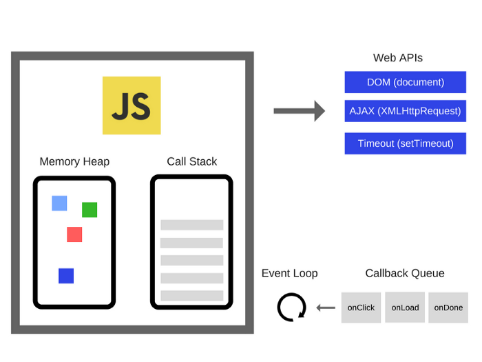
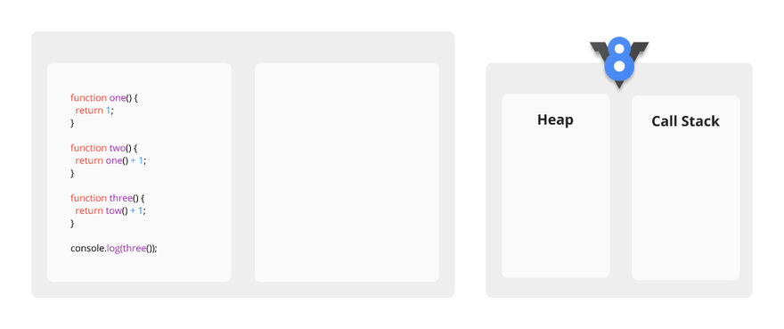
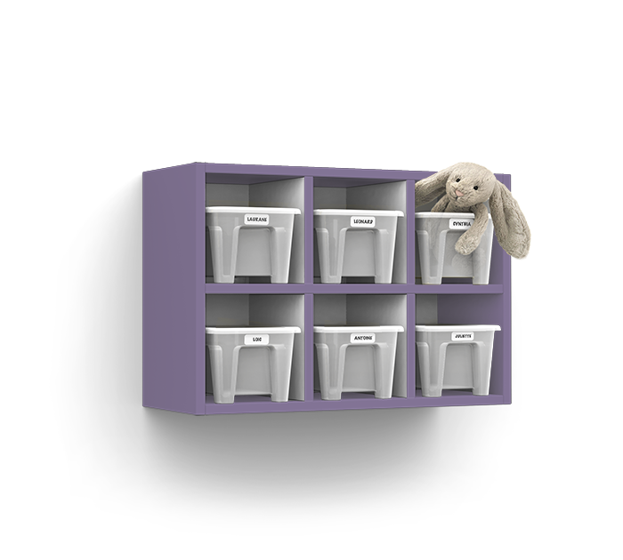
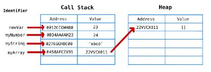
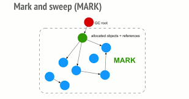
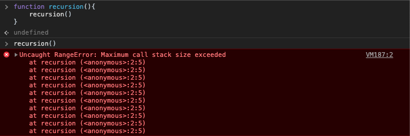

[지난 포스팅](https://oowgnoj.dev/review/advanced-js-1)에서 현대의 자바스크립트 엔진이 비약적으로 성능을 향상시킬 수 있었던 이유를 다뤘다(컴파일러 vs 인터프리터). 성능도 중요하다. 하지만 엔진의 가장 중요한 임무는 **코드를 읽어 실행하는 것이다**. 
이 때 가장 기본적인 과정을 생각해보면, 지금은 어떤 코드를 실행하고, 이 다음엔 어떤 코드블록을 실행할지 인지하는 것이다. 한가지 더, 변수를 저장해 다음 줄에서도 그 변수를 사용하는 것이다. 따라서 엔진은 무슨 일(?) 이 있어도 앞선 두가지 정보를 꼭 기억하고 있어야 한다.

## 콜스택 call stack - 어디까지 읽었지?
자바스크립트 엔진은 현재 진행상황을 추적하기 위해 콜스택을 사용한다. 스택은 LIFO (후입선출) 형태로 대표적인 자료구조의 하나다. 아래 예시를 보며 콜스택의 동작과정을 이해해보자.

```jsx
function one() {
	return 1
}

function two () {
	return one() + 1;
}

function three() {
	return two() + 1;
}

console.log(three())
```

위 예시를 실행하면, `console.log(three)` 에서 three 함수는 two 함수를, two 함수는 one 함수를 실행한다. 그리고 실행된 순서로 콜 스택에 쌓이게 된다. 콜스택은 맨 위에 쌓인 것 부터 하나씩 꺼내어 차례대로 계산한다. (LIFO)




한가지 더 기억하자. 콜스택은 **스코프 내부의 원시타입 변수를 저장한다.** 원시타입 변수는 `string`, `number` 등 메모리 크기가 고정된 변수다. 원시타입과 참조타입을 잠깐 살펴보자.

```jsx
const str = 'a' // 1 byte
const str1 = 'aa' // 1 * 2 = 2 byte
const arr = [] // ?
```

`str` 변수는 런타임에서 메모리의 크기가 바뀌지 않는다. 반면에 `arr` 변수는 런타임에 한개의 `element` 가 추가될수도, 100개가 추가될수도 있다. 반대로 지워질 수도 있다. 중요한 점은 해당 `arr` 변수의 크기가 유동적으로 변화한다는 점이다. 이렇게 **원시타입 데이터는 콜스택에 저장된다. 아니라면, 이제 설명한 메모리 힙에 저장된다.**


## 메모리 힙 - 복잡한 데이터 저장


메모리 힙은 unstructured memory 가 저장되는 공간이다. 다른 말로 `참조타입` 데이터가 저장되는 공간이다. 무슨 말인지 잘 모르겠다. 약간의 비유를 들어보자.

### 박스([], {}) 와 박스 진열대(memory heap)


자바스크립트는 엔진은 실행과정에서 크기가 유동적으로 변하는 데이터를(객체, 배열 등)를 박스에 넣어 따로 보관한다. 박스가 하나면 괜찮지만 많다면 박스를 정리할 수 있는 진열대가 필요하다. 이걸 `memory heap`이라고 생각하면 된다. 
**정리하면 박스는 구조화되지 않은 데이터들 (배열, 객체) 등이고 메모리 힙은 박스들을 한 곳에 모아 진열하는 진열대라고 생각하자.**




실제로 위 그림을 보면 원시타입 자료형(string, number)는 call stack에서 메모리 주소와 값(value)를 저장하고 있다. ***반면에 배열 자료형의 경우 `myArray` 값으로 다른 주소를 가지고 있다.*** 비유한걸로 예를 들자면 박스 고유번호인데, 왼쪽 Heap 칸에서 박스 고유번호를 통해 값을 찾을 수 있다. 

실제로 자바스크립트를 주로 사용하는 웹 프론트엔드는 많은 참조타입 변수를 포함한다. (`document` 부터도 객체다) 이런 참조타입 변수가 `memory heap`에 등록되고, 등록되고, 등록되고 ...하다보면 memory heap의 공간이 다 차버려 브라우저가 작동하지 않는다. ***하지만 우리는 변수를 선언할 뿐 수거하지 않는다. 엔진 내부에 수거를 전담으로 하는 일꾼이 따로 있기 때문이다.***

## garbage collection
앞서 말한 **'변수 수거를 전담으로 하는 일꾼'**이다. 이 일꾼은 알고리즘을 바탕으로 업무를 진행한다. call stack 내부에 저장된 원시타입 데이터의 경우 stack 이 pop 되면서 함께 변수들도 사라진다. 하지만 memory heap 내부에 있는 데이터들 (array, object)의 경우엔 **알고리즘을 사용해 더이상 참조하지 않는 데이터를 판별하고, 지운다.** 어려운 알고리즘이 아니라(?) 아래서 간단하게 살펴본다.

### mark and sweep algorithm



변수가 **데이터를 가르키고 있으면 mark 하여 남기고, 그렇지 않으면 지운다.** *아래 두 예시로 '아 이렇게 작동하는 구나' 정도만 이해하고 넘어가면 좋을 것 같다.*

```jsx
var obj = {'a': 1}
obj = 1
// 1. obj 가 1로 바뀌면서 더이상 {'a': 1}는 가르키는 변수가 없다. 
// 2. 메모리 힙에서 지워진다.
```

```jsx
function foo (){
	var obj = {'a': 1}
}

foo();
// 1. call stack에 foo()가 쌓이고 obj가 저장되는데, 
// 2. stack이 popped 되면 더이상 obj를 가르키는 변수가 없다.
// 3. 메모리 힙에서 지워(sweep)진다.
```

## memory leak

모든 저장공간은 한정되어 있다. 자바스크립트 프로그램 (browser/node.js) 은 메모리 사용에 제한은 없다고 하지만, 컴퓨터의 모든 메모리를 차지하는 것은 전혀 바라는 상황이 아니다. 특히 memory leak (필요 없는 데이터가 메모리의 자리를 차지하는 경우)엔 더 그렇다. **memory leak은 garbage collector 필요하지 않은 데이터를 수거하지 않는 현상을 말한다.** 마지막으로 흔히 memory leak 을 발생시키는 경우 3가지에 대해 간단히 살펴보자.

### global variable

Global scope(모든 함수의 밖)에 선언된 변수를 global variable 이라고 부른다. 이 경우 **실제 사용이 끝났어도 해당 script가 종료될 때 까지 global scope에 남아 memory heap 공간을 차지한다.** 

### setInterval

무한히 반복되는 `setInterval` 메소드 같은 경우도 비슷한 현상이 발생한다. setInerval 내부에서 참조타입 변수를 사용하게 되면 프로그램이 종료되기 전 까지 해당 변수를 참조하고 있어, sweep이 발생하지 않는다.

```jsx
setInterval(()=> {
	console.log(obj)
}
// 강제로 clear / stop 하기 전 까지는 garbage collection 되지 않는다
```

### Event Listener

이벤트를 등록(`addEventListener`)하고 제가하지 않으면(`removeEventListener`) 해당 이벤트는 memory heap에 계속 남아있는다. 특히 SPA(Single Page Application) 에서 페이지를 번갈아 왔다갔다 할 때 많이 발생된다. 

***잠깐, React에서 dom 마운트 해제될 때 이벤트 제거되지 않나?***

- 최신 브라우저에서는 마운트 해제될 때 이벤트 리스너를 제거하지만 이전 브라우저는 지원하지 않는다.
- 컴포넌트간 이벤트 충돌을 피하기 위해 제거해주는 것이 좋다.




## 정리
- 자바스크립트가 실행될 때 가장 중요한 요소는 코드를 읽어 저장하고, 실행하는 것이다
- `callstack`에서 현재 코드의 진행 상황을 추적한디. 또, 원시타입 데이터를 내부에 저장한다.
- `memory heap`은 참조타입 데이터를 저장하는 공간이다.
- 사용이 끝난 memory heap 내부의 데이터는 `garbage collector`에 의해 수거된다.
- 메모리기 수거되지 않아 발생하는 `memory leak`을 잘 인지하고 예방해야 한다.

## 참고한 사이트
[Garbage Collection in Redux Applications](https://developers.soundcloud.com/blog/garbage-collection-in-redux-applications)

[How JavaScript works: memory management + how to handle 4 common memory leaks](https://blog.sessionstack.com/how-javascript-works-memory-management-how-to-handle-4-common-memory-leaks-3f28b94cfbec)

[자바스크립트는 어떻게 작동하는가: 엔진, 런타임, 콜스택 개관](https://engineering.huiseoul.com/%EC%9E%90%EB%B0%94%EC%8A%A4%ED%81%AC%EB%A6%BD%ED%8A%B8%EB%8A%94-%EC%96%B4%EB%96%BB%EA%B2%8C-%EC%9E%91%EB%8F%99%ED%95%98%EB%8A%94%EA%B0%80-%EC%97%94%EC%A7%84-%EB%9F%B0%ED%83%80%EC%9E%84-%EC%BD%9C%EC%8A%A4%ED%83%9D-%EA%B0%9C%EA%B4%80-ea47917c8442)

[자바스크립트는 어떻게 작동하는가: 메모리 관리 + 4가지 흔한 메모리 누수 대처법](https://engineering.huiseoul.com/%EC%9E%90%EB%B0%94%EC%8A%A4%ED%81%AC%EB%A6%BD%ED%8A%B8%EB%8A%94-%EC%96%B4%EB%96%BB%EA%B2%8C-%EC%9E%91%EB%8F%99%ED%95%98%EB%8A%94%EA%B0%80-%EB%A9%94%EB%AA%A8%EB%A6%AC-%EA%B4%80%EB%A6%AC-4%EA%B0%80%EC%A7%80-%ED%9D%94%ED%95%9C-%EB%A9%94%EB%AA%A8%EB%A6%AC-%EB%88%84%EC%88%98-%EB%8C%80%EC%B2%98%EB%B2%95-5b0d217d788d)