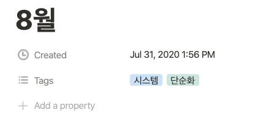

8월 에는 단순한 일상을 계획하고 싶었다. 사람들을 두 가지의 부류, 단순화 인간과 최적화 인간으로 나눈다면 나는 후자의 성향이 강하다. 비유하면 단순화 인간은 주제를 정하고, 기 - 승 - 전 - 결에 딱 맞추어 블로그를 쓴다. 반면에 최적화 인간은 주제에서 약간 벗어나도 글이 더 나아질 것 같으면 기존 구조를 바꿔서라도 어디엔가 넣고 싶다.

이렇게 최적화를 추구하다 보면 때로는 결과물이 좋거나, 여러 일을 꽤 효과적으로 처리할 수 있지만, **매번 의사결정을 내려야 하고 혹시 일이 조금이라도 계획대로 흘러가지 않는다면 일이 꼬이는 경향이 있다.** 또한 같은 일을 마치는데 오래 걸린다. 기존 계획을 수정하는데 시간과 에너지가 소모된다. 완성품에 대한 기대가 높아지다 보니 마무리 짓지 못하는 경우가 더러 있다. 모든 상황에서 단순화가 더 나은 방식이라고 생각하진 않지만 **단순한 일상이 가져다주는 이점**이 분명 있다고 생각했다. 특히 지금 나의 상황에, 아래 3가지를 개선할 수 있어 보였다.

1. 한꺼번에 많은 일을 다루려다 보니, 처리속도와 능률이 저하되는 현상. (Thrashing)
2. 의사결정의 상당한 에너지 소모 (ex, '오늘은 뭐 해야 하지?', '어떻게 블로그를 쓰면 좋을까?')
3. 의지와 집중력이 흔들려도 꾸준히 결과를 만들어낼 수 있다면 좋겠다.

일상을 단순하게 만들기 위해 우선순위를 생각해야 했다. **고민 끝에 기록, 개성, 운동으로 범위를 좁혔다.**

### 기록

기록의 목적은 배움에 있다. 특히 프론트엔드 분야는 높은 수준의 추상화와 뛰어난 라이브러리로 비교적 쉽게 사용할 수 있다. **잘 알고 있다고 착각하기가 정말 쉽다.** 하지만 간단한 개념도 적으려고 하거나 다른 사람에게 설명하려고 하면 어려움을 겪었다. **기록을 통해 '내가 아는 것이 무엇이고 모르는 것이 무엇인지' 명확하게 인지 해야 하는 시간이 필요하다고 느꼈다.** 더해서 해석을 덧붙여 부가가치를 창출할 수 있기를 바랬다. 하지만, 하나의 포스팅을 작성하는데 많은 노력과 시간이 들어 고민 끝에 3가지 습관으로 개선해보고자 했다. 이 내용은 [지금부터 시작하는 3가지 좋은 글쓰기 습관](https://oowgnoj.dev/review/output-training)에 정리했다. 조금씩 나아지고 있다는 생각이 든다.

### 개성

두 번째 꼭 놓치지 않고 싶었던 점은 나의 개성이였다. [7월 회고](https://oowgnoj.dev/post/review-july)에서 개성을 찾으려고 노력 했지만 단시간 내에 찾기란 쉽지 않았다. 따라서 시간을 두고 기록하고 분석하는 뱡향으로 수정했다.

**세 줄 일기**
[박요철님 브런치](https://brunch.co.kr/@aiross/865)를 읽고 세 줄 일기를 도입했다. 오늘의 1. 좋았던 점, 2. 안 좋았던 점, 3. 내일의 각오를 매일 기록하는 것이다. 한 가지 아쉬운 점은, 노트에 쓰고 있다보니 간단한 텍스트 마이닝이나 키워드추출과 같은 분석이 제한된다. 사실 일기만큼은 종이에 쓰고 싶은 욕심에 그렇게 했었는데 노션에 적는 것도 생각해봐야겠다.

**개발자의 낭만을 찾아서** 라는 주제로 블로그 포스팅 하는건 어떨까 생각했다. 결국 0과 1로 이루어진 소프트웨어지만 선배 엔지니어분들의 철학과 고민이 담기며 낭만 있다고 생각한 적이 종종 있다. redux-saga 공식문서에 나오는 thunk 패턴과의 차이점을 보며 처음 느꼈다. 조만간 시도해봐야겠다.

### 운동

운동은 멘탈관리에 좋다고 생각했다. 운동을 마치고 샤워하면 정말 단순한 감정이 든다. 좋다. 어렵게 보였던 문제들에 대해 자신감도 생기고 실질적으로 생각 정리도 많이 된다. 아침이나 저녁에 강아지와 함께 조금이라도 뛰면서 실천하고 있다.

기록, 개성, 운동 외에도 중요한 것들이 많다. 가족들과의 시간, 취미 활동도 하면 좋고 여러 가지 있을텐데 **지금 나의 상황에서 지속해서 실천해야 하는 것** 위주로 선정했다. 의미있는 결과는 단기간에 이루어지지 않는다는 것을 잊지 말자.