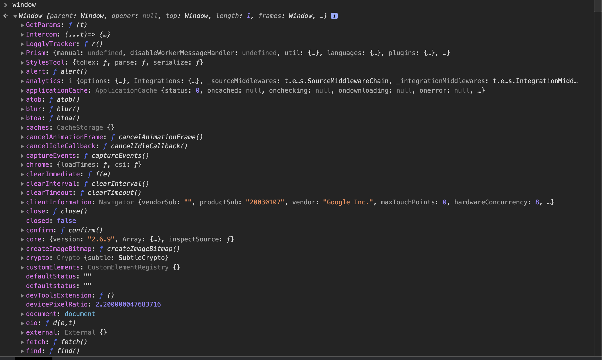
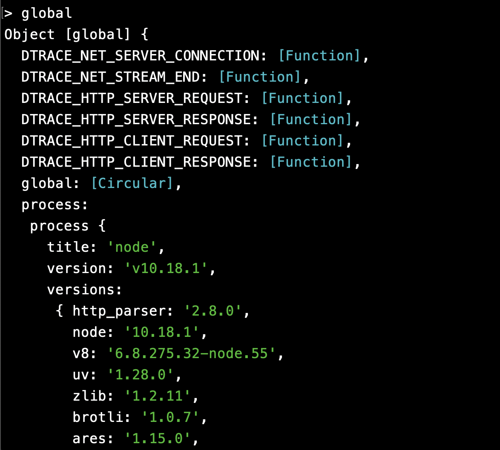
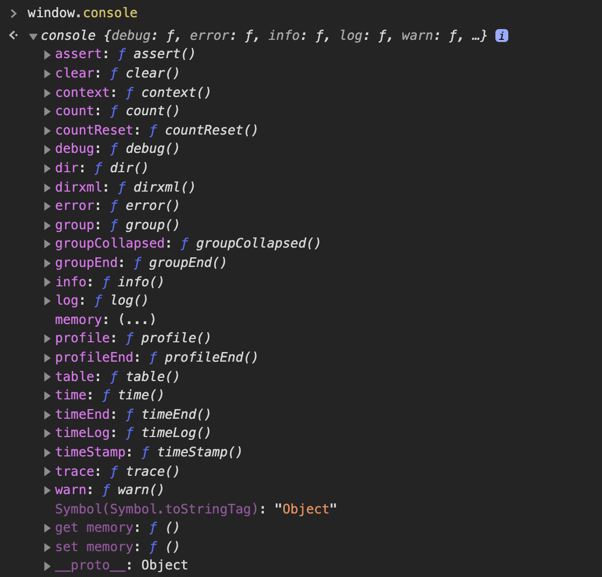

### 엔진?


뭔가 *엔진, V8 등의* 단어를 접했을 때 하드웨어적인 느낌이 들었다. ~~아마존 서버실이라던가..~~  하지만, 결론부터 이야기하면 자바스크립트 엔진도 하나의 (거대한) 함수다.

### 함수?

프로그램을 높은 단계에서 추상화하면 주어 + 동사라고 생각한다. 변수는 주어, 동사는 함수다. 'A 에 B 를 실행한다' 의 구조라고 생각한다. 프로그램을 만드는 개발자가 하는 일은 변수를 선언하고, 여러가지 모듈(함수)를 만들어 하나의 어플리케이션으로 합치는 과정이다.

모듈화를 통해 얻는 이점 중 두 가지는 1. 변수 충돌을 막고  2. 지역 변수를 사용해 **함수가 실행될 때만 메모리를 사용한다**. 함수가 실행되었을 때 함께 생성되는 실행 문맥과 관련이 있다.

### 함수는 본인의 실행 문맥을 가진다.

우리가 익숙한 함수, call stack 그리고 변수를 먼저 살펴보자. 


함수가 실행되면 call stack에 쌓이고 `return` 시 pop 된다. 더불어 함수가 실행되면 **실행 문맥(Execution context)**이 생긴다.

### 실행 문맥

함수의 실행 문맥은 `this`, `argument(s)`, `variable environment` 로 이루어져 있다. arguments는 함수에 주어진 인자, variable environment는 변수가 저장되는 영역이다. (`this`는.. 다음에 알아 보자.)

함수가 콜스택에 쌓일 때 실행 문맥이 생기고, pop 되면 실행 문맥도 사라진다. 

````
function goTravel () {
	let feeling = '행복';
	console.log(`저의 기분은 ${feeling} 합니다`)
	..
}
function goAmusementPark(){
	let feeling = '짜릿';
	console.log(`저의 기분은 ${feeling} 합니다`)
}
goTravel() // 저의 기분은 행복합니다.
goAmusementPark() // 저의 기분은 짜릿합니다.
````

만약 위 코드를 함수를 사용하지 않는다면? 

````
let feelingTravel = '행복';
let feelingAmusementPark ='짜릿';

console.log(`저의 기분은 ${feelingTravel} 합니다`} // 저의 기분은 행복합니다.
console.log(`저의 기분은 ${feelingAmusementPark} 합니다`} // 저의 기분은 짜릿합니다.

````

지금은 문제가 되지 않는다. 만약 기분이 100 가지면 어떨까? main 프로그램이 실행되면 모든 기분 변수를 다 저장하고 있어야 한다. 변수명도 불필요하게 복잡해지고, 길어진다. 앞서 말한 함수 활용의 장점이다.

### 전 : 자바스크립트를 실행하면 거대한 함수를 실행하는 것이다

자바스크립트 엔진이 사용되는 브라우저, node.js 를 실행하면 **자바스크립트 엔진이라는 커다란 함수가 실행된다.** 앞서 말한 **실행 문맥(execution context)도 존재**한다. 이를 **전역 실행 문맥(global execution context)**라고 부른다. 콜스택 제일 아래에 존재한다. 전역 실행 문맥은 `Global Object` 와 `this` 를 포함한다. (마찬가지, this 는 나중에 살펴보자)


**전역객체 (Global Object)**

전역 객체 내부에는 자바스크립트라는 큰 함수 내부에서 필요한 변수와 메서드 등이 정의되어 있다. 브라우저는  `window`, node.js 의 경우엔 `global` 이다. 크롬 브라우저에서 window를 타입하게 되면 아래와 같은 엄청난 객체를 볼 수 있다. 복잡하게 보이지만 익숙하고, 필요한 것들이 많이 있다.





<node 의 경우 global>

**console.log**

우리가 자주쓰는 `console.log` 도 (브라우저의 경우) `window.console` 객체 내부의 함수다. 



Google Chrome 탭을 많이 생성하면 탭마다, 자바스크립트 엔진 (함수)가 실행된다..

### 마치며

자바스크립트 엔진 하면 