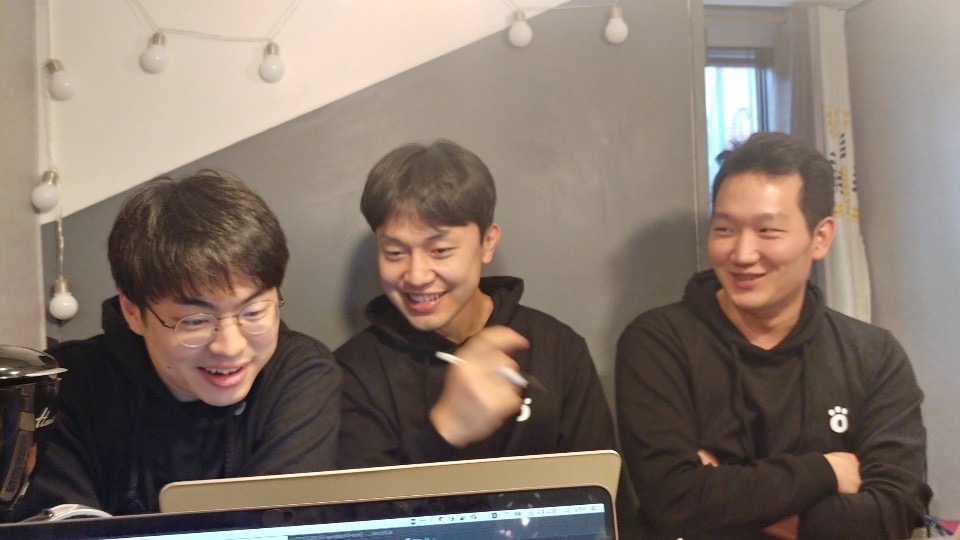

부트캠프를 함께했던 동기들과 코로나로 인해 미뤘던 해커톤을 진행했다. 해커톤에서 느꼈던 것을 간단하게 정리 하고싶다. 
목표는, 팀원들의 블로그를 모아 보여줄 수 있는 포털을 구현하기로 했다. 더해서 다른 개발 글도 볼 수 있고, 프론트/백엔드 로드맵을 참고해서 매주 발표하는 세션의 주제가 어떤 큰 개발 영역 안에 속해있는지 시각화도 기획했다. 결과적으로는 생각했던 모든 것을 완성하진 못했지만 재미있고 소중한 경험이었다. 

## hello world
졸업 후 공채 사이 기간에 생활코딩 WEB 수업으로 개발을 시작했다. 개발자를 선택하기 까지에는 여러 다른 이유들도 있었지만, 재미와 흥미로 시작했다. 지난 시간동안 부족한 점을 많이 느꼈다. 잘해야 한다는 생각, 기간 내에 구현해야 한다는 생각이 머릿속에 자리 잡았다. '머릿속에 있는 아이디어를 눈으로 볼 수 있다는' 흥미와 기대감을 느끼는 순간보다, 이 아이디어가 언제 화면에 나타날지, 화면에 얼마나 빠르게 나타날지를 신경 써야 했다. 일 하다 보면 아이디어에 대해 크게 신경을 쓰지 않는 순간도 있었다. 해커톤의 결과물이 배포되기 시작했을 때 '당연히 돼야지'라는 생각보다 개발을 처음 시작했을 때, 텅 빈 브라우저에 hello world가 나타났던 기분을 느꼈다. 즐거웠다.

## 좋은 팀원, 좋은 시간
소중한 금-토 시간에 연차까지 내어 참여했고 퇴실때 까지 열정과 체력을 불태우는 모습이 좋았다. 의도하진 않았지만 프런트 / 서버를 하시던 분들이 반대의 포지션을 맡게 되었다. 체력/기술적으로 모두 쉽지 않으셨을 거라 생각한다. 또 어찌 보면 큰 도움이 되지 않을 수도 있다. 좋은 분위기로 마무리되어 감사했다. 

## 예상 *2
마지막은 프로젝트 자체에 대한 약간의 교훈인데, 계획했던 것보다 시간이 더 들어가는 경험을 다시금 했다. 예전에 어디서 들었던 말인데 '앞서 생각했던 시간의 2배가 걸린다는 연구 결과가 생각났다.' 이번 해커톤에서도 생각했던 것보다 시간이 더 소요되었다. 더해서 오랜 시간 지속하면서 약간 체력적인 부분(운동을 시작해야겠다.)과 집중력에서 아쉬움을 느꼈다. 빠듯한 일정에 당연하다고 느낄 수 있는 부분이지만 다음에는 조금 신경 썼으면 해서 남겨본다.

해커톤 장소였던 서촌의 airbnb 에서 개발을 처음 시작했던 마음, 각오, 이유 감정이 떠올랐다. 그리고 잘 해보고 싶은 마음이 즐길 수 있는 기회와 시간을 잘 보이지 않게 만들었던 지난 몇 개월이 생각났다. 
인생은 B와 D 사이의 C다 !!

