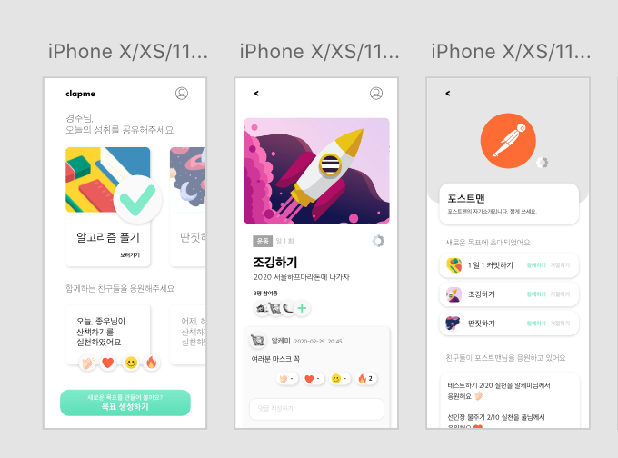
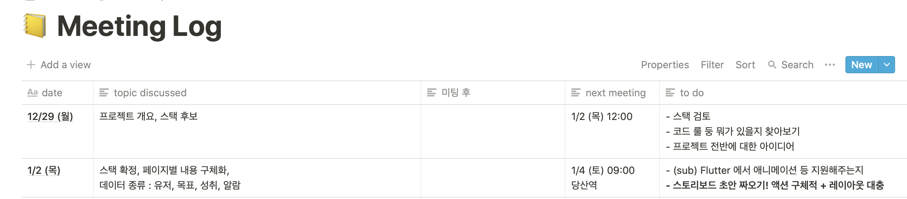
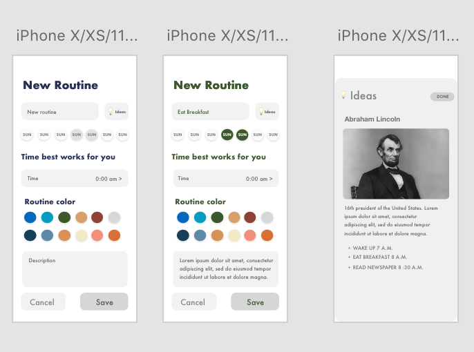
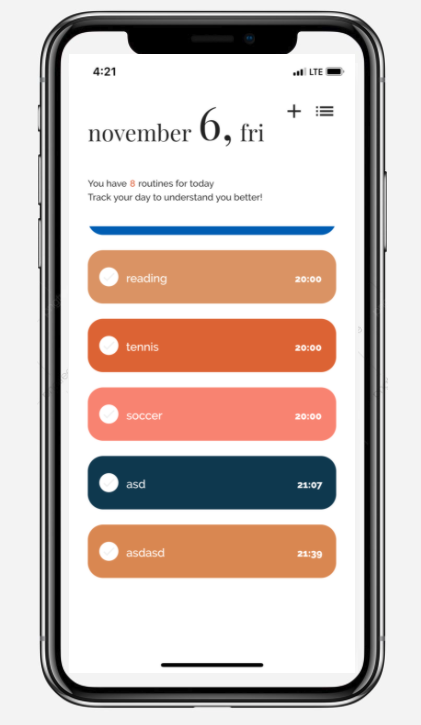
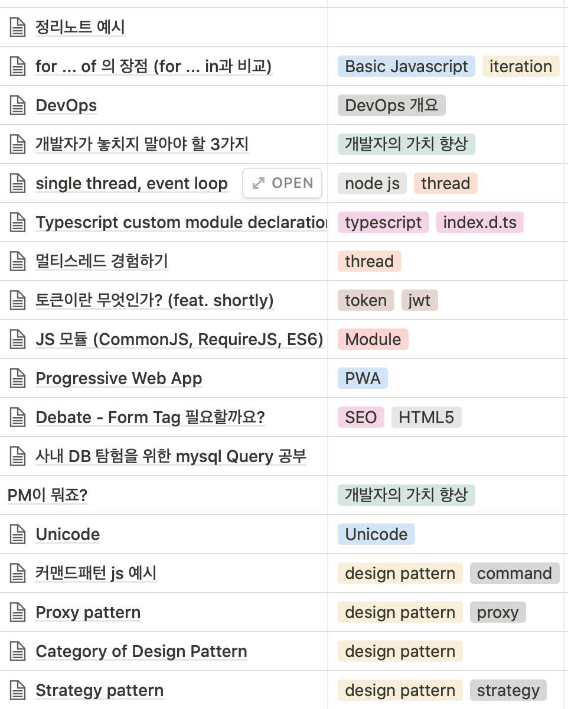
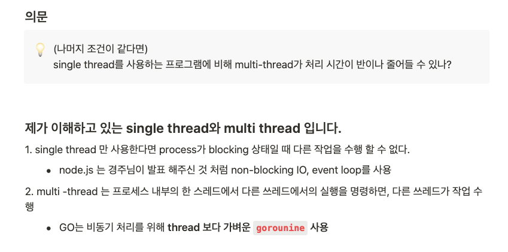
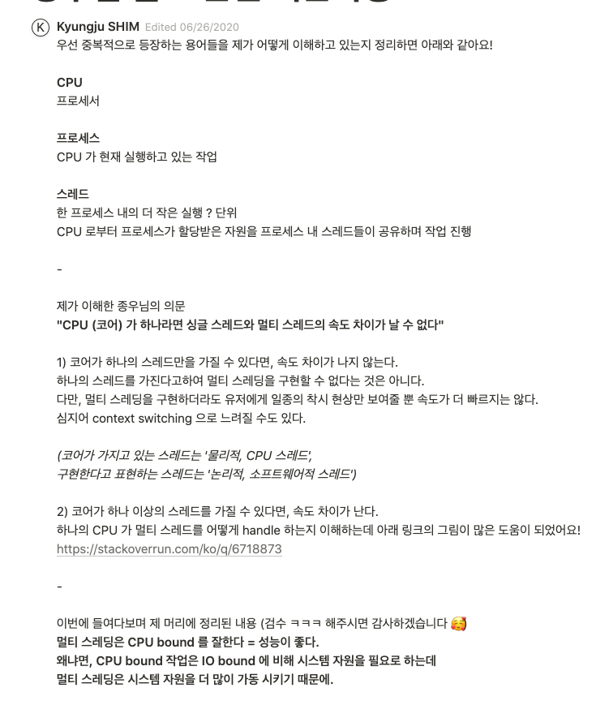
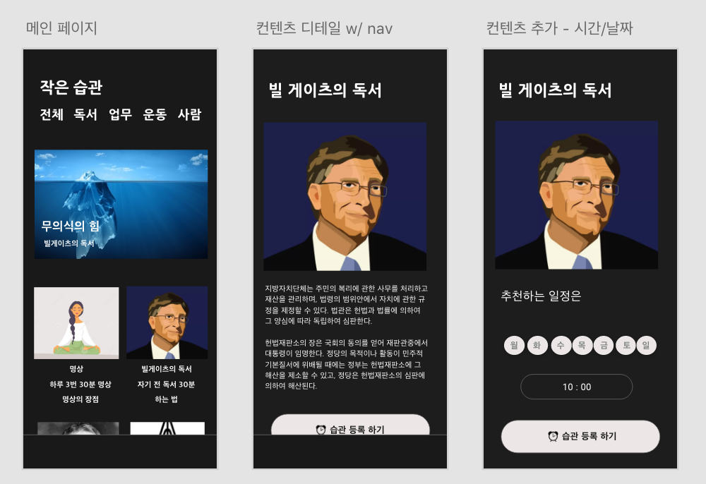

개발자로 전향하고 첫 해가 지나고 있다. 돌이켜보면 상당한 시간과 노력을 들였지만 사이드 프로젝트에서 정확히 무엇을 얻고 싶은지는 생각하지 않았던 것 같다. 무언가를 만들고 싶었고, 재밌게 느껴졌다. 이번 포스팅에서 (조금 일찍) 올해 진행했던 프로젝트애 대해 배우고, 느낀 점 위주로 정리하려고 한다. 

## CLAP ME

2020.01 - 2020.08

주변 사람들과 자신의 목표 / 공동의 목표를 공유하고 격려와 feedback을 받을 수 있다. `Flutter` 를 사용해 개발했고, 서버는 `flask` 로 구현했다. 

#### 새로운 기술을 두려워 하지 말자.

클라이언트와 서버 모두 모두 처음 접해보는 스택으로 정했다. 가장 큰 이유는 다른 언어/프레임워크에 대한 도전정신이 투철했었다 (ㅠㅠ). 당차게 시작했지만 여러 익숙하지 않은 개념들과 언어를 만났다. 예시로, Flutter에서 API 요청을 보내고, 서버의 response를 클라이언트의 모델로 맵핑하는 과정이 javascript 배경을 가지고 있던 나에게는 낯설었다. **하지만** **의외로 기술적인 어려움은 시간을 들여 공부해가니 괜찮았다.** 다른 사람들도 비슷한 어려움을 겪고 있었나 보다. 공부하며 번역해 둔 [복잡한 JSON 파싱하기](https://oowgnoj.dev/post/flutter-json) 에 블로그 방문자 유입이 꽤 있었고, 출판사로부터 flutter 원서 번역 제의를 받기도 했다. 서버 경험은 없었지만 백엔드 개발자 팀원의 도움을 받아 간단한 DB 모델링과, API를 만드는 작업도 해보니 막상 그리 어려운 점은 없었다.

#### 어디까지 만들어야 하지?

**의외로 어려웠던 점은 프로젝트 관리에 대한 측면이다.** 사이드 프로젝트는, 토이 프로젝트라고도 불리운다. 사람마다 이유를 가지고 사이드 프로젝트를 한다. 주로 새로운 기술을 익히는데 간단한 todo list를 만든다거나, 평소 좋아하거나 관심이 있는 분야의 문제 해결을 해줄 수 있는 프로그램을 간단하게 만들 수도 있다. 아니면 다른 분야로의 전직을 위해 포트폴리오를 만들거나, 부수입원을 만드는 등 여러 목적과 이유가 있을 수 있다.

**돌아보면 딱 어떤 목표가 없어 그런지 모든 것을 잘 해보고 싶었던 욕심이 있었던 것 같다**. 기술, 기획, 클린 코드, 문서화 등 모든 부분을 놓치지 않으려고 하다 보니 열심히 하는데 더디게 진행되는 느낌을 받았다. 중도에 진행 방식을 바꾸거나 하는 때도 있었다. 예를 들면 기술에 대한 이해도를 함께 높이고자 중간중간 [발표 형식](https://oowgnoj.dev/post/network-websocket)으로 미팅 시간에 기술에 대한 학습 위주로 진행하면 구현 자체가 어느새 뒷전으로 가 있다거나. 구현 자체에 신경 쓰다 보면 '알고 쓰자'에 대한 목마름이 다시 생각났다. 

#### 짧은 호흡과 정확한 목적
반년이 지났을 무렵, 초기 기획 버전에서 많이 수정해 MVP 버전을 배포하고 팀원과 회고하는 시간을 가졌다. 꾸준히 진행하고 포기하지 않았다는 것, 그래도 시도하며 배운 것도 많이 있다는 점이 좋았다. **다만 오랜 시간과 노력이 결과물에 반영되지 못한 부분이 아쉽게 느껴졌다. 호흡은 짧게 task는 작게 나누어 작업하는 것에 중요성을 체감했다.**

**토이 프로젝트로 목표했던 한 가지만 잘 달성하면 좋은 결과라고 생각하게 되었다.** 왜 사이드 프로젝트를 진행하는지 (재미, 구현, 기술에 대한 이해도)를 시작하기 전에 충분히 고민한다면, 집중 해야할 부분을 명확히 알게 되어 생산성이 향상되고 혹시 생길 수 있는 의사결정에 가장 주된 척도로 활용될 수 있다고 생각한다.

#### 결과

기획이 많이 바뀌게 되어 푸쉬 알람이 주기능이 되었고, 위인들의 습관에 대한 컨텐츠를 포함하고 있다.

## WIKI

2020.06 - 

주제를 선정/발표하고, 해당 내용을 노션 페이지에 정리해 wikipedia 형태로 만들고 있다.

#### 지식공유의 장점

**(공유)하기의 즐거움**

주제에 대해 학습하고 정리하는 과정에서 즐거움을 느꼈다. **팀원들에게 정확한 정보 전달을 위해 다양한 레퍼런스를 찾아봤고, 알기 쉽게 설명하기 위해 내가 먼저 명확하게 이해해야 했다.** 혼자만의 궁금증으로 학습했을 때 보다, 더 열의를 가지고 학습하는 모습을 발견했다. 

**(공유)받기의 즐거움**

다른 분들이 겪었던 문제나 관심사를 접할 수 있었다. 이해가 부족하고, 잘못 알고있었던 개념에 대해서도 점검할 수 있는 기회가 되었다. 아래는 한 팀원분께서 싱글 스레드와 멀티스레드에 대해 발표하신 내용에 대해 의문사항이 들어 [노션](https://www.notion.so/cbd758aa85174770ae688782342a718f)에서 대화를 나눴던 내용이다.

#### 조금 아쉬웠던 점

준비가 부족해 위에 언급했던 공유의 장점을 충분히 느끼지 못했던 발표도 더러 있었다. 모두 주말 아침 소중한 시간을 내어 참석하기에 주제에 대해 먼저 충분히 이해하고 쉬운 언어로 설명하고 싶었지만 다른 사람들의 글을 짜집기해 정보를 전달하는 형태가 되어 아쉬운 감이 있었다.

## MYRO

2020.10 ~ 

루틴 관련 컨텐츠와 알람을 등록할 수 있는 어플리케이션

### 목표와 방향
**일상에 도움이 되는 앱을 만들고 싶다.** 다른 사람들은 언제 어떤 습관을 했는지, 어떤 도움이 될 수 있는지에 대한 컨텐츠를 포함하는 앱을 기획했다. 우선 실질적인 사용자가 생겼으면 좋겠다. 지금은 컨텐츠를 팀원과 함께 직접 올리는 형태가 되겠지만, 나중에는 사용하는 유저가 업로드 할 수 있게 하면 좋겠다. 이 밖에 다양한 기능을 추가하고, 개선하는 방향이 되면 좋겠다. `React Native` 와 `node.js` 를 사용해 구현하고 있다. 

### 정리하며
팀 프로젝트를 꾸준히 진행할 수 있었던 것은 좋은 팀원과 함께할 수 있었기 때문이라고 생각한다. 사실 프로젝트를 하며 팀원으로서의 내가 어떤지 깊게 생각해 본 적이 없다. 지금 참여하고 있는 프로젝트와 앞으로 만날 팀원분들에게 좋은 팀원이 되는 것도 정리가 필요해 보인다. 배포가 되어있는 프로젝트는 아직은 없어 조금은 아쉽게 느껴진다. 하지만 지난 시간동안 시행착오를 겪으며 나름의 노하우가 생겼을거라 생각한다. (MYRO는 가능하면 올해 안에 MVP 버전을 각 스토어에 배포하는 것을 계획하고 있다.)