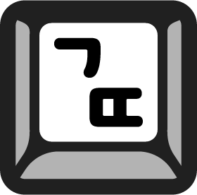
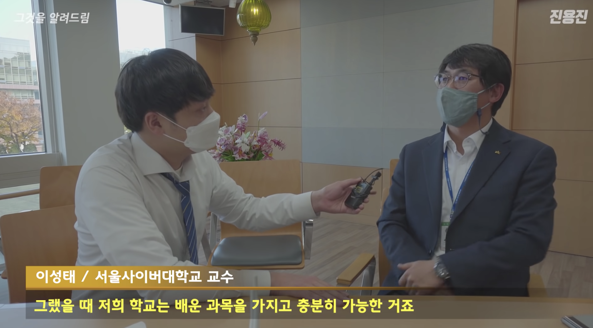

[글또](https://www.notion.so/ac5b18a482fb4df497d4e8257ad4d516)는 개발의 여러 분야의 사람들이 모여 격주에 한 번씩 블로그 쓰고 제출하는 모임입니다. 6개월간 지속하여, 총 12개의 글을 제출하게 됩니다.

### 내 글을 보는 분이 있다고? 🙃
모임의 가장 핵심 규칙은 블로그를 작성하지 않으면 보증금에서 만원이 차감됩니다. Deadline이 생겨 꾸준히 글을 작성하게 될 것 같다고 생각했습니다. 
**더해서 제 글을 읽는 분이 있다는 확신을 하고 싶었습니다.** 블로그를 운영하며 주로 기술이나 개념을 정리하는 형식으로 글을 써왔는데요, 때때로 '누가 이 글을 보겠어?'라는 생각이 들었습니다. (워낙 잘 되어있는 포스팅이 많으니까요... ㅎ). 다른 사람들에게 공유가 된다는 것을 염두하고 글을 쓴다면 더 나은 글을 쓸 수 있을 것 같았습니다.

### 더 나은 글?

제가 추구하는 이상적인 블로그 글은 **직접적인 경험이나 생각을 바탕으로 글을 쓰고 공유하는 것입니다.** 저만이 쓸 수 있는 글이라고 생각했기 때문입니다. 6개월간 12개의 글 만큼은 위 형태를 유지하고자 합니다. 

**질문에서 출발하는 글쓰기**

프로그래밍 분야에서 생각이나 경험 위주로 글을 쓰는 것이 쉽지 않다고 느꼈습니다. 주제가 너무 구체적이거나 광범위하게 되어 그랬던 것 같습니다. 그래서 생각한 것이 질문에서 출발하는 형태입니다. **업무, 사이드 프로젝트, 읽었던 레퍼런스 등에서 의문이 생겼던 것을 직접 경험하거나 탐험하는 방향을 잡아보려 합니다.** (유튜브 진용진님 채널에서 아이디어를 얻었습니다.ㅋㅋ)

주니어 개발자로서 더 주요한 기술과 주제에 대한 정리와 학습을 제쳐두는 것에 대한 망설임은 있었습니다. 하지만 약간(?) 모자라도 직접 겪은 것을 바탕으로 글을 쓰고 싶었습니다.
 
얼추 방향을 잡고 나니, 평소에 궁금했지만 그저 지나쳤던 것들이 생각났습니다. **물론 정답이 있는 공식 문서와 서적 등 좋은 레퍼런스가 많습니다. 하지만 명시되어있는 특징을 체득(體得)하지는 못한다고 느꼈습니다.**

### 앵무새 죽이기 🦜
구현하거나 새로운 개념을 이해할 때 stack overflow, 공식 문서 등 커뮤니티에 많은 도움을 받고 있습니다. 글또에 참여하는 동안 다른 분들의 도움을 좀 덜 받고(?) 궁금증을 가지고 탐험한 여정을 작성해보고 싶습니다. 글또 5기 화이팅 !!