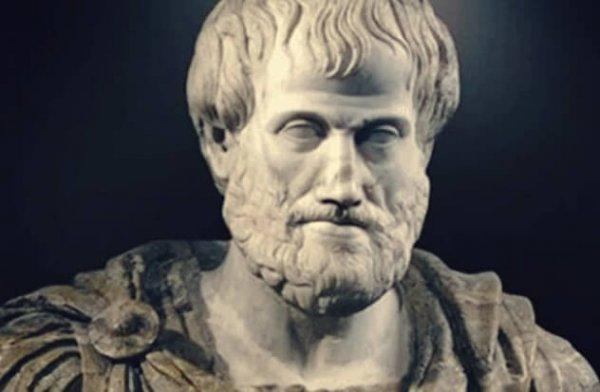

### 왜 성장에 주목~~(집착)~~할까?

성장이라는 단어를 자주 접한다. 주로 컨퍼런스, 발표, 블로그 글, 입사(퇴사) 사유 등등 여러 곳에서 만날 수 있었다. 며칠 전, 회사에서 다른 개발자분의 이야기를 듣게 되었다. 결론은 친구들이 좋은 회사에 입사했고, 자신도 얼른 '성장' 하고 싶다는 말이었다. 비슷한 경험으로 면접에 종종 참여할 기회가 있었는데, 거기도 상황은 크게 다르지 않았다. 여러 질문에 대한 대답이 결국에 면접자님이 생각하시는 성장에 초점이 맞추어 있는 경우가 많았다.

개발 직군에 한정해 이유를 찾는 것은 의미가 없다고 생각했다. 대부분 좋은 직장, 보수, 하루가 멀다 하고 나오는 신기술, 반복되는 업무에서 발생한 기술적 갈증 등에서 비롯되지 않았을까? 적어도 나의 경우는 그랬다.

무언지 모르겠지만 일단 성장 하고 싶었다. 일상, 계획, 마음가짐, 선택 등을 많이 바꿔놓았다. CS 공부를 틈틈이 이어나가기도 했고 (기술적 성장), '개발자의 기본은 알고리즘' 발표를 보고 daily_aligorithm 레포지토리를 생성하기도 했다 (논리적 사고의 성장). 채용공고도 살펴보며 (커리어적 성장) 고민도 했다.

과거에 작성한 코드, 블로그, 메모를 보며 개구리 올챙이 적 시절을 떠올렸던 순간도 있다. 분명히 기술, 업무적으로 나아졌다. 다만 내가 성장 한 걸까? 이대로가 괜찮을까? 라는 물음은 이어졌고, 확답을 내릴 수 없었다. **나는 성장에 대한 정의가 필요했다.**

### 거인의 어깨위에 올라가보기

성장에 대한 정의를 찾아보기 시작했다. 책, 인터넷, 블로그 등을 뒤적거렸다. 그러다 접한 '나 자신과 친구 되기'라는 책에서 성장에 대한 여러 학자들의 정의를 드디어 찾았다.

먼저 고대 그리스 학자 아리스토텔레스는 성장을 **자신의 잠재력을 실현하는 과정**이라고 했다. 동의할 수밖에 없었지만, 뭔가 시원하지 않았다. 다음을 기대하는 마음으로 책장을 빠르게 넘겼다. 정신 분석자 에릭 에릭슨 교수님은 **책임을 통감하는 능력과 각오**라고 말했다. 나아가 **개인의 한계를 뛰어넘어 다른 사람의 책임까지 통감하는 것** 이라고 정의했다. 머릿속으로 이해는 할 수 있었지만, 뼈를 때리는 문장은 아니였다. 다음은 요하네스 카시아누스 (4세기 후반 영성가) 의 정의를 보았다. 이분은 **욕심/자만/슬픔/분노 등의 자신의 감정적 한계를 극복하는 것** 이라고 정의 내렸다. 여전히 속이 시원하지 않았다. 마지막으로, 마가복음에 간접적으로 명시되어 있는 성장의 정의, "생각의 획기적인 발전"을 보고 책을 덮었다.

### 거인의 어깨 👋🏻

앞선 네 분이 그랬던 것 처럼, **성장에 대한 정의는 각자 내리는 것 이라고 생각했다.**

A를 하면 개발자로 성장할 수 있다고 말하는 글, 세미나 등을 예시로 들어보자. 그 자료가 성장 → 커뮤니케이션이라고 이야기 하고 있다면, 과연 모든 개발자는 커뮤니케이션을 잘 해야 할까? 좋은 조언이지만 정확히 말하면 이러한 글들의 주제는 **일반적인 '더 나은 몫을 하는 개발자'라는 목표를 달성하는 방법을 추천해 준다고 생각했다.**

반면에 자신이 성취감을 느끼고, 발전하고 있다고 믿는 성장에는 **방향과 과정이 필요하다는 결론을 지었다.**

## 성장의 주된 요소 두 가지

### 방향 (무엇을 하는지)

어떤 사람은 빠르게 프로그램을 만드는 것이 좋은 개발자라고 생각하는 반면, Clean Code에 가치를 두는 개발자도 있다. (결론은 둘 다가 되어야 하지만..) 스타트업에서 일하는 개발자는 빠른 실행력과 프로젝트 관리에 조금 더 중점을 둔다면, 대기업은 보다 안정성에 투자할 것이다. 이처럼 성장에는 **무엇에 관심이 있는지에 대한 자신의 가치가 주입되어야 한다고 생각한다.** 자신의 관심사를 찾기 힘든 상황이라면 꾸준한 노력과 관심이 뒷받침 되어야 발견할 수 있다고 생각한다. 다만 '생각하면 재밌는 것', '오래 생각할 수 있는 것', '평소에 자연스럽게 하는 생각' 등이 그 힌트가 될 수 있지 않을까 조심스럽게 생각한다.

방향을 생각해보며 회사 업무를 제외하고 토이 프로젝트에 기획까지 참여했던 프로젝트를 돌아봤다. 다음과 같은 공통점이 있었다. **(여행, 일상, 습관) 등의 데이터를 수집하고, 가공해 유저에게 유의미한 정보를 제공한다.**

### 진행했던 프로젝트

-   Travel calculator (7박 8일 런던 -> 300만원 (비행기표 + 숙박료 + 식비))
-   myro (습관 기록 / 추천)
-   life to pixel (생활 기록 -> 시각화)

### 관심 있었던 분야

-   data analytics
-   data visualization
-   natural language processing

같은 개발 직군(프론트 / 백엔드)에 한정지어 보더라도, 서비스(제품)에 따라 많이 다를 수 있다고 생각한다. 자신의 관심사에 맞추어 서비스나 제품을 만드는 것이 조금 더 성장할 수 있는 듯 한 느낌이 들었다. 왜냐하면, 일단 재밌다. 그리고 그 분야에 대해 다른 사람들보다 더 생각을 많이 하고, 더 발전할 기회가 있지 않을까 생각했다.

### 과정 (어떻게 하는지)

누구에게나 어떤 시기에는 결과가 썩 좋지 않았더라도 자신이 크게 성장했다고 생각하는 경험이 있을 거로 생각한다. 자신이 성장했다고 생각하는 경험이 꼭 지표(실력, 보수, 이직 등)와 정비례 한다고 생각하지 않는다. 그래서 성장은 과정이라고 생각했다.

최근에 몰입에 대한 황농문 교수님의 [강연](https://www.youtube.com/watch?v=sJ9vZxOIEMQ)과 [저서](http://www.kyobobook.co.kr/product/detailViewKor.laf?ejkGb=&barcode=9791191119640)를 접했는데, 몰입의 여부도 주요한 영향이 있어 보인다. 나아가 발표와 저서에서 '어떤 일을 하는지보다 어떻게 하는지가 더 중요하다'라고 말씀하셨다. 이러쿵 저러쿵 쓰기보다 관심이 있으신 분은 세바시 강연 자료를 보시길 바란다.

## 정리하며

마지막으로 성장에 대한 정의를 찾아보며 가장 마음에 들었던 문장을 소개하려고 한다

> _성장이란 좋은 돌 뿐만아니라 나에게 있는 어떤 돌맹이라도 포용하고 그것으로 집을 지어가는 과정_

(2021년에는 어떤 성장을 하게될지 기대된다. 🙃)
