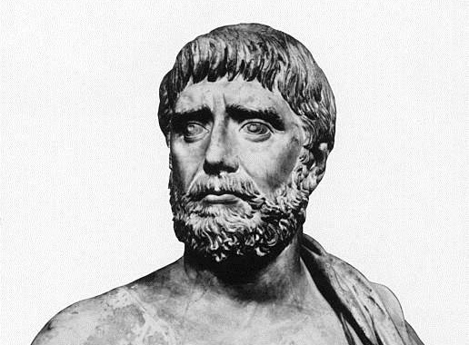
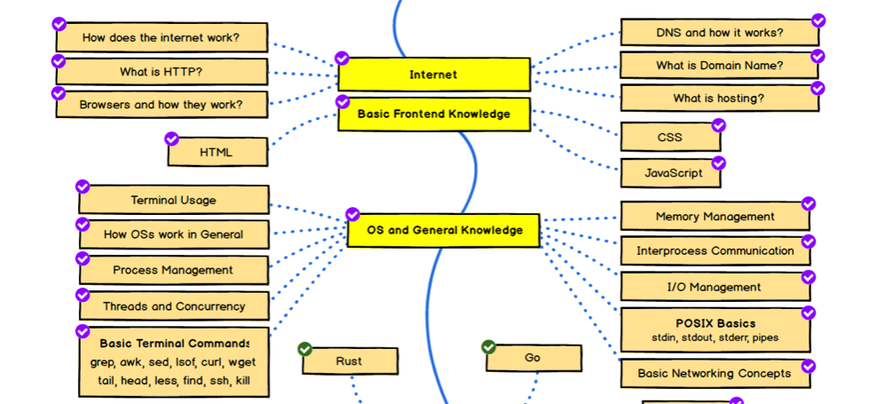

### 당근마켓 거래 후기

등장부터 무언가 찐 개발자 느낌이 났다. 전반적인 백엔드 질문과 취업팁을 여쭤 보았는데, 결국 평소가 중요했다. 도움이 될 만한 내용이 많아 간략하게 정리했다. 영하의 날씨에도 1시간정도 시간을 내어주신 몬스터헌터(!?)님 감사드립니다 🙏🏻

### 취업 Tip

-   사람들이 관심을 가질만한, 실제로 쓰일만한 어플리케이션을 만들면 포트폴리오가 된다.
    -   만드는 과정에서 일지를 기록 (블로그에 남긴다)
    -   **블로그 형태는 꾸준함과 Convention이 중요하다.**
-   언어는 node, GO, scala, Python 등을 많이 사용하는데 지금은 크게 중요하지 않다.
    -   만약 특정 회사를 노린다면 회사가 쓰는 언어/프레임워크를 파악하고 과제를 하는 것이 좋다

### 공식 문서

-   공식문서를 잘 읽어보자 (다른 문서는 취급을 안하신다고...ㅎ)
-   특히 노트형식이나 강조 문구로 되어있는 것을 정독하자.
-   '이러면 안되' 부분에 주의하자
-   공식문서 대로만 해도 어지간한 트래픽은 감당할 수 있다.
-   자주 발생하는 문제들 같이 정리된게 있다면 꼭 확인하자.

## 책 생각의 시대

### 책을 보게 된 이유

-   프로그래밍의 경우에 지식이 많다고 실력이 있다고 보기엔 어렵다. 그리고 **지식과 생각은 다르다고 어렴풋이 생각했다.**
    -   생각 : 헤아리고 판단하고 인식하는 것 따위의 **정신 작용**
    -   지식 : 교육이나 경험, 또는 연구를 통해 얻은 **체계화된 인식의 총체**
-   개발을 하며 바이너리 이진수의 합이 어떻게 세상을 바꿀 수 있었는지, 그 속에 수 많은 사람들의 노력과 **생각이 기반되어 있다고 생각했다.**
-   **논리적 생각의 중요성에 대해 느끼게 되었고 서점 매대를 둘러보며** 이 책을 고르게 되었다.

### 짧은 정리

은유, 원리, 문장, 수, 수사 5가지 생각의 도구에 대한 설명 주를 이룬다. 자녀를 둔 부모님의 교육방식에 대해 이야기하는 느낌으로 말씀하셔서 곧 출산을 앞둔 누나가 생각났다. 저자는 신경 가소성을 언급하며 생각하는 힘을 길러주는 실용적인 가이드라 이야기 하지만 효과가 있을까 하는 의문은 들었다. 탈레스, 피타고라스 등 위대한 업적을 남긴 사람들이 생각의 도구를 활용해 어떻게 그 당시 위대한 업적과 발견을 했는지에 대한 설명은 재미있게 읽었고, 추상화와 은유는 책 읽은 뒤로 때때로 일상 생활에서 생각이 났다.

## Hello Backend !

### 백엔드 로드맵

-   공부해야 할 것들이 많아보이는데, 이론만 읽기 보다 활용에 초점을 맞추는 것이 여러 면에서 좋아보인다.
-   그 밖에 운영체제 라던가, DB 스케일링 등의 이슈는 천천히 기록해두고 공부하는 것으로 방향을 잡아가면 좋을 것 같다.

### 채용공고

-   어떤 언어를 쓰는지도 중요하지만, 결국 **채용공고에 나와있는 정보들은 추상적이고, 모호했다. 가장 확실한 방법은 내가 이력서/포트폴리오를 만들어 제출해보는 것이라고 생각했다.**
