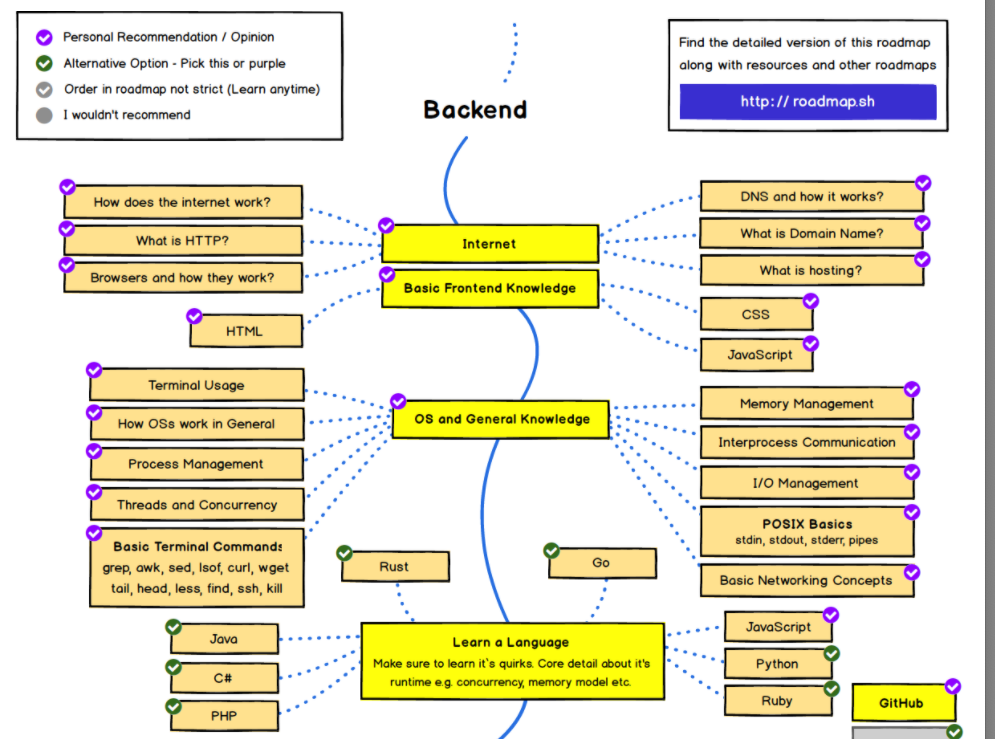

백엔드 개발을 시작하기로 마음먹고 두가지 질문이 떠올랐다. ***무엇을 어떻게*** 학습 해야할까?에 대한 질문이였다. 이 글에서는 무엇을 공부할지에 대해 정리해본다.

## 무엇을 공부해야 하는지

서버 개발 채용공고를 살펴봐도 해당 회사가 속해있는 산업과 개발 팀의 문화, 어떤 문제를 해결하고 있는지에 따라 사용하고 있는 기술의 범위가 매우 달랐다. 

서버 개발은 언어 + 프레임워크 + (인프라)를 기본으로 한다. 대충 살펴본 결과 약간 규모가 있는 스타트업과 규모있는 서버를 구축하는 경우에는 전통적(?)인 Java의 spring 프레임워크를 사용해 개발하고. 머신러닝, 인공지능이 회사의 주된 서비스일 경우에는 파이썬의 Django, Flask를 사용하기도 한다. 일부 기업들은 MSA (Micro Service Architecture)를 사용하며 다양한 언어와 프레임워크를 도메인에 따라 여러 독립적인 서버로 나누어 각 특성에 가장 잘 어울리는 언어 (Node, Python, Ruby, Go 등)와 프레임워크 (Nest, Flask, Rails ..) 등을 사용한다.

특정 기업에 목표가 있고, 채용이 될 때까지 해당 기업만 지원 한다면 해당 기업이 사용하는 언어와 프레임워크를 바탕으로 공부하면 된다. 하지만 두가지 이유로 현실적인 대안이 되지 못한다. 첫 번째로 지원과 모든 전형을 통과하는 것에 대한 리스크 관리 측면이고, 두 번째는 모든 기술을 사전에 익혀야 할까? 에 의심이 든다.

그렇다면 어떤 것을 공부하는게 효과적일까. 아래에는 5분 동안 생각해 본 간단한 방법을 적어보았다.

1. 대학에 다시 입학해 컴퓨터 공학을 전공한다.
2. 시간, 금전적 측면에서 대학보다는 MOOC 플랫폼에서 대학교 커리큘럼을 따라 강의를 수강한다.
3. 여러가지 언어와 프레임 워크, 기술을 사용해 프로젝트를 진행하고 포트폴리오를 만든다.
4. 손 가는대로 채용공고에 나와있는 기술들을 공부한다.

편의를 위해 1, 2번을 "전통적인 커리큘럼을 따라가는 공부 형태"라고 묶고. 3, 4번은 부딪히면서 배우는 "야생 학습" 이라고 이름을 붙여보자.

"전통적인 커리큘럼"의 장점은 기초부터 다루는 경우가 많아 노력만 한다면 기초를 빼먹지 않고 공부할 수 있다. 다른 측면으로는 실무&구현 과는 떨어진 어찌보면 공부를 위한 공부가 될 수 있다. 또 많은 경우 강의 형태로 이루어져 있어, 수동적인 특징과, 시간/비용의 측면에서 자원을 많이 요한다. 

"야생학습"의 장/단점은 주로 전통적인 커리큘럼을 따라 공부하는 방식의 반대에 해당한다. 필요한 것에 대한 공부를 실시간적으로 할 수 있어 이론과 실습의 경계가 딱히 없다. 또 시간/비용의 자원을 효과적으로 사용할 수 있다. 반면 의식적인 노력 없이는 기초에 대한 학습 과정을 놓칠 수 있고, 편향적인 학습의 형태를 띌 수도 있다.

### 로드맵

이런 고민의 과정에서 오픈소스 [Roadmap.sh](https://roadmap.sh/backend) 가 생각났다. 21년 1월 기준,  Front-end, Back-end, DevOops 등 여러 소프트웨어 직군에 **요구되는 지식과 기술을 연관성, 시간적 순서에 따라 로드맵의 형태로 보기쉽게 정리되어 있다.** 

단, 어떻게 공부해야 하는지에 대한 자료는 포함하고 있지 않은데, 이 점은 자신이 가지고 있는 현재 상태에 따라 유동적으로 학습하면 될 것 같다.

예를 들어, 필자는 스타트업에서 프론트엔드를 1년 정도 개발했는데 여기서 HTML, CSS, Javascript를 포함해 git, HTTP등 알고 있던 개념은 정리하는 방식으로 넘어갈 수 있다. 반면, RDB와 NoSQL, ORM 등 경험과 지식이 부족한 영역을 책, 동영상, 구현 등 많은 방법 중 하나를 선택할 수 있다.

따라서 기본적인 알고리즘과 함께 [로드맵](https://roadmap.sh/backend)의 키워드를 하나씩 정복한다는 마음으로 학습을 이어나가면 충분할거라 생각한다.

+) 여기에 더해 컴퓨터 공학 4년제 커리큘럼에서 익숙한 과목부터 책이나 동영상 강의로 하나씩 정리해간다면, 조금 더 구조적으로 지식을 쌓아나갈 수 있다고 생각했다. (아래 목록은 조금씩 바뀔수도 있을 것 같다.)

- [Introduction to Algorithm](https://www.youtube.com/watch?v=HtSuA80QTyo&list=PLUl4u3cNGP61Oq3tWYp6V_F-5jb5L2iHb) - MIT
- [운영체제](http://www.kocw.net/home/search/kemView.do?kemId=1046323) - 이화여대 반효경 교수님
- [컴퓨터 네트워크](http://www.kocw.net/home/cview.do?mty=p&kemId=1169634) - 한양대 이석복 교수님
- [시스템 프로그래밍](http://www.kocw.net/home/search/kemView.do?kemId=1223639&ar=relateCourse) - 한양대 남해운 교수님

## 어떻게 공부해야 하는지

알고리즘이나 구현의 경우 학습 방법이 명확하다. 문제를 정의하고, 해결 가능한 방안을 모색하고, 구현을 통해 실력을 향상시킬 수 있다. 정리하며 내부 작동원리나, 모기술에 대해 간단히 정리하면서 학습한다면 더 좋겠다.

반면 로드맵에 키워드 형태로 작성되어 있는 기술/지식을 학습하는 경우 자료의 형태와 학습 방식에 따라 큰 차이가 날거라고 생각했다. 작년에 반효경 교수님의 운영체제 강의를 들었다. 돌아보며 아쉬웠던 점은 지식을 반복해서 사용하지 않아 기억에서 잊혀진다는 점, 검증 절차가 부족해 알고 있는지, 모르고 지나가는지 정확히 판별하기 힘들었다. 이번 기회에 어떤 방식으로 새로운 지식을 습득하는 것이 효율적인지 정립해나가면 좋을 것 같다.

### 수동적인 자료는 신속하게 여러번 반복하기

필자의 경우 글, 영상, 책 등을 읽어 지식을 습득하는 경우 한번에 모든 개념을 이해하려고 노력했었다. 자연스레 한정된 시간에서 수동적으로 정보를 주입하는 시간이 늘어갔고, 내 것으로 만들기 위해 정리하거나, self-test를 하는 시간과 노력이 줄어들었다. 

이번 Backend 101 을 통해 학습을 진행할 때에는 가능한 한번에 모든 내용을 이해하려 하지 않는 것을 지향해보려 한다. 이러한 방식을 추구하는 데에 크게 세가지 이유가 있는데, 첫번째는 습득한 정보를 바탕으로 정보를 재구성해 부족한 부분을 찾고 반복하기 위함이다. 두번째는 천천히 꼼꼼하게 읽으며 생길 수 있는 '알 것 같다'는 착각을 방지는 것이고, 마지막으로 오랜시간 수동적인 학습을 진행하면 지치기 때문이다. 

궁금증을 바탕으로 찾아보고, 생각해보고, 정리하는 것이 효과적이라고 생각한다.

### 비유하기

새로운 개념의 주요한 특징을 찾아보고 익숙한 개념과 연결지어 학습 하려고 한다. 기대효과는 쉽게 생각하고, 기억할 수 있기 때문이다. 다만 비유를 위해 새로운 개념을 변형 시키거나, 정확한 이해를 방해하지 않는 선에서 적용하는 것이 좋을 것 같다.

### 한 문장으로 정리하기

마지막으로 '이해한 것을 바탕으로 한 문장으로 정리하는 것'이 필요하다고 생각한다. 정보를 습득하고, 긴 문장의 줄 글이나, 많은 블룻 포인트로 정리하게 되면 기억도 잘 나지 않을 뿐더러 후에 해당 기술의 main point를 놓치기 쉽다. 따라서 필요할 때 한 문장으로 정리된 문장을 바탕으로 생각을 이어나간다면, 정보를 더 찾아간다면 효과적일 것 같다는 생각을 했다.

### 마지막으로

'무엇을 학습하는지'에 대한 고민은 크게 하지 않았다. [로드맵](https://roadmap.sh/backend)을 기반으로, 면접 질문, 최신 기술 소식등 흐름을 주기적으로 접한다면 경로에서 크게 벗어나는 경우는 없다고 생각하기 때문이다. 게다가 지금은 기초와 관련된 학습을 하고 있기 때문에 최신 기술이 크게 작용하지 않는다.

반면 '어떻게 학습하는지'는 가장 중요한 자원인 시간과 에너지를 얼마나 효율적으로 사용하는지와 직결되는 문제다. 따라서 이 글에서 완벽한 전략을 세우지 못하더라도 주기적인 피드백과 수정이 필요하다.

여기에 더해 [함께 자라기](http://www.yes24.com/Product/Goods/67350256) 저자, 애자일 코치 김창준도 '*더 나아지기 위해 반드시 전략이 필요하다'*고 말씀하셨다. 최근 잘 다니던 회사에서 퇴사하고, 익숙하지만 새로운 분야에 뛰어들게 된 것은 더 나아지기 위함이였다. 무조건적인 학습과 구현은 크게 도움이 되지 않는다고 판단했었고, 한단계 도약을 위해 공부를 선택했다. 이 점을 잘 기억하며 Backend 101을 마무리하는 순간까지 열심히 달려보자.