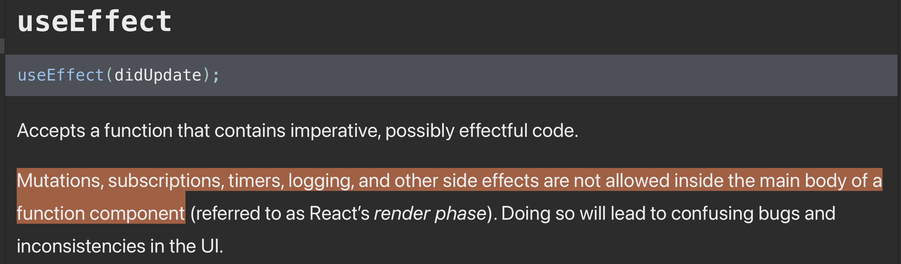
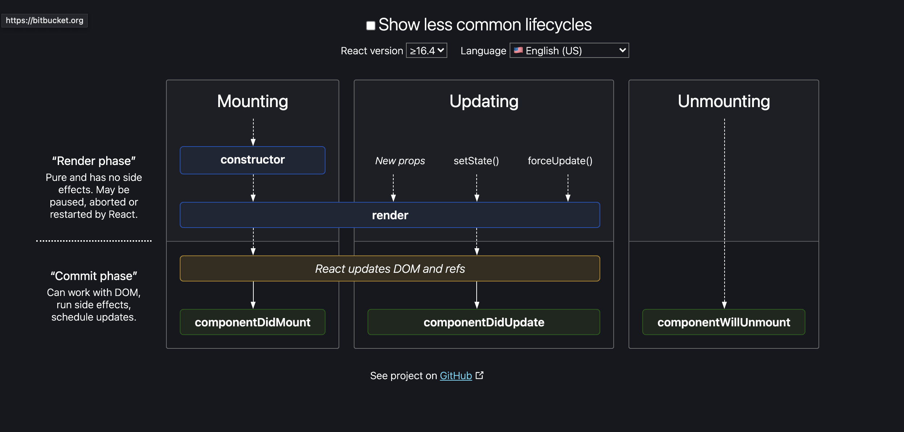

웹 어플리케션에서 부수효과(Side Effect)의 존재는 필수적이다. 다른 컴포넌트에 영향을 미치는 코드블록이나API 통신, 이벤트 핸들러 등록 등 "side"라는 단어가 잘 어울리지 않을 정도로 중요한 기능이다.

컴포넌트 내부에서 API 통신을 하기를 원한다면 클래스 컴포넌트의 경우 `componentDidMount` 내부에서, 함수형 컴포넌트의 `useEffect`의 첫번째 인자로 전달하는 함수 내부에서 실행한다. 

근데 왜 우리는 useEffect 내부에서 사이드 이펙트를 실행시켜야 할까? (함수형 컴포넌트를 사용하는 경우) 그냥 body에서 실행하면 안될까?

### Render and commit Phrase

공식문서에서 궁금증에 대한 힌트를 얻을 수 있었다. render phrase는 컴포넌트의 생성, 갱신, 소멸과 관련되어 있는 life cycle의 한 부분이다. 

아래 그림에서 컴포넌트가 생성, 갱신, 소멸될 때 발생하는 메소드가 나와있다. "렌더링" 이라는 표현을 많이 쓰는데, 생성과 갱신의 경우 공통적으로 *render* 과정 까지를 Render phrase 단계라고 부른다. 이후에 리액트가 DOM, refs를 업데이트 하는 단계는 commit phrase라고 부르는 것을 알 수 있다.

Render phrase에서 리액트는 새로운 props와 state를 바탕으로 Virtual DOM을 그린다. (추가로 갱신의 경우에는 어떤 차이가 있는지 파악한다). 한마디로 **state와 props를 바탕으로 어떤 화면이 나타나야 하는지 리액트가 파악하는 과정이다.** 이어지는 commit phrase에서는 Virtual-DOM을 바탕으로 실제 DOM에 마운트 한다. (화면에 그리는 단계는 아직이다)

### 렌더가 되기 전에 데이터를 받아오면 되지 않나?

결국 외부에서 데이터를 받아오면(Side Effect) 컴포넌트가 생성될 때의 초기값을 바탕으로 Virtual-DOM을 생성하고(render phrase) 실제 DOM에 마운트 하는 과정을 거쳐 변경된 state를 바탕으로 다시 render와 commit 단계를 거쳐 데이터를 갱신하는 과정을 리액트는 수행하고 있다는 결론이 나온다.

그러면 위의 의문이 자연스레 떠오를 수 있다. **아예 render 전에 데이터를 받아오면(부수효과를 만들고) 되는데 왜 구태여 두번 수행하는 것일까? 결론부터 이야기하면 성능이 저하된다.**

가상돔을 그리는 과정에서는 오직 컴포넌트의 "순수한 부분"만 포함되어야 한다. 그래야 리액트의 핵심인 이전 렌더링 결과와 이번 렌더링 결과를 비교해 바뀐 것만 비교해 컴포넌트를 업데이트 할 수 있기 때문이다.

Side Effect를 야기하는 과정을 가상돔을 만드는 과정(render phrase)에 포함되면 부수 효과가 발생할 때 마다 Virtual-DOM을 다시 그려야 한다. 또한 데이터 요청의 경우에는 동기적으로 네트워크 응답을 받아야만 다음 과정이 진행될 수 있다.

따라서 리액트는 컴포넌트 내부의 순수한 부분을 사용해 화면을 그리고 난 후 부수효과를 발생시킨다. 이후에 컴포넌트 갱신이 필요하다면 다시 모든 과정을 거쳐 다시 렌더링하는 과정을 거쳐도 가상돔을 활용해 필요한 부분만 업데이트 하여 성능에 큰 영향을 주지 않는다.
### Reference

- [리액트 모아보기](https://goidle.github.io/react/in-depth-react-intro/)