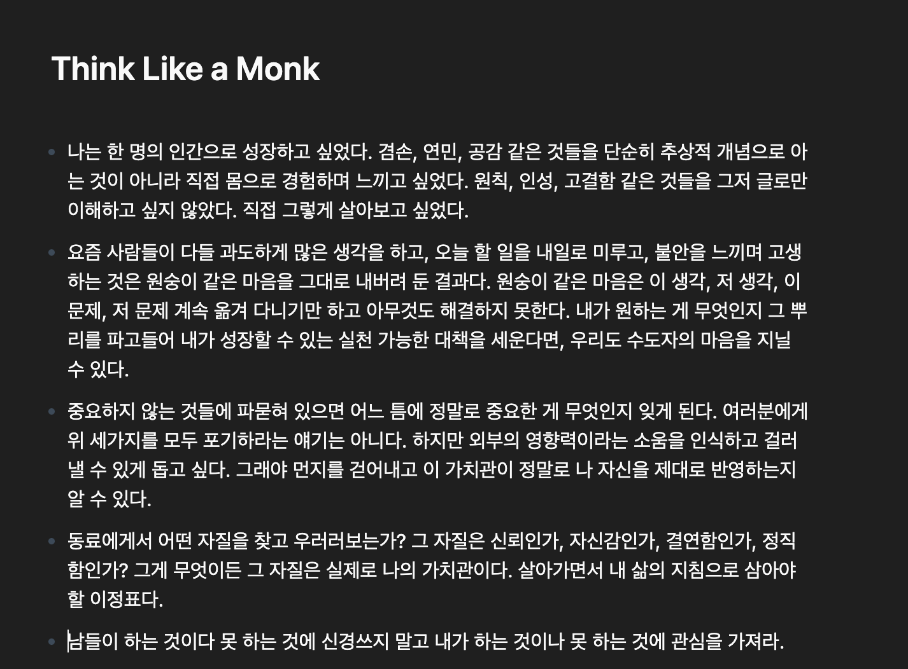
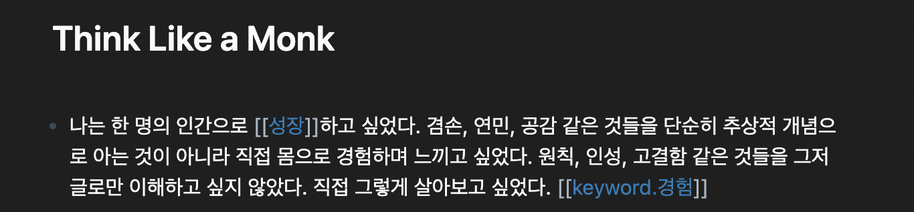
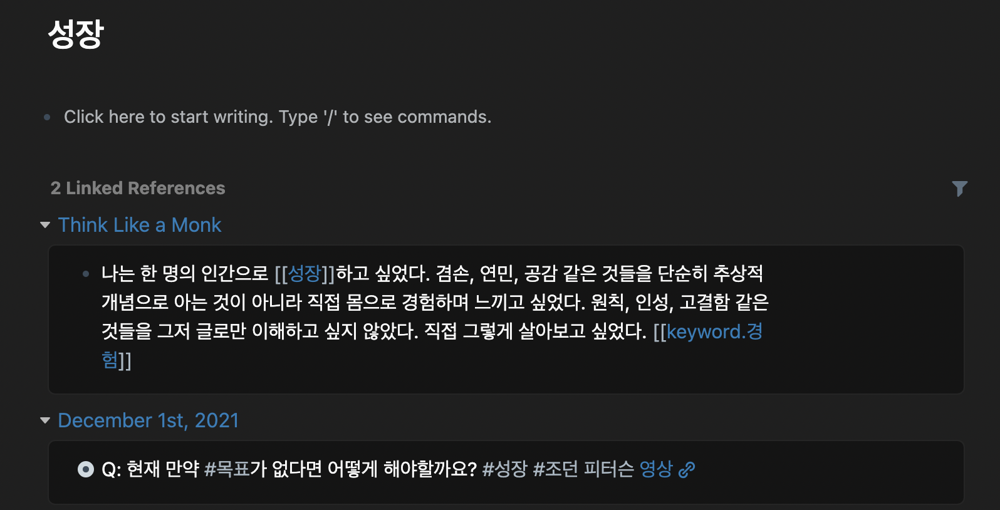

### 정답 없는 문제들

인생에 정답이 있다고 생각하던 시기가 있었다. 지금도 이런 생각에서 자유롭진 않다. 예를들면 '대학 졸업하고 좋다고 하는 기업에 입사' 하는 것 것이다. 나름 자유로운(?) 인생을 추구한다고 생각했지만 그렇지 않았다. 정보와, 즐길 거리, 사회적 관계 속에서 무엇이 나의 생각이고 타인으로 부터 온 믿음인지 분간하기 어려웠다. 이 무렵 노트에 생각과 감정을 기록하기 시작했다. 일기와 비슷한 형태를 띄지만 어떤 개념이나 대상에 대해 점검, 감사, 회고, 다짐, 재고(再考) 등에 대한 내용이 주를 이루었다.

가끔 학습(學習)이 더 편하다는 생각이 들었다. 적어도 'A란 이런 것이다'라는 정답이 있고 이해하면 되기 때문이다. 학문적인 요소는 파고 파다보면 언젠가는 알 수 있다는 믿음이 있었지만, 생각이나 마음의 경우에는 그렇지 않았다. 내가 좋아하는 것은 무엇인지, 어떻게 해야 인생의 의미있게 살아갈 수 있는지, 왜 같은 실수를 반복하는지 등 정답 없는 물음들이 멀게만 느껴졌다.

#### 정답없는 문제들이 어려운 이유

며 칠, 몇 달 동안 고민해도 나아지는 것이 없다고 느꼈다. 되려 머릿속만 복잡해지는 느낌이었다. 그럼에도 포기할 수 없었던 이유는 이런 물음들과 관계를 맺어가는 것이 급하지 않지만 중요한 일이라는 느낌 때문이었다. 어려움 이면에는 모순도 있었다. "이성적"으로 생각해 보면 A를 선택하거나 라고 대답해야 하는데, 막상 마음과 행동은 그렇지 않았다. 이성적으로 내린 결정은 힘이 약하거나 번복의 대상이 되기도 했다. 그러다 증명된 것은 아니지만 인간의 뇌 구조에서 힌트를 찾았다.

#### 대뇌피질 (신피질) 과 번연계

인류 문명을 이룩할 수 있었던 가장 큰 요인으로 '인간의 뇌'인 신피질이 꼽힌다. 고등 행동(기억력, 사고력, 추리, 계획, 운동, 문제해결, 언어) 등을 관장한다. 우리는 이 능력을 이성이라고 부른다. 반면에 동기, 정서, 감정, 직관은 '포유류의 뇌' 라고 부르는 번연계에서 작용한다. **놀라운 것은 번연계는 언어를 처리할 수 없다.**

번연계가 만들어 내는 여러 감정/감성/동기들에 대해 더 많은 관심을 두고 싶었다. 이성으로 감정을 다스리는 것 보다는 감정의 힘과 방향을 이성에 밀어주고 싶었다. 하지만 "벼락치기"로 어려운 물음들에 대해 답하기에는 어렵다는 생각이 들었고, 매일 조금씩 데이터를 쌓아나가야 한다고 생각했다. 그리고 이 방식 중에 하나로 사용하고 있는 롬 리서치를 활용하고 있다.

### 전통적인 노트 작성법

우리에게 익숙한 노트(노트앱) 작성 프로세스는 최소단위가 하나의 노트로 관리된다. 무슨 말이냐면 예를 들어 책 [수도자처럼 생각하기]에서 인상깊었던 문장을 기록한다고 가정해보자. 아래 스크린샷과 같이 기록할 수 있다.

제목에 노트의 주된 내용 (이 경우에는 책 제목)을 적고 관련된 내용을 아래 모두 적으면 된다. 과정을 일반화 해보면 1. 노트 전체를 아우르는 주제를 정하고 2. 주제에 대해 쓰면 된다. 마치 1월 2일 "장바구니 리스트"를 적는 것과 비슷하다. 이런 과정에서는 최소 단위가 하나의 노트로 관리된다. "수도자 처럼 생각하기"를 읽고 남긴 메모의 모든 내용은 해당 노트에 종속될 수 밖에 없다.

### Roam Research

roam research 는 제텔카스텐 개념을 구현한 노트 어플리케이션이다. 제텔 카스텐은 []학자가 고안한 메모 방법론으로 색인 카드를 사용해 "나중에 필요한 경우에 꺼내어 보기"에 초점을 맞춘 도구이다 . Roam Research의 **단어 단위로 쪼개어 기록/관리할 수 있는 기능으로 인해 말로 표현하기 힘든 다양한 개념들에 대해 조금 더 가까이 접근할 수 있다고 생각한다.**

전통적인 노트 작성 방식과는 다르게 Roam Research의 기능을 사용하면 음절(단어)단위까지 다른 노트들과 연결지을 수 있다. 위 노트의 첫번째 블룻포인트를 Roam의 방식으로 다시 작성해보면 아래 스크린샷과 같이 작성할 수 있다. 여기서 [[성장]]과 [[keyword.경험]] 대괄호로 감싸게 되면 해당 문장은 성장 keyword.경험 노트와 연결된다. 즉, 다시 말해 이 문장은 책 [수도자 처럼 생각하기]에 대한 메모지만 동시에 성장, 경험의 노트에도 포함된다.

실제로 아래 성장 페이지를 들어가보면 References라고 해서, 조금 전에 작성한 Think Like a Monk 메모가 연결되어 있다.

불현듯 떠오르는 생각이나 개념을 말로 풀어 표현하기에는 어렵지만, 단어 형태나 짧은 문장이 문득 떠오르는 경우가 있다. 그런 생각들을 기록한다고 하더라도 어디에 어떤 식을 기록해야할지 고민이 되고, 주로 이런 메모들은 나중에 다시 필요한 경우에 찾을 수 있는 확률도 낮다. 이런 기록들을 적절한 단어를 참조해 작성해둔다면 후에 어떤 고민이나 결정이 필요할 때 조금 더 생각의 발자취를 폭넓게 돌아볼 수 있기를 바란다.

